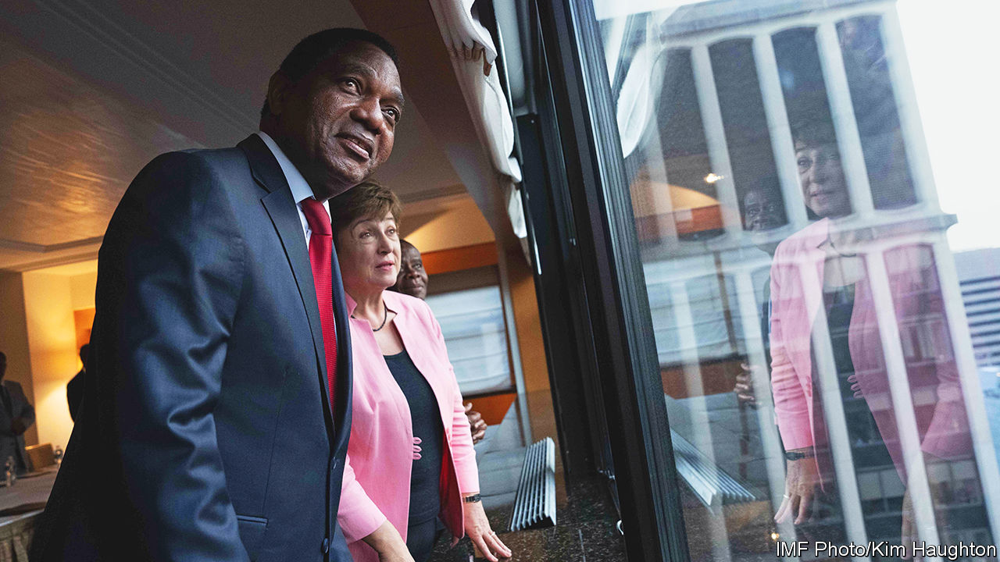

###### A new age of austerity

# Africa faces a mounting debt crisis 

##### Rising rates are hurting some of its brightest economic stars 

 

> May 16th 2023 

A year ago Ghana’s finance minister, Ken Ofori-Atta, eschewed talk that his country would need a bail-out from the IMF. Ghana had at that point been in and out of 16 IMF programmes since attaining independence in 1957. “We have forgotten how difficult and tenacious that master from Washington was,” he said.

Yet now Ghana is entering a $3bn, three-year programme. The IMF’s board approved it on May 17th, based on assurances from Ghana’s bilateral creditors, including China, that they will restructure its debt. Ghana will get a first tranche of $600m immediately, though further infusions will probably require progress on cutting its debt burden. Zambia, which like Ghana is in default on its sovereign loans, has struggled to agree to detailed terms for restructuring its debt. But it hopes to achieve a deal next month. 

Ghana and Zambia highlight the pivotal role that China and private creditors have begun to play in restructuring the billions of dollars in debt owed by African countries—and the need for closer co-operation among China, Western creditors and multilateral financial institutions. The two distressed borrowers also point to a new period of austerity in Africa, where the ratio of public debt to GDP has soared. 

This austerity will have a big impact on African economies and domestic politics. African attitudes to the rest of the world will be shaped by whether outsiders, especially the West and China, are seen to be helping or hindering progress. 

Post-independence Africa has endured two periods of rising debt levels. The first was in the 1980s and 1990s, which led to a crisis that eventually resulted in big write-offs by rich countries. It was exacerbated by weak commodity prices and slow economic growth. Average real GDP per person in Africa shrank in both decades.

The second period of rising debt was in the 2000s and 2010s, when African countries looked beyond aid and cheap loans from multilateral institutions. From 2007 to 2020, 21 of them borrowed on global capital markets, many for the first time. China’s financiers lent $160bn to African governments from 2000 to 2020. Domestic capital markets were increasingly tapped, too. Between 2010 and 2020, African government debt that is held domestically increased from an average 15% of GDP to 30%. 

African politicians stress that borrowing was needed to invest in schools, clinics and roads. Many borrowed too much, or misspent the proceeds. One Zambian source recalls that in 2014 officials sought to sell only a $500m Eurobond (a bond in a currency other than your own) but yield-hungry investors coaxed them into doubling the issuance. “We did it because we could,” he says. 

Now politicians oversee austerity because they must. Public debt as a share of GDP reached an average of 56% in sub-Saharan Africa in 2022, the highest level since the early 2000s, exacerbated in part by covid-19 and Russia’s invasion of Ukraine. That may not look high by rich-world standards, but it is barely affordable in Africa, where interest rates are much higher. Moreover, 40% of Africa’s debt is denominated in foreign currencies, making countries prey to the vicissitudes of exchange rates. This year sub-Saharan African countries’ spending on servicing external debts (both interest and principal repayments) will reach 17% of government revenues, the highest level since 1999, according to Debt Justice, a British NGO. 

That leaves less for everything else. In 2010 the average sub-Saharan country spent 70% more on health per person ($38) than on external debt ($22). By 2020 spending on debt service was 30% higher. 

Though most African countries face austere times, the debt crisis is less homogenous than in the early 2000s. This time countries fall into one of three categories, says Greg Smith, an emerging-markets fund manager and author of “Where Credit is Due”, a book on African debt.

The first, “emerging Africa”, encompasses a few of the continent’s richer countries, such as Mauritius and South Africa. These are still able to borrow on capital markets, though at higher rates. The second group, comprising more than 30 countries, is “poor or prudent Africa”. These are either too well-run to have racked up high debt levels (eg, Botswana) or too badly run to have attracted mainstream commercial creditors (many of the rest). While many in this group face rising debt-servicing costs, bailing them out would be relatively cheap and straightforward. 

“Frontier Africa”—the third group—is where things get tricky. The approximately 15 countries in this set include many of Africa’s most promising economies. Yet they have been largely shut out of Eurobond markets for almost a year, as a result of their own mounting fiscal pressures as well as rising global rates. Mr Smith calculates that they need to borrow about $30bn a year to service existing foreign debts. 

The two “frontier” countries that have already defaulted show how resolving this era’s debt crises will be more complex than the first. Start with Zambia. After Hakainde Hichilema (pictured) was elected president in 2021 his government quickly won the trust of the IMF, which agreed to a $1.3bn programme. But releasing all of this money depends on creditors taking a hit. This makes it a test case of the Common Framework, a blueprint introduced by the G20 in 2020 for restructuring debt by a diverse group of creditors, in particular commercial bondholders and China.


China is the cause of delays in Zambia, which defaulted in late 2020, argue Western officials. Zambian officials hope that a deal will be reached next month. But they are impatient. “We’ve done [our bit] in a very short period of time. But the Common Framework is failing to deliver… and that’s frustrating,” says Situmbeko Musokotwane, Zambia’s finance minister. “The power rivalry” between China and the West unduly complicates matters, he laments. 

China, whose banks hold more than a third of Zambia’s external debts, had insisted that if its institutions were to take losses on their loans, so should the World Bank and the IMF. Yet in recent talks about debt restructurings in general, China has dropped this demand in exchange for multilateral institutions making grants or concessional loans to countries that receive debt relief, said Ceyla Pazarbasioglu, a senior executive at the imf. 

“China will accept additional concessional aid for Ghana in lieu of [multilateral] haircuts,” says Bright Simons of Imani, a think-tank in Accra, Ghana’s capital. The World Bank is preparing a $900m lending programme over three years alongside the IMF’s bail-out. However, Ghana may not be a demanding test case, as it owes China far less than Zambia does.

Who’s to blame?

China does more to help than is often assumed, argues Deborah Brautigam, a scholar of China-Africa relations. During the pandemic, she says, it accounted for 63% of the $13.1bn in debt rescheduled by creditors to the 46 countries taking part in a scheme known as the Debt Service Suspension Initiative. 

China is far from the only headache for debt-laden African countries. Before it defaulted last year, Ghana had almost as much domestic debt as foreign debt. As a result the IMF insisted that Ghana restructure its obligations to domestic creditors before it could get a bail-out. Local banks have had to write down the value of their bonds by almost a half, damaging the country’s financial sector. 

Another challenge is private foreign investors, who hold about $13bn in Ghanaian bonds (compared with $1.9bn owed to China). Getting their agreement will not be easy, especially as exemptions for some domestic creditors leave external ones with a greater burden. Mr Ofori-Atta has also told external bondholders they need to take bigger losses than bilateral creditors. 

Even if Africa’s other “frontier” countries avoid default, they are still in trouble. Kenya recently failed to pay civil servants on time. “Salaries or default? Take your pick,” said David Ndii, an economic adviser to President William Ruto. 

Ethiopia, Africa’s second-most populous country, has been mostly shut off from aid and capital markets since descending into civil war in 2020. As in Ghana, Nigeria and other countries, its government has borrowed extensively from its central bank, weakening the currency and fuelling inflation. Now that the war appears to be more or less over, it wants help from the IMF before a $1bn Eurobond payment falls due at the end of 2024. 

In Nigeria debt service, mostly domestic, took up a staggering 96% of government revenues last year. Part of the problem is that the government has collected little money from oil recently due to rampant oil theft, low production and the cost of fuel subsidies, which are deducted before oil proceeds reach the treasury. Bola Tinubu, Nigeria’s incoming president, promises to fix the oily mess, but so have many past presidents of his country. Even in better-run places, debt service is chewing up government revenue. In Ivory Coast and Senegal it accounts for about one-quarter of revenue.

Ideally, economic growth would allow Africa to escape the squeeze. But the outlook is gloomy. In April the IMF cut its growth forecast for sub-Saharan Africa in 2023 to 3.6%, only about one percentage point higher than population growth. Austerity may well slow growth further. 

 


Development wonks often tell African countries to raise more tax. The median sub-Saharan country gathers tax revenues worth 13% of GDP compared with 18% in other emerging economies and 27% in rich countries. Despite the nagging, this has barely increased in a decade.

How can Africa plug the gap? Across the region 21 countries have borrowing arrangements with the IMF; more will follow. But other sources of cash are drying up. Chinese loan disbursements to Africa have fallen to about 10% of their peak in 2016. Between 2012 and 2021 international aid to sub-Saharan Africa amounted to 3% of the region’s GDP, down from 4% in the previous decade. Eurobond markets may reopen, but interest rates will be higher than in the 2010s. The lowest Eurobond rate obtained by Ghana—continental west Africa’s richest country by GDP per person—was 6.4%. It will be tough to find investments that generate the returns to pay back, in dollars, loans at higher rates. 

The new austerity will shape African politics. Most “frontier” countries are democracies. Economic discontent has already led to changes in government in Zambia and Kenya, where civil unrest flared again recently. Ghana’s elections next year will be a referendum on the ruling party’s economic management. 

Democratic deficit

Mr Hichilema, Zambia’s president, worries that democracy in Africa itself is at risk. In an article earlier this year he argued that the political and civic reforms he has introduced would matter little when his people continued to suffer from the economic mismanagement of his autocratic predecessor. “You can’t eat democracy,” he concluded, in a warning to those who hold Zambia’s fate in their hands. 

African attitudes to the rest of the world could harden, too. The “structural adjustment programmes” of the late 20th century were resented in much of Africa. Today, amid economic hardship, African frustration with Bretton Woods institutions and their Western patrons is rising again. China, meanwhile, could lose its mostly benign image, should it be seen as holding economies to ransom. 

Afrobarometer, a pan-African pollster, has found that views of America and China are turning sour. In surveys conducted in nearly 30 countries in 2022, 51% and 49% of respondents said respectively that China and America were good influences in their country. These shares were down by ten and 11 percentage points from 2019. 

A sense of “plague on all their houses” could deepen if Africa suffers from geopolitical rivalries. The IMF recently found that sub-Saharan Africa was the region most at risk if the West and China decoupled into two different trading blocs. In a “severe scenario”, after 10 years the GDP of a typical country in the region would permanently be 4% lower than otherwise, a larger hit than the global financial crisis. 

Africa is richer and more democratic than in the 1980s. Its policymakers are savvier. Yet global forces are making it harder to escape the new squeeze. This time will indeed be different. All the same, it could still be very painful. ■

