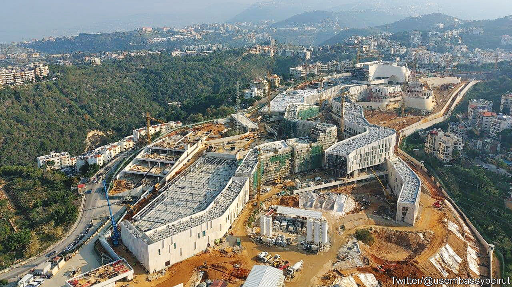

###### Behold now behemoth

# America’s new embassy in Beirut is vast 

##### But for its diplomats the most important thing may be to leave it 

 

> May 18th 2023 

In the hills above Beirut, cranes swing above a vast new American embassy. Covering more than 43 acres, it will be the second-biggest diplomatic outpost in the world, surpassed only by America’s embassy in Baghdad. It is set to cost $1bn, about the same as the United States’ mission in London, the costliest the country has ever built. The immenseness of its scale suggests America has no plan to abandon its role in the Middle East. But it also highlights the superpower’s difficulties.

The new embassy in Beirut will be surrounded by towering concrete walls and barbed-wire fences. “Is that an embassy or a military base?” asked people on Twitter when photographs of the development were shared. Like the existing embassy, it sits in Akwar, a leafy suburb, far from the city centre. Security is plainly the dominant factor, as it now is across the world. Even in London, considered a lot less dangerous than capitals such as Baghdad or Beirut, a moat runs around the embassy. America’s ten-storey embassy in Cairo, built in 1980, is now surrounded by a cordon of concrete blast shields.

America’s emphasis on security when it comes to building embassies has its roots in Lebanon. In April 1983 the Islamic Jihad Organisation, a forerunner of Hizbullah, bombed the American embassy in Beirut. The attack killed 63 people and destroyed much of the building. Next year Hizbullah set off a car-bomb that killed 23 people at an annex of the embassy. Those attacks prompted America to focus overwhelmingly on security when designing and building its embassies.

That principle was codified in 1985 by Bobby Ray Inman, a recently retired admiral, in a report for the State Department. It included a series of guidelines for American diplomatic buildings and for those working in them. The facilities, it was argued, should be located within a single, well-defended perimeter far away from heavily populated areas.

The threat of terrorism is a real problem for American embassies, says Elliott Abrams, a former assistant secretary of state, but the isolation and fortress-like appearance of American embassies give a bad impression. And local Beirutis do not expect to benefit from the new edifice. “People from the embassy don’t buy things here,” says a chemist whose shop abuts the site. “They bring everything with them—they fly it in by helicopter.”

Suspicion of America already runs deep in the Middle East, so cutting its diplomats off from the local populace hardly improves things, especially in places such as Egypt, Jordan and Lebanon, where relations with America have generally been friendly. Nowadays embassy staff are barred from using public transport or living outside official residences. It is a real loss, says Mr Abrams, if American diplomats cannot travel freely within the country or mix with the locals. The size of the new embassy in Lebanon suggests a worthy commitment to remain engaged in the Middle East. But the diplomats who work there will need to find a way to sally beyond its walls. ■

