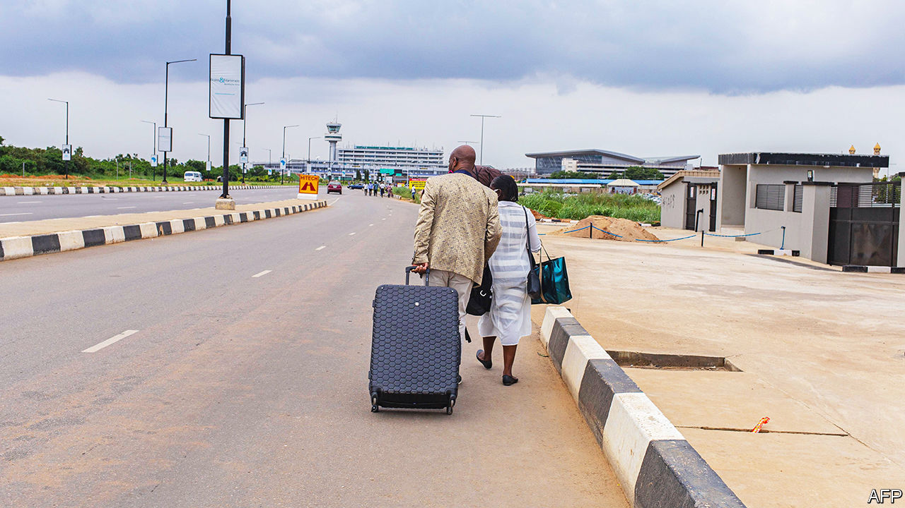

###### Grounded in Nigeria

# Foreign airlines in Nigeria are frustrated by the blocking of their funds 

##### Will the new president urge the central bank to hand over the cash? 

 

> May 18th 2023 

International airlines with bases in Nigeria are looking hopefully at the inauguration of Bola Tinubu as president on May 29th, since their fate may rest in his hands. They want the country’s new chief pilot to tell the central bank to let them have their cash. Of the $2.2bn in airlines’ blocked funds across the world, the wodge stuck in Nigeria, almost $800m, is the biggest, says the International Air Transport Association (IATA). That figure has doubled since September. Nigerians are frequent flyers, thanks in part to their huge, helter-skelter diaspora, but, unless the bank acts fast, frustrated airlines may make it harder for any of them to get anywhere at all. 

Dwindling oil revenues, meagre exports and currency interventions have drained Nigeria’s foreign-exchange coffers. The central bank must decide how to parcel out scarce cash. Every fortnight or so it promises airlines a morsel of all the dollars their accumulated revenues in naira should equate to, at an exchange rate almost 50% less advantageous than its official one. Even then, it does not guarantee when the pledged money will arrive. KLM, the Dutch carrier, which has been flying to Nigeria for 75 years, is waiting for funds promised in September. Emirates, fed up with waiting for an estimated $500m, pulled out last year, despite the popularity of its route. 

In 2022 about 3.5m people flew in and out of Nigeria. Once a profitable route, it should have offered airlines an opportunity to recoup lockdown losses. “It should be lucrative, but it’s not if you can’t get your money,” says IATA’s Willie Walsh. Airlines have to keep paying interest on their own debts, even as they chase the arrears they are owed.

A manager at one of Nigeria’s leading banks notes that some airlines unlawfully sell tickets in dollars within the country. Others are taking on more cargo. Faced with the prospect of reducing its Nigeria-bound flights, KLM resorted to selling only the priciest of tickets to Nigerians and as a last resort increased its prices in naira to make up for the added risk. But passengers grumble that they are being fleeced.

As carriers run out of tricks, more may leave. Rising jet-fuel costs and other levies are obstacles enough. Every so often the central bank gives a “special allocation” of funds to placate rankled airlines as a temporary reprieve. The aviation minister has called for patience.

In the long run larger airlines may be able to absorb the losses, but Nigerian passengers will be certain to lose out. Unless Mr Tinubu’s crew finds a way to replenish reserves and disburse the cash, foreign flyers may stop coming. “We’re not talking years here,” says Mr Walsh. “We’re talking months and weeks.”■

