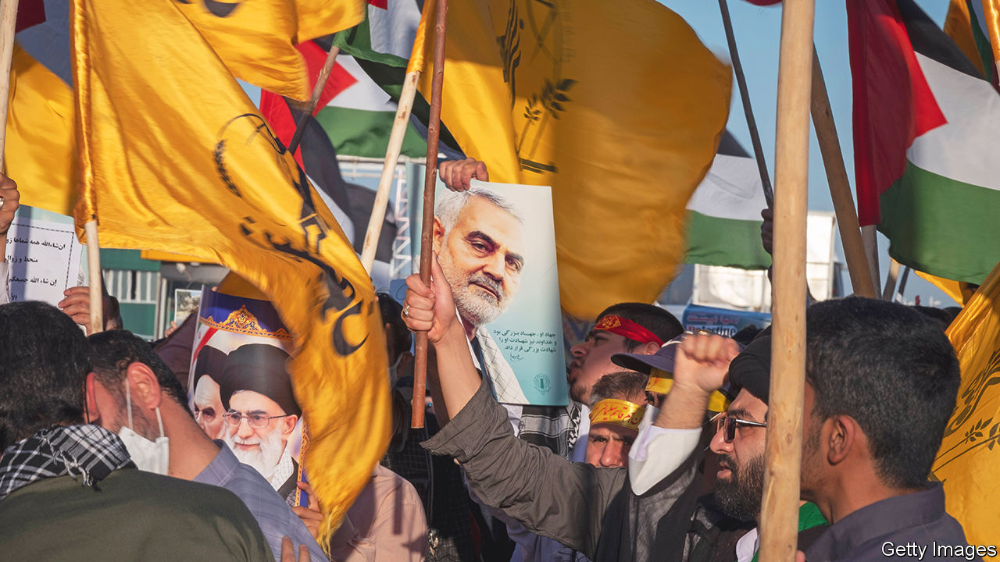
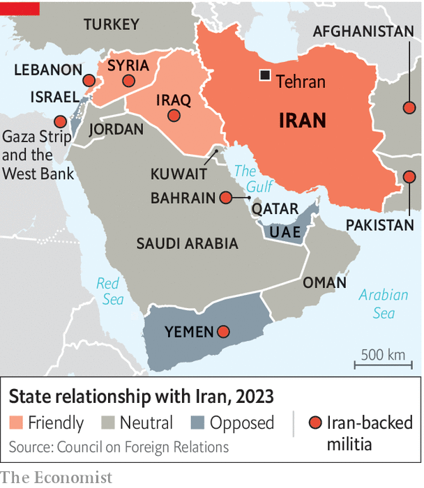

###### A power project

# Iran’s proxies in the Middle East remain a powerful force 

##### A recent altercation with Israel has exposed their limits 

 

> May 18th 2023 

As Israeli aircraft pounded the beleaguered Gaza Strip for five days, starting on May 9th, officials in Jerusalem were at pains to point out that they were targeting only the Palestinian Islamic Jihad militia (pij). This is a small radical group funded by Iran, which had been firing rockets at Israeli towns. Israel’s strategy was clear. It wanted Hamas, the larger Islamist movement that controls Gaza, to stay out of the fight. This is because it has a much larger arsenal of rockets, many provided by Iran, which can paralyse life in Israel much more effectively. 

The strategy worked. Hamas stayed on the sidelines until a ceasefire was brokered by Egypt. Israel hopes that it has driven a wedge between two Iranian allies on its borders. The deal has set back Iran’s efforts to use its proxies to advance its regional ambitions and to attack—albeit indirectly—its chief enemies: Israel and America.

Iran’s proxies have always been a key part of its push to assert itself as a regional force. Since the early 1980s, groups backed by Iran such as Hizbullah, a militia-cum-party in Lebanon, and the Badr Organisation in Iraq have played big roles in the Islamic Republic’s foreign policy. It has also projected its power through its support for the Houthis, who have menaced the Saudis in Yemen, as well as Hizbullah and the Palestinian factions.

Iran’s proxies both fulfil the ideological mission of exporting the Islamic revolution and serve as tools of diplomacy and coercion, says Behnam Ben Taleblu of the Foundation for Defence of Democracies, a think-tank in Washington, dc. They have become ever more relevant as Israel’s relations with its neighbours have improved through the Abraham accords, whereby in 2020 it agreed to establish formal ties with four Arab countries.

Israel has largely succeeded, through persistent air raids, in denying Iran a permanent military foothold in Syria. It has, however, failed to prevent Iran’s proxies, Hizbullah and Hamas, from building up sizeable arsenals in Lebanon and Gaza. These may not represent an existential threat to Israel. But they do pose enough of a danger for it to have sought unofficial truces with them. In three of Israel’s recent operations in Gaza, it has not targeted Hamas. Likewise, since the end of its war in 2006 with Hizbullah, the two seem to have agreed that though they can confront each other in Syrian territory, they will refrain from doing so in Lebanon. 

There are limits, anyway, to the power of Iran’s proxies. “Ultimately Hizbullah and the other Shia militias were not enough to save Assad in Syria,” says Raz Zimmt, an Iran-watcher at Israel’s Institute for National Security Studies affiliated to Tel Aviv University. Iran had to deploy its own forces and in 2015 begged Russia to help prevent Syria’s regime from falling. In Yemen, too, although Iran’s supply of missiles and drones helped the Houthis harry the Saudis and their allies, some of the more sophisticated attacks, such as the ones on the Saudis’ oil-processing facilities in September 2019, are believed to have been carried out by Iran itself. 

 


While proxies such as Hamas welcome their benefactor’s support, they also have their own agendas. These do not always align with those in Tehran. Such groups naturally consider their own local constituencies’ interests. So they are not always prepared to do Iran’s bidding. In recent weeks Israel has exploited this dynamic in Gaza. Iran wants its Palestinian clients there to act as a constant thorn in Israel’s side. But as Israel’s most recent strikes make clear, that is not necessarily to the good of the local population. 

Like the pij, Hamas gets funds from Iran. Unlike the pij, however, it is responsible for actually running Gaza. It also hopes one day to lead the broader Palestinian movement. As a result Hamas is split when it comes to Iran. Some members openly support the Islamic Republic. Others, including Yahya Sinwar, Hamas’s chief in Gaza, are trying to stay less obviously aligned. Israel has encouraged this division by somewhat relaxing the blockade it has imposed in Gaza, with Egypt’s co-operation. It has allowed 20,000 day-labourers to enter Israel, where they earn desperately needed money. Because Mr Sinwar is loth to jeopardise this, he is reluctant to join the joint command structure Iran seeks to establish for its proxies on Israel’s borders.

The biggest weakness of Iran’s proxy strategy lies closer to home. As the country’s economy teeters, investing scant resources in arming foreign militias is feeding resentment among Iranians. And ironically, though its proxies have been central in Iran’s foreign policy, its position in the Middle East has been bolstered by more conventional means. On March 10th Iran agreed to restore diplomatic ties with Saudi Arabia, hoping this will go some way to ending its economic isolation. Still, others will keep up the pressure against Iran as long as it destabilises the region elsewhere. Rather than enhance Iran’s geopolitical might, the proxies risk becoming a major obstacle. ■

