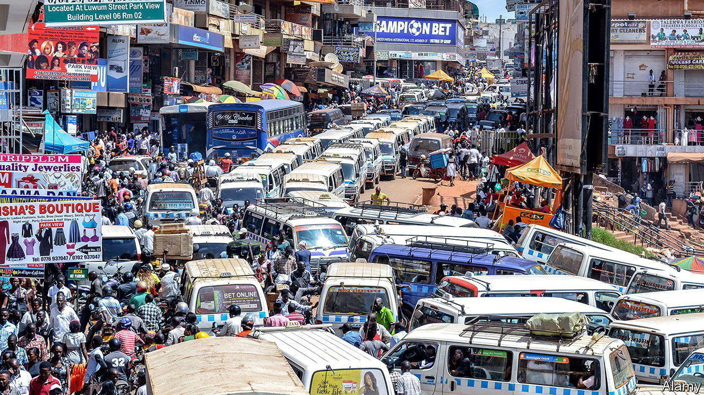

###### Big deals on the bus

# Looking for the African middle class? Head to the bus park 

##### New “executive” services promise comfort and punctuality 

 

> May 18th 2023 

The Ugandan traffic officer slid back the door of the 14-seater taxi to find 20 adults, four children, and a squashed  correspondent. “Why are none of you complaining?” she asked, peering into the tangle of limbs. Indeed, nobody had said anything as the conductor had delayed departure to stuff his minibus beyond legal limits. And now they kept quiet as the policewoman ordered the excess passengers to disembark. A mile down the road, with the cops out of sight, the evictees squeezed back in again, having hitched a ride on tactically positioned motorbikes.

The policewoman’s question is pertinent. Why should African travellers put up with discomfort and delay? Shared taxis and intercity buses routinely leave hours late. Most passengers tolerate bad service with surprising equanimity. But some of them are starting to demand a better one—a sign of rising incomes and the changing economic value of time.

Public transport in Uganda often tests patience. Your correspondent once sought a ride from a taxi park in Lira, a northern town. “Hurry, hurry,” urged a tout, steering him towards a packed vehicle with a revving engine. Ten minutes later, with the taxi still motionless, a passenger stepped out to “buy a soda” and never returned. A quarter of an hour passed, and another did the same, then another. It eventually became clear that almost all the “passengers” were paid stooges, enticing customers with the illusion that the taxi was full and ready to leave.

The answer to the policewoman’s question is given by Huzairu Lubega, who manages a bus company. Buses with fewer than 45 passengers cannot cover the costs of fuel and maintenance, he says, so they wait for hours for extra travellers. The only way to leave on time would be to raise the price of tickets. Passengers accept delays because they understand this trade-off, and are too pinched to pay for a faster service. When most people are hard up, late departures are the market equilibrium. 

But as incomes rise, so does the opportunity cost of waiting around. In January Global Coaches, which runs to the prosperous city of Mbarara, launched an “executive” bus service in response to customer demand. Travellers pay a third more than the usual fare in return for air conditioning, larger seats, folding tables and complimentary water. Even better, the bus leaves on time. “You know the schedule so you can plan your day properly,” says Pius Mugabe, an engineer with a window seat. Without wishing to sound “fancy”, “you are seated with people you can relate to”.

This kind of premium service is already well established in wealthier African countries. Some Kenyan bus companies offer an earthbound version of the airline experience, replete with on-board Wi-Fi, refreshments, a “business-class” section and cavernous VIP seats. Their customers are not the moneyed elite, who are chauffeured about in oversized Toyota Prados. Instead, they are an emerging class of salaried workers and small-businesspeople who cannot afford to drive but still have meetings to attend on time.

Scholars have spilled much ink debating the size of the African middle class. Some definitions are so broad as to encompass almost anyone who is not living in poverty. Others count only the affluent minority who live a Western lifestyle. But another way to understand class is through the subtle markers of social distinction. Just look for a punctual departure and a bit of leg room. ■

