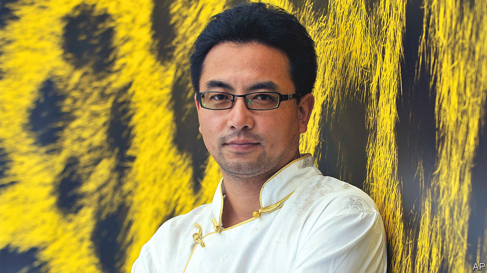

###### The long take

# Pema Tseden was the founder and builder of Tibetan cinema 

##### He did so by knowing exactly how to work round the Chinese authorities 

 

> May 18th 2023 

For 15 minutes, in a film called “Jinpa” made in 2018, a man drives a truck across a Tibetan plateau. He has dishevelled hair, a moustache and glasses; his truck has a picture of a lama on the windscreen and decorations on the cab roof. But the camera is not interested in him or in his vehicle. Its eye is on the immense landscape around him. In “Tharlo”, a film made three years earlier, the lens rests for 12 minutes on an elderly shepherd among his sheep. He is tiny; the hills are huge. Viewers are not asked to engage first with this character, but with the place. 

This, Pema Tseden would explain, was Tibetans’ way of looking. They would often gaze steadily, and for a long time, at clouds, peaks, bowls or leaves. He himself, as a student, would sit at the back of the class to contemplate a drop of water, or the view from the window. When he went into film-making, driven by his childhood passion for the films he had seen on outdoor screens in his remote mountain village, he carried with him the technique of the long, unmoving take. It was the rhythm of Tibetan life. 

That life had not been truly represented in cinema before. In Western or Chinese films about Tibet almost everything, clothes, manners, language, even thinking, was inaccurate. He set out to change that. His feature films—seven of them, with two more in post-production—were exclusively in the Tibetan language, shot on location there (often round his home region of Guide, in Qinghai province) and almost entirely with amateur Tibetan actors. They showed neither a mystery-land of fairy-tale splendour, as the West believed, nor barbarous peasants, as the Han Chinese occupiers thought, but building sites, boomtowns, cluttered kitchens, decaying temples and pasturelands bisected by barbed wire.

In this landscape people faced everyday problems: protecting their herds, finding actors for a village opera, dealing with an unwanted pregnancy, or merely getting from town to town in shaky vans or on battered motorbikes. At every turn, ancient tradition collided with modern ways. In “The Silent Holy Stones” a ten-year-old trainee monk, on a visit home, became obsessed with a TV series called “Journey to the West” and tried to take a videoplayer and monitor back to the monastery to show his teacher. In that case, the quiet Tibetan gaze was fixed on a flickering small screen. 

The stories were simple. So too was the screenwriting, since he was also a writer of novels and short stories, which fed into his work. Making the films, though, was difficult. Because Tibet had no cinema industry, it had no cinematographers, sound recordists, set designers or screen actors. As the first Tibetan to graduate from the Beijing Film Academy, he took it upon himself to persuade his cinema-loving Tibetan friends to go there too and train in the skills he needed. Later, they themselves became directors. They also put up money for his first films, since Tibet provided no other source. Some funding, however, came from China. 

That touched on his second problem. Since 1951 Han Chinese had been in charge in Tibet, and their presence and power were increasing. His writing he could pursue by himself, but if he wanted to be a film director he had to work with the Chinese state. He did not object to this fundamentally. The very films that had drawn him to cinema had been Chinese comedies and B-movies. He was fluent in Chinese, and had graduated as a translator; he also wrote in it, finding it made him think in an interestingly different way. At the Beijing Film Academy he devoured both the teaching and the library, where he watched a host of classic films he, and Tibet, had never seen. Freedom, he felt, was a relative concept. 

He therefore did not mind working within the official censorship system. Uncomplainingly he sent his scripts for review, and some were rejected. That taught him which topics to avoid. In general, he got round the censors with exceptional subtlety. The Chinese presence in Tibet was almost invisible in his films: a shop sign here, a TV news bulletin there. His themes might touch on national directives—the need to have an ID card, the one-child policy—but with no open criticism. A sharper culture-clash came in “Old Dog”, in which a herdsman refused to sell his mastiff, a breed much sought-after in China, to a Chinese businessman, because of a Tibetan tradition that animals should not be commodified. Even there, his son took the businessman’s side. 

Subtlety was called for in his public statements, too. In interviews, specially in the West, he kept his answers short and careful. Since he was quiet by nature, a slim, calm figure, this political astuteness hardly showed. He never initiated topics, and in group discussions a stray remark might often make him lose himself in thought. Silence was a good insurance policy.

It was also something long engrained in him. His parents had been nomadic herdsmen, and his happiest childhood memories were of his grandfather, a monk, who had brought him up. After school he was made to copy out Buddhist scriptures, learning both his written language and his spiritual culture. Several of his films explored Buddhist teachings on compassion, life, death and time, asking especially how far compassion should go. As far as the king Drime Kunden in the traditional New Year village opera, the theme of “The Search”, who gave away his wife and even his eyes to those who needed them more?

The teaching that permeated his films was impermanence. Earthly life was brief. Everything would disappear. This made him pessimistic, but also resigned to death, after which came the afterlife. His WeChat avatar was a single eye, the third eye, which opened into wisdom. True wisdom was to see the self, as Drime Kunden did, from the viewpoint of an outside observer.

That was the key. As a boy he would regularly herd sheep in the high pastures, sitting silently among them. Sheep were omnipresent in his films. He felt great loneliness there, but also the detachment that became so necessary later. By detaching himself, he could work happily within Chinese constraints. And he would rest his camera’s gaze less on fleeting human faces than on the vast Tibetan landscape before him, beyond argument, the long take. ■

