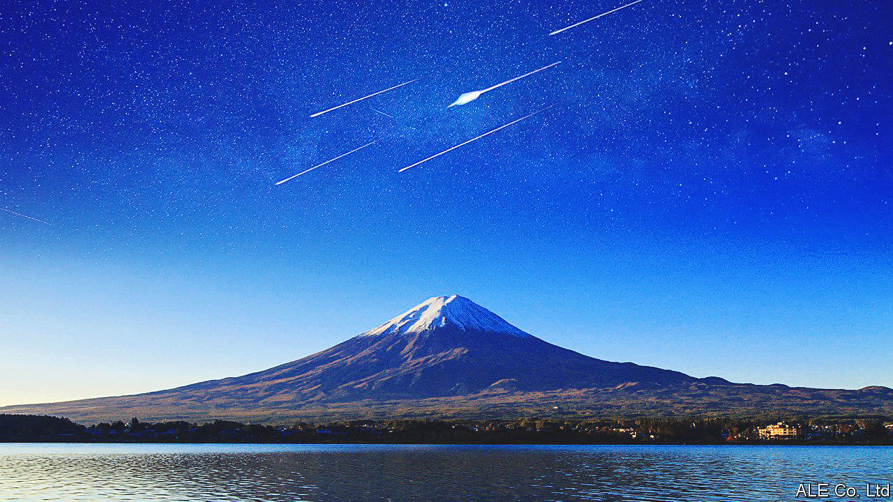

###### Painting the heavens

# Artists hope to turn selfies into comets 

##### A pair of space art projects hope to light up the sky 

 

> May 17th 2023 

For most of its history, spaceflight has been done with military, scientific or commercial motives in mind. But lighter-hearted uses are possible too. Wealthy space cadets can already buy trips into orbit (the next such mission, run by a firm called Axiom Space, is due to take four astronauts to the International Space Station on May 21st). Now two groups are planning to use the heavens for art. One wants to build an artificial comet; the other to set up man-made meteor showers.

Start with the comet. In a paper published in , Greg Pass, an academic at Cornell University, and his colleagues describe their plans for an art project that would allow up to a billion people to have tiny self-portraits launched into space and blown out by the sun, forming the tail of a man-made comet. 

Natural comets are space-going balls of rock and ice in highly elliptical orbits. When they are far from the sun, they are dormant and invisible. As they get closer, a mixture of radiation and the solar wind causes them to start spewing water and dust. Those tiny particles reflect sunlight, giving comets their spectacular tails. Dr Pass and his colleagues propose to substitute those grains of dust and ice with millions of tiny self-portraits. The project is called the Altimira comet, after a cave in Spain featuring neolithic handprints—”prehistoric selfies”, as the team describe them—on the walls. 

Natural comets are big, at least by earthly standards. Halley’s comet, which flies past the sun every 75 years or so and is easily visible from Earth, is about 15km across. The Altimira comet, by contrast, is designed to fly as a CubeSat—a miniature satellite 10cm on each edge. CubeSats are designed to tag along as passengers on the launches of bigger spacecraft. 

The CubeSat specification limits the satellite’s payload to a volume about the size of a cricket ball. Reproducing something approximating the effect of a natural comet from such a small space will be tricky. Each of the portraits must be tiny—about 12 millionths of a metre across. The plan is to etch them into silicon and then coat them with gold to help them sparkle upon release. The team has proposed an orbit that would see the comet pass within 15,000km of Earth—a hair’s breadth in space. Even so, big telescopes would be needed to see the resulting display. 

Still, the plan seems technically feasible. The paper demonstrates that making the gold-coated selfies can be done at scale. With the help of electron-beam lithography, Dr Pass and his colleagues produced 5m of them and suspended them in a vial of water. They are working with a Japanese chip-making firm called NuFlare Technology to scale up production. 

The artificial meteor showers, meanwhile, are the brainchild of ALE, a firm based in Tokyo. Natural meteor showers are caused by small particles of dust and rock burning up in Earth’s atmosphere. ALE hopes to recreate the phenomenon on demand by filling small satellites with tiny spheres about 1cm across. 

Putting the satellite in the proper orbit, and releasing the spheres at the right moment, would allow it to create spectacular meteor showers anywhere in the world. The company reckons its ersatz meteor showers should be visible from about 200km away. And because its meteors will be travelling more slowly than the natural kind, each streak of light should remain visible for longer. 

As is  for any self-regarding art project, both endeavours strike a high-minded tone. Altimar’s billion selfies, apparently, will be an “individually expressed act of collective participation”. ALE hopes to “contribute to the sustainable development of humankind”. But plenty of unglamorous engineering will need to be done first. The Altimira comet will need to scale up its selfie-production process and find a suitable rocket on which to hitch a ride. ALE was originally due to test its idea with a satellite launched in 2019, but was stymied by technological problems. It now plans the first demonstration for 2025. ■


