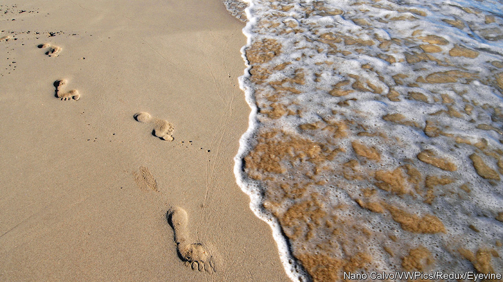

###### The DNA dragnet

# Humans shed genetic information everywhere they go 

##### There is enough of it to easily identify individuals 

 

> May 17th 2023 

In the genetic age, ecologists’ jobs are made much easier by two things. One is that every organism carries its own chemical identity card, in the form of its genome. The second is that they drop these ID cards everywhere they go. Urine, bits of fur stuck to a hedge, even shed skin cells: all deposit DNA into the environment. Cheap gene sequencing allows scientists to harvest this “environmental DNA” (eDNA) from soil, sand, water and the like, and use it to keep track of which species are living where.

“Every organism,” of course, includes humans. In a paper published on May 15th in , a group of researchers from America and Europe report that such eDNA surveys pick up large quantities of human DNA too. That DNA can be read—and potentially matched with individuals—by anyone with the right equipment. 

The researchers did not set out to study “inadvertent human genetic bycatch”, as they call the phenomenon. The work began at the Witney Sea Turtle Hospital in Florida, during an investigation into a viral turtle disease. The researchers sampled water from the turtle’s tanks, as well as from ocean water and beaches upon which the creatures nested, looking for viral DNA. 

They expected to sweep up DNA from other species during their trawl. What was surprising, according to Jessica Farrell, a biologist at the Witney Hospital and one of the paper’s authors, was just how much human DNA they found. Even though many of their sampling sites were not near towns and cities, they found human genetic material in every sample they examined. 

Intrigued, they expanded their search. In both Florida and in Ireland they found human DNA in rivers, with concentrations especially high as they flowed through towns. They found it in beach sand, and even in air from rooms in which humans had been working. Human DNA is not quite everywhere: it was not detectable in deep-ocean water, or on remote beaches closed to the public. But anywhere that humans are, their DNA appears to be as well.

In one sense, that is unsurprising. But advances in gene-sequencing meant there was enough information in the samples to deduce plenty of things about the humans in question. The researchers could pick out males thanks to DNA from the Y chromosome. They could infer an individual’s ancestry, and even spot mutations that affect susceptibility to disease. David Duffy, another of the paper’s authors, said the amount and quality of the DNA they recovered “far exceeded” the minimum necessary to be included in America’s database of missing people. Dr Duffy and his colleagues did not try to identify individuals in their study, for ethical reasons. But they had no doubt it could be done.

All this raises uncomfortable questions. The most immediate probably apply to scientists themselves. Most countries have far stricter rules governing the collection of human DNA than of other sorts. If studying eDNA in turtles—or any other organism—necessarily involves gathering human genetic information too, ecologists will have to be more careful with their data. 

In the longer run, the researchers speculate about all sorts of uses. Police might trawl room air to help establish a crime suspect’s movements. Prompted by covid-19, many countries are beginning to use genetic surveillance of waste-water to track viruses. Crunching the human DNA too, especially at the level of individual streets, might have health benefits, such as quickly spotting cancer-causing mutations in people’s genomes. It could also allow governments to build up uncomfortably detailed pictures of their populations.

For now, all that may seem fanciful. But the cost of genome sequencing has fallen a hundred-thousand-fold since the turn of the century. Opportunistically analysing the human DNA that suffuses the environment is only going to get cheaper and easier. As the ecologists can attest, it offers another way for humans to keep track of who, exactly, their fellow humans are—and what they are up to. ■


