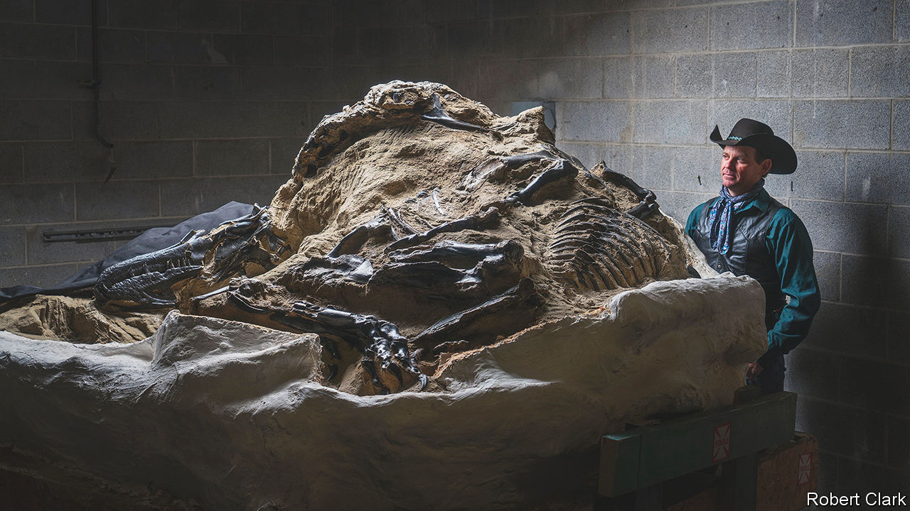

###### Digging up the money

# The market for dinosaur fossils is booming 

##### To the chagrin of some palaeontologists 

 

> May 17th 2023 

In the badlands of central Montana, Clayton Phipps, a third-generation cowboy, makes his living wrangling metre-long horns. It is a lifestyle he inherited from his father and grandfather. But in Mr Phipps’s case the horns in question belong not to Montana’s herds of Angus and Hereford cattle but the three-horned dinosaur .

“I describe myself as a dinosaur cowboy,” says Mr Phipps. Others would call him a commercial fossil prospector. Mr Phipps spends his time finding, digging up and preparing fossils to sell to prospective buyers. In 2006 he hit the headlines when he discovered “Duelling Dinosaurs”, the complete skeletons of a  and a  buried alive by a landslide while locked in a fatal embrace. Pictured above, it is perhaps the most spectacular fossil specimen ever found.

Prospectors such as Mr Phipps supply a flourishing market for dinosaur fossils, fuelled by well-heeled private collectors. The boom started in 2018 when Aguttes, a French auction house, sold the almost-complete skeleton of a carnivorous dinosaur (thought to be a relative of ) for $2.4m at a glamorous event on the first floor of the Eiffel Tower. It took off in earnest when Christie’s, a London auctioneer, sold “Stan”—one of the most complete  fossils ever found—for $31.8m in 2020, a record. 

“There has been a serious uptick in demand for dinosaur specimens since then,” says Cassandra Hatton, head of natural history at Sotheby’s, yet another auction house, this time based in New York. In the past two years, at least six specimens have sold for $6m or more, including the “Duelling Dinosaurs” in 2020. The next big sale is likely to come at the end of July, when Sotheby’s is due to auction off another nearly complete skeleton—though it is, for now, tight-lipped on the details.

For some scientists all this is a travesty. The qualities that make fossils attractive to collectors—rarity, uniqueness and completeness—are also the ones that make them scientifically valuable. That has led to rows in the field, with some worried that the influx of private buyers is bad for science. “There is concern that museums and other tight-budgeted public institutions will be priced out of access to valuable specimens,” says Professor Paul Barrett, a palaeontologist at the Natural History Museum in London. In an open letter to Christie’s in 2020, the Society of Vertebrate Palaeontology (SVP), an American scientific body, warned that “fossil specimens that are sold into private hands are potentially lost to science.” 

Bones under the hammer

That has certainly been the fate of some fossils. The dinosaur auctioned by Aguttes in 2018, which may have been a new species, was sold to an anonymous French art collector and has not been seen since. For that reason, many scientific journals—including  and the —refuse to publish studies on privately held fossils. The SVP would like journals to go further, and exclude private specimens that have been given to museums on long-term loans.

Not all palaeontologists agree. Dissenters point out that the evidence that private collectors really are pricing museums out is mixed. The secretive buyer who bought “Stan” at Christie’s in 2020—amid much opprobrium—was revealed in 2022 to have been the Abu Dhabi Department of Culture and Tourism. It bought the fossil as a centrepiece for the Abu Dhabi Natural History Museum, which is due to open in 2025. Likewise, “Duelling Dinosaurs” will, by the end of the year, become the main attraction at the North Carolina Museum of Natural Sciences. Both specimens will be available for scientists to study as well as for the public to admire.

Even when specimens do end up in the hands of private collectors, their owners are often happy to support scientists. Niels Nielsen, a former Danish investment banker, bought “Tristan”—a jet-black —in 2014, then offered the fossil to the Natural History Museum in Berlin on long-term loan, free of charge. “Tristan” has rotated between the Natural History Museums of Berlin and Copenhagen ever since. 

A similar arrangement has been announced for “Big John”—the largest specimen of  ever found. In 2021, “Big John” was sold for $7.7m to a buyer later revealed to be Siddhartha Pagidipati, an American businessman. The fossil is due to be sent on long-term loan to the Glazer Children’s Museum in Tampa. “Our interest in purchasing “Big John” and other specimens is first and foremost to make them available to the public and for research,” says Mr Pagidipati. 

Not everyone agrees with research bans in journals, either. Oliver Rauhut is a curator at the Palaeontological Museum in Munich and one of almost 50 signatories to a letter published in in 2020 criticising the SVP’s proposals. He has pointed to the example of . First described in 1861, this was an early species of feathered dinosaur that helped prove that modern birds are descended from the ancient reptiles. Every one of the dozen known specimens of  was found, collected and prepared by enthusiastic private collectors. Excluding such fossils from the scientific literature simply because they are privately owned “seems arbitrary”, wrote Dr Rauhut in a paper on the topic. 

Others argue that scientists in the field, despite their noble motives, could use some help. “Every year, thousands of fossils around the world are exposed to the elements by ordinary geological processes before being weathered to dust without a trace,” says Ms Hatton, of Sotheby’s. In December 2022 her firm sold “Maximus”—a remarkably intact  skull—for $6.1m. The rest of the specimen, barring a badly eroded clavicle, had crumbled from exposure to ice, wind and rain. If it had been found earlier, she says, more of the skeleton might have been recovered. “In the real world, most public institutions barely have the necessary staff and funds to ensure basic operations,” says Dr Rauhut, who thinks private collectors can provide useful support for public institutions. 

Almost all of the fossils bought at auctions in recent years were taken from the Hell Creek formation, a geological deposit that spans much of Montana, Wyoming and the two Dakotas. There is a good reason for this: in America, there is clear legal precedent guaranteeing that fossils discovered on private land belong to the landowner and can be legally traded.

That is unusual. Besides Hell Creek, the most important fossil-bearing deposits in the world are in Qinjiang in China, the Gobi Desert in Mongolia, Campanha in Brazil and Argentine Patagonia. In all four countries, dinosaur fossils are considered the property of the state. That does not stop trade—but it does push it into the black market, where crime syndicates smuggle fossils across national borders. Given their illegality, such fossils are unlikely ever to end up in a scientist’s hands.

That belongs in a museum

The keenest supporters of privatised fossil-hunting argue that the growing legitimate market might help curb the dodgy one. Big Western auction houses, often pilloried for enabling sales to anonymous billionaires, demand the same sort of provenance assurances as they do for fine art and antiquities. The hope is that will make it harder for unscrupulous dealers to pass off ill-gotten specimens as legitimate. “It may not always seem like it,” argues Ms Hatton, “but we are all on the same side.” ■


