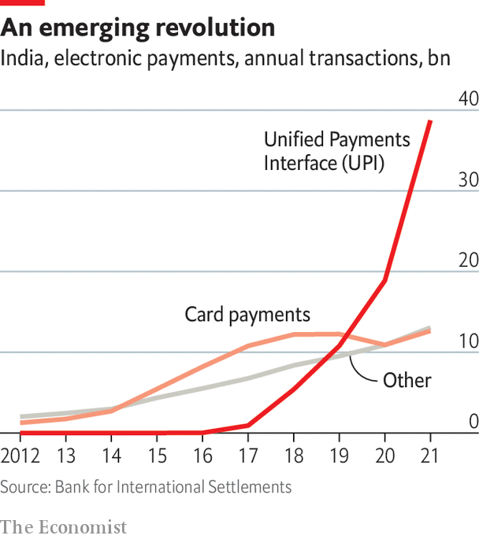

###### Emerging markets

# A digital payments revolution in India 

##### How emerging economies from India to Brazil built alternative payments models 

 

> May 15th 2023 

Take a walk on Mumbai’s Juhu beach and little has changed in five years—except for the QR codes adorning every food stall. Go to São Paulo in Brazil, Beijing in China, or many other cities across the emerging world and you find something similar. “Most people only want to use UPI,” says Govind, a seaside-snack vendor at Juhu, referring to India’s fast-growing payments network. 

The Unified Payments Interface (UPI) is a platform that allows free and fast account-to-account transfers using fintech apps such as PhonePe or Google Pay. Unlike Alipay in China, it is open, so users are not locked into a single company and can take their financial history to competitors, notes Praveena Rai, the chief operating officer of the National Payments Corporation of India (NpCI), which manages the platform. And it is facilitated by QR codes or easy-to-remember virtual IDs.

UPI is drawing attention from across the world. “Look at what India has accomplished with the UPI, Aadhaar and the payments stack,” Sundar Pichai, Google’s CEO, has marvelled. Overall, it processed over $1trn in transactions in 2022, equivalent to a third of India’s GDP. It was bolstered by the government’s surprise “demonetisation” of 2016, when multiple high-denomination banknotes were discontinued. UPI also benefited when covid left consumers scared of cash. It has grown from around 17% of 31bn digital transactions in 2019 to 52% of 88.4bn transactions by 2022. “India leads the world in real-time digital payments by clocking almost 40% of all such transactions,” Narendra Modi, the prime minister, has boasted.

The Indian model is inspiring others. Brazil’s Pix, which facilitates bank-to-bank payments with a small fee, was launched in November 2020. It now accounts for some 30% of Brazil’s electronic payments (credit and debit cards take up around 20% each). Such open instant-payment systems are an alternative both to the bank/card model in the rich world and to the closed fintech one in China. “What we have shown is that it doesn’t cost that much to move money if your network is well designed,” says Nandan Nilekani, co-founder of the Indian tech giant Infosys, and an architect of India’s “digital stack”, including UPI. 

An even bigger prize than efficiency is the chance to supercharge development. Raghuram Rajan, a former Reserve Bank of India (RBI) governor, notes that digital payments generate real-time data on sellers’ businesses and buyers’ purchasing habits. That allows lenders or insurers to reach customers who may have neither the financial history nor enough assets to participate in traditional finance. As Patrick Collison of Stripe, a payments firm, puts it, “The provision of credit is more socially valuable the less legible the creditworthiness of the borrower.” 

Digital development

Digital forms of money have long been a source of progress in emerging markets. In 2007 M-PESA, a mobile-money service, was launched in Kenya by the telecoms giant Safaricom. Users give cash to designated agents to top up an account linked to their phone’s SIM card. Payments are sent by SMS to friends, family or retailers. M-PESA is now used by over 90% of Kenyan households. It makes it much easier than before to send money to relatives over distances. Consumer spending tends to go up when money can be moved with less friction. Academic estimates suggest that M-PESA has reduced extreme poverty in Kenya by at least 2%. 

In China Ant Group, which was spun out of Alibaba, an e-commerce giant, and its fellow payments firm, WeChat Pay, have largely digitised the payments business. Once the fintech behemoths have lured consumers, they can offer loans and other financial services, helped by algorithms that gobble up data. More than 90% of digital payments in China now occur on these two apps. Before the recent government crackdown, Ant was involved in over 20% of Chinese short-term consumer credit. But Chinese fintech firms have had several high-profile clashes with the government: Ant’s planned flotation was blocked and the lending of fintech firms was forced to shrink. Yet Christopher Beddor of Gavekal Dragonomics, a China-based research firm, says the worst of the attack on tech is over. In December 2022 Ant won approval to raise $1.5bn in capital.

The Alipay model is being widely copied elsewhere. PayTM, an Indian fintech giant that listed publicly at a value of nearly $20bn in 2021, has tried to replicate Alipay by creating a similar closed fintech ecosystem in India. It counts Ant as one of its biggest investors. Grab and Gojek, two South-East Asian superapps, have pursued similar attempts at digitisation.

The benefits of digital finance tend to be bigger in emerging economies than in the rich world, says Saurabh Mukherjea of Marcellus, an asset manager. That is because people in rich countries already have access to most modern financial services through well-kept record systems, as well as assets that can be collateralised. The hope is that UPI and similar systems might now let some poorer countries leapfrog the West. The Indian government has given nearly all households a bank account in a scheme called “Jan Dhan Yojana” that is making UPI far more accessible. New payments systems may even foster a credit boom. EY, a consultancy, says that fintech lending in India reached $270bn in 2022, up from just $9bn a decade earlier. This could be supercharged by the Account Aggregator scheme, which, like open banking in Europe, allows users to carry their financial history to a competitor.

Open payments systems may not produce another giant with the clout of Ant in China. Alipay charges 0.1% for withdrawals above a certain threshold. Retailers pay an average of 0.55% in transaction fees. Its lending division once made comparable revenues. That open payments reduce the likelihood of a similar Indian giant emerging is partly by design. “Without UPI we’d get something like Ant without the tools to deal with it,” says one Indian grandee, referring to the inability of the government to curb monopoly abuse.

State support has been critical to the open platforms’ success. Chinese fintechs thrived partly because of scant regulation. India’s central bank has heavily promoted UPI, even requiring retailers above a particular size to accept it. It also mandates zero fees and subsidises participants. Brazilian banks are similarly mandated to offer Pix. Though it is not free, its fees average only around 0.2% for traders, compared with over 2% for credit cards.

Competitive advantage

Boosters of India’s system like noting that UPI promotes competition among fintechs and banks. Consumers want to use the most accepted payment systems; retailers similarly need access to the widely used. That is why card networks or closed systems often end up favouring a few players. Visa and Mastercard dominate the rich world, as Alipay and WeChat Pay dominate China, giving them huge market power. The architects of UPI and Pix see their models as breaking such a trend to concentration. “We see UPI as a public utility,” says Ms Rai of NPCI.

Yet the state-led, zero-fee model has downsides. Indian bankers claim that a shortage of revenue has dissuaded banks and fintech firms from investing in consumer protection. “There are tech costs, maintenance costs, fraud and dispute costs,” complains one. “Why would a financial firm incur all those expenditures when there’s no revenue stream?” asks Ajay Shah of the XKDR Forum, a think-tank in Mumbai. “This is a wake up call…maybe the answer is to charge a little more,” says Mr Rajan, the former RBI governor. 

Ms Rai counters that UPI’s zero cost boosts economic growth. The government compensated banks and some fintechs with just over 2,000 crore rupees ($250m) in 2022 as a subsidy for their public service in sustaining UPI. But that is a paltry 0.025% of the total value of transactions, and also far less than what it costs to run the UPI system, reckons one banker. Despite calls either to allow fees or to raise the public subsidy, India’s 2023 budget will cut it by about 25%. 

 


Customer protection has suffered. A survey by Renuka Sane, an Indian economist, and her co-authors, found that 18% of UPI users had some grievance with the system, such as fraud or a mistaken payment. Less than 30% have seen their complaints resolved. Uttam Nayak, a former boss of Visa in India, notes that, although UPI has rapidly growing volumes, the overall transaction value has not taken off as much. Consumers prefer safer payment methods for big-ticket items. “I use UPI to buy chai. But I wouldn’t use it for a plane ticket,” says one architect based in Mumbai.

There are other flaws with UPI. Transaction success rates, a key metric that can encourage more spending, are lower than for payment systems in developed markets. Financial-data sharing, which promotes competition among banks and unlocks access to credit, has been slow to take off. Sahamati, an association of account aggregators, finds that the number of linked accounts has grown to 5m in April 2023. But that is small when set against India’s vast population. 

Developing UPI will require more investment. Ms Rai notes that it offers a useful customer-acquisition channel for banks and fintechs that could benefit from its massive amounts of data. “We see digital payments as a way to onboard customers,” says Harshjit Sethi, managing director at Sequoia India, a VC firm. “Then you layer other financial services around them…like the holy grail of lending.” Sameer Shetty of Axis Bank, one of India’s largest, says that “Account aggregator is where UPI was in 2017.”

But such change can happen only if the fintechs are let in. BhratPe, one leading Indian fintech, has a lending licence. Others such as PayTM, Google Pay and PhonePe do not. Politics could get in the way. A paper from the RBI in August 2022 looked at fees for larger value payments. Insiders familiar with the NPCI, the RBI and the finance ministry say the first two are open to transaction fees, but the government has all but shut the door on the idea.


 Will state-directed entities be able successfully to maintain such a technologically advanced payment system? “What you want is for the market to churn rather than picking winners,” says Mr Shah of the XKDR Forum. “UPI was central planning.” Even those who champion UPI see a need for multiple payment options. One grandee talks of “concentration risk”. They note that “If NPCI goes down, then the whole payment system goes down,” adding that there “could be a role for a second NPCI.”

No instant-payment system is perfect, but UPI is a clear improvement on cash. In March the RBI launched UPI for feature-phones equipped with buttons, not touchscreens, which could expand access to the system. And it is spreading abroad. Already UPI is integrated with Singapore’s payments system, letting people send remittances with a relatively low 3% fee. India wants UPI to become a payment option abroad, just as Alipay is widely accepted outside China. Ms Rai says other countries may even adopt the entire UPI stack. Mr Nilekani hopes UPI will eventually be used everywhere. “If I go to Lulu in Dubai or Harrods in London, I should be able to make a payment with UPI.” That would surely create new competition for the bank/card behemoths in the West.■

