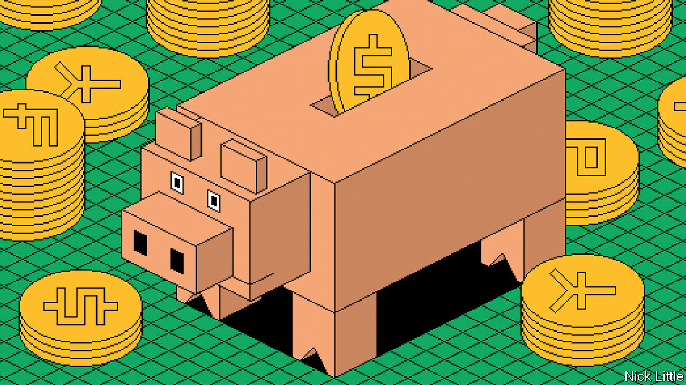
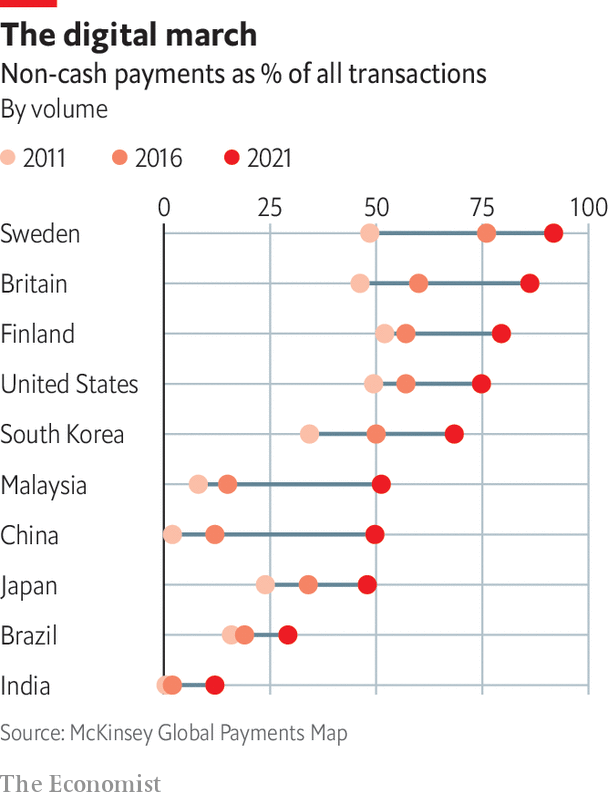

###### Digital finance

# As payments systems go digital, they are changing global finance 

##### The fight over payments systems is hotting up around the world. There may be surprising winners, says Arjun Ramani 

 

> May 15th 2023 

Payment is one of the most fundamental economic activities. To buy anything, you need something the seller wants. One option is barter, but that is beset by friction (what are the chances of having something your counterparty wants at any exact moment?). Early forms of money, from cowrie shells to beads to metal coins, offered a solution: they were always in demand to settle transactions. But they came with their own problems, from counterfeiting and delay to not having enough when needed (illiquidity). The use of credit for trade, first recorded in Mesopotamia five millennia ago, changed the game. It provided immediate liquidity, boosting commerce, but it also required trust and verification, introducing a fresh set of issues.

For centuries humans have mostly used physical objects, including cash, to transact. Banks were originally meant merely to safeguard commodities such as grain, rather than being linked to consumer payments. Later, cheques became tied to bank accounts. The first credit cards (Diners Club in 1950) and cards with magnetic stripes (American Express in 1971) started a broader shift away from paper money and cheques for retail payments. But they were mostly limited to developed economies and to affluent customers of banks, still the central nodes of finance.

Now a new wave of digitisation, driven by the arrival of smartphones and the internet, is changing payments systems again. By making possible near-instant, remote payment, it massively reduces friction in the movement of money. This both facilitates trade from a distance and leaves a clear auditable trail. Digitised forms of payment can also become a basis for the provision of broader financial services, an especially important change in poorer countries with less developed financial systems. 

 


The arrival of digital-payment platforms promises to create new kings of the highly lucrative global payments system, which recorded some $2.1trn in revenues in 2021. Out with lumbering banks, expensive credit cards and grimy physical cash, it suggests. Instead, in with flashy crypto protocols, seamless fintech wallets and even digital central-bank money. Some of the excitement around this has been excessive. But this special report argues that the system of moving money around is indeed undergoing massive change. The share of cash-based transactions is plummeting, having fallen by an average of 25 percentage points in the world’s main markets from 2011 to 2021. Emerging economies are seeing some of the biggest drops (see chart). Digitisation is a big part of this shift away from cash.

Various systems are emerging around the world, each with its advantages and drawbacks. And it is not always new fintech firms, digital newcomers or fancy cryptocurrencies that are leading the rewiring. Often, it is a combination of state-led systems and incumbent banks that are adopting new technology. Thus in India and Brazil, new state-sponsored payment platforms have become the dominant forms of non-cash payment, bringing hundreds of millions of previously unbanked citizens into the formal financial system. In the West the bank/card model has, despite its fintech challengers, remained largely intact even as digitisation takes hold. China’s closed fintech apps and new settlement system may yet spread across Asia and also reduce the region’s dependence on the dollar. 


There are big implications in all this for relations between money and the state. Some governments may be using digital finance to help police their own people. The West may find that the spread of digital-payment platforms means it loses some financial clout. Frictionless movement of money may make for greater efficiency, but it could foster financial instability by making it easier for customers to withdraw bank deposits, a lesson seen in the failure of Silicon Valley Bank, which was preceded by a bank run.

Just as with any new technology, digital finance has had its share of hype. But modern digital-payment platforms are clearly challenging the old order. Traditionally banks were the entry point to formal finance. Now payments through apps that use QR codes, fast payment networks and high-speed internet connections have become the gateway for many. As users begin sending and receiving money, the data that such platforms collect can help unlock other financial services such as loans and insurance.

A good example is China’s Alipay, initially an escrow service for Alibaba’s e-commerce platform. Before this, notes Jack Poon of Hong Kong Polytechnic University, “You had to go to a street shop to buy video-game points in-person.” Alipay, which drew inspiration from the servicing of eBay by PayPal, a payments firm, boosted e-commerce by using smartphones and QR codes to scale up fast. Along with its counterpart WeChat Pay, it now processes some 90% of Chinese digital payments. “People look at you funny if you try to pay with cash,” notes Mr Poon.

A payments upheaval 

As the world started going increasingly cashless, and with record-low interest rates making money in effect free, a frenzy erupted around digital finance in the summer of 2020. Hundreds of new crypto protocols were launched, and many earned interest on crypto-deposits of 20% or more at seemingly no risk. The market value of the cryptosphere grew to $3trn in 2021. China’s Ant Group, a payments and lending firm, began gearing up for a blockbuster listing at an expected valuation of over $300bn. By summer 2021 PayPal was worth around $350bn, putting it close to JPMorgan Chase, the world’s biggest bank, and Visa, the largest card network (then valued at $450bn and $520bn, respectively).

However the frenzy proved short-lived. The market chaos of the past year, triggered by rising interest rates and the fallout from Russia’s invasion of Ukraine, has humbled many digital challengers. The first market to correct was China itself. In November 2020 the Chinese government halted the planned flotation of Ant Group. It was a forewarning of what was to come. The market value of all cryptocurrencies has dropped by nearly three-fifths since its peak in 2021.  estimates that the world’s 100 largest public and private fintech firms have seen their collective market value cut by half since then.

Yet despite these market ructions, three lasting changes have emerged from the upsurge in digital finance and new payments platforms. First, the debate in richer countries over whether crypto or fintech firms will end the reign of banks and card networks has been all but settled. Crypto has shed its go-getting reputation, and is struggling to demonstrate its usefulness. Whizzy fintechs will doubtless keep growing. But the old bank/card model has adapted better to digitisation than many who predicted revolution expected. 

In some cases the subtle alliance between banks and the state has bolstered this stability. In China the crippling of Ant Group by the government let banks remain prominent in lending. In America Facebook came too close to finance when it tried to launch its online currency, Libra, and was forced back. Apple Pay and Google Pay are growing, but for now play only a niche role in payments. And crypto has split into two parts: a regulated piece that may become indistinguishable from traditional finance, and a less regulated one that operates mostly in flailing economies like Argentina.

The second big change is that emerging markets have developed open payments systems. They provide an alternative to both the bank/card model in the rich world and the closed fintech giants of China. Indeed, it is possible that through instant bank account-to-account transfer systems in Europe, and the roll-out of the Federal Reserve’s FedNow instant-payments service in America, the rich world may come to copy the best systems from the emerging world.

A third change is that many governments are taking steps to reduce their dependence on Western payment networks and on the dollar. Such efforts, which have a long history, have been accelerated by sanctions imposed on Russia after its invasion of Ukraine. Several countries have built national alternatives to card networks like Visa and Mastercard. China is deploying an alternative to the SWIFT international messaging system for banks. 

Some countries are also building multilateral payment linkages that allow citizens to use their domestic favourites abroad. UPI wallets from India can now be used in Singapore. Alipay wallets from China are accepted everywhere from Dubai to Washington, DC. GrabPay of Malaysia is usable across much of South-East Asia. China is leading the creation of an Asian payments system, with the yuan as the primary currency. As technology cheapens possible alternatives to the dollar, they may come to challenge the West’s grip on international finance. 

For control over payments systems confers massive political power. They are used to collect taxes and distribute benefits. They leave digital trails that ensure economic activity is more visible to the state, making tax evasion and organised crime harder to sustain. It is no surprise that many governments should be cracking down on crypto, which promised permissionless access to payments. America has just levelled charges against Binance, the world’s largest crypto exchange, for evading American regulations. China is trying to ban crypto. India has restricted its use. 

This report will describe the differing payment models, contrasting the bank/card networks in the rich world with the fast payments systems in emerging markets and the closed fintech ones in China. It will assess the possible role of cryptocurrencies and central-bank digital money. And it will look at how some governments may seek to use digital finance to reduce their dependence on the West. A good place to start is where the most exciting action is: the emerging world.■

