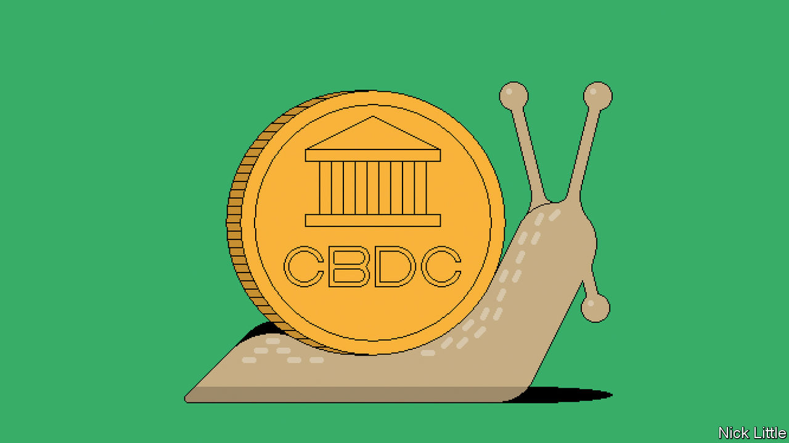

###### Digital money

# Central-bank digital currencies are talked about more than coming to fruition 

##### The roll-out of central-bank digital currencies is proving slower than expected 

 

> May 15th 2023 

In 1992 the Bank of Finland, the country’s central bank, launched a curious card called Avant. It looked like a debit card, except that it was meant to replicate the properties of cash. The money stored on an Avant card was backed by the Bank of Finland rather than a commercial bank, which made it, the bank claims, the world’s first central-bank digital currency (CBDC). Cardholders did not have accounts with the bank. Instead their monetary value was tracked by chips physically inserted into them. As with cash, that meant that users were anonymous. Avant ran for three years before being privatised and later discontinued. It saw little uptake compared with other payment channels, such as credit cards with reward points. And it failed to make money. 

It took another 30 years for the idea of central-bank digital money to be seriously revived. As recently as 2016, almost no central banks were seriously looking at CBDCs. Now most are. Declining cash usage, the rise of cryptocurrencies and Facebook’s possible launch of a digital currency called Libra all pushed central banks to look for ways to avoid losing control of their financial systems. Fully 114 countries, representing over 95% of world GDP, have now launched or are exploring CBDCs, up from only 35 in mid-2020, reckons the Atlantic Council. At least ten have fully launched, with China being the largest to run a pilot.

Despite the hype, a small but growing group of politicians and central bankers are questioning the purpose of CBDCs. In January 2022 a report by Britain’s House of Lords concluded that “We have yet to hear a convincing case for why the UK needs a retail CBDC.” In March Sweden’s Riksbank released a 900-page report concluding that the case for an e-krona (in a place with a high degree of cashlessness) was not strong. It has been joined by others that see little advantage in pursuing a CBDC, given the advanced nature of their banking and payment systems. 

Yet it would be wrong to write off CBDCs. Central banks are the ultimate settlement institution of any financial system. A “wholesale” CBDC, accessible only to certain financial institutions, could make payments systems more competitive by giving fintechs access to central banks directly rather than through banks. CBDCs might help upgrade cross-border payments, making possible instant settlement across pairs of currencies. Even for countries that have advanced payment systems, there is a case for a CBDC to influence standards governing the design of newfangled currencies. It is not inconceivable that CBDCs could one day go mainstream. Despite recent scepticism, the hardly hypeish deputy governor of the Bank of England, Sir Jon Cunliffe, has said it is likely that a “digital pound will be needed in the UK.”

The impact of CBDCs will depend greatly on their design. All are liabilities of a central bank, meaning they do not come with the risk of deposit runs on commercial banks. Some use private blockchains, others do not. Yet the fully launched CBDCs and pilots, from the Bahamas to China to Nigeria, have converged on a few common principles. They are typically intermediated by commercial banks and work with private wallet-providers, limiting the complexity of managing them. The Bahamian sand dollar and Nigeria’s e-naira, the earliest to launch, have caps on how much users can hold. China’s e-CNY, the largest-scale CBDC pilot, is similar. None bear interest and all have zero transaction fees, at least for now. The reason for usage caps and zero interest is to avert large outflows of deposits from commercial banks into CBDCs. 

How are the experiments faring? The sand dollar, e-CNY and e-naira have seen little uptake despite high-profile launches. In March the  reported that most shops in China rarely take payments in e-CNY. Some 26 cities are participating in the pilot. Data from the PBOC, China’s central bank, found that only some 13.6bn yuan ($2bn) was in circulation in January. A total of 261m wallets were created by the start of 2022, yet only 100bn yuan ($14bn) was transacted between October 2020 and August 2022. The reason, say some Chinese users, is that Alipay and WeChat Pay already work well, so many retailers cannot be bothered with e-CNY.

Other central bankers are watching with interest. Some have dropped the idea altogether. The central bank of Denmark (which already has a highly digitised payments system) has said “It is not clear how a retail CBDC…can contribute to better and more secure access to payments.” The Bank of Japan started piloting a CBDC in 2021 but “has no plans to issue” it. Finland, perhaps remembering Avant, also has no plans (though it supports a digital euro to improve cross-border payments across Europe). The problem, says an economist at one central bank, is that most of the potential value of a CBDC can be realised within the existing system.

What might drive more adoption? Some governments are encouraging CBDCs through incentives. Nigeria is offering 5% discounts to those who use the e-naira to pay for rickshaws. Like others, it is motivated by the need for greater financial inclusion, as much of its population is unbanked. China has handed out “red envelopes” with free e-CNY. It has also long struggled to coax fintech firms such as Ant and Tencent to hand over access to real-time transaction data. That gives it an incentive to put the e-CNY in the centre of commerce. 

Others focus on what might make CBDCs special. Lewis Sun, who heads emerging payments for HSBC, a bank, thinks that although using CBDCs for payments alone may not be that different from existing wholesale payment systems, “Programmable money is unique.” Rich Turrin, a Shanghai-based author of the book “Cashless” about China’s CBDC, describes an experiment in the province of Chengdu, where reports suggest six farmers were given e-CNY with smart contracts stipulating that it could be used only for farming purposes. Some think this could be a step towards a dream of fine-grained more efficient control over the entire economy. CBDCs could also help countries perform the messaging and movement of funds required for cross-border transactions, possibly bypassing the dollar system, suggests Mr Turrin.

Yet these possible futures all remain experiments for now. “It is still early days,” admits Mr Turrin. In that, at least, it is not unlike the crypto industry.■

