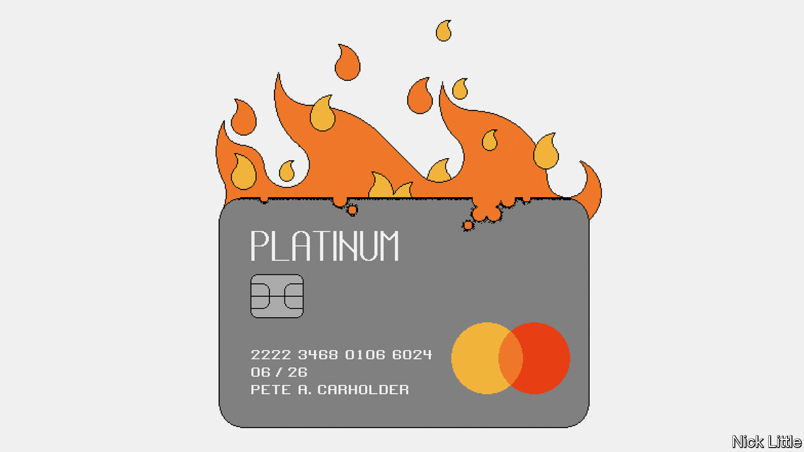
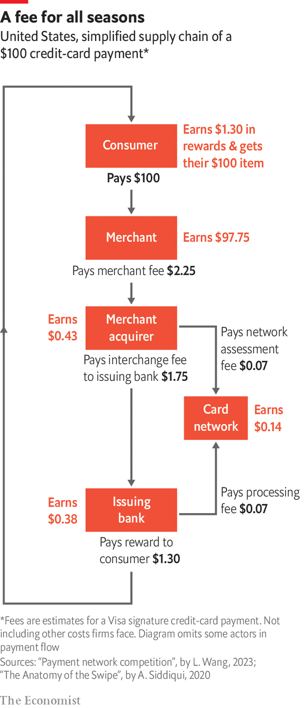
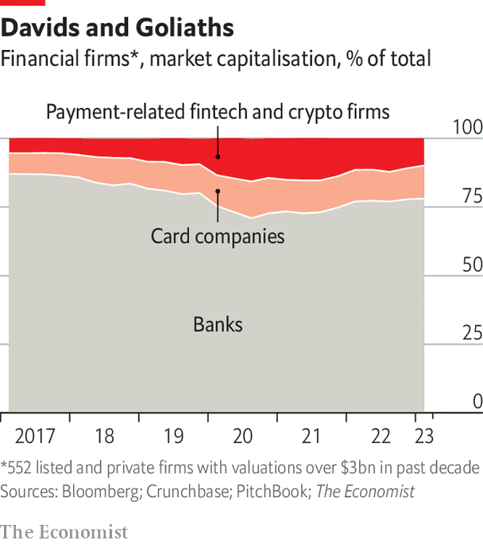

###### Techfin v fintech

# The old bank/card model is still entrenched in the rich world 

##### Banks and card networks have proved remarkably resilient in the face of digital competition 

 

> May 15th 2023 

Last October Italy’s new right-wing prime minister, Giorgia Meloni, chose card fees as one of her early targets. Her quarrel was with charges levied on card payments that go to processors, networks and banks. Angered by the policy of her predecessor, Mario Draghi, to fine firms that rejected digital payments, she called card fees a “hidden tax” on small businesses. Ms Meloni also suggested raising the limit on how much cash was allowed for large transactions, though she later backed away from this.

Everyone complains about card fees. Smaller firms sometimes even refuse cards or impose surcharges. Yet businesses in Europe have it better than most, for fees are usually capped at 0.3% for credit cards and 0.2% for debit cards. In America credit-card fees are uncapped. Moreover cash imposes costs of its own, including slow processing and the chance of greater tax evasion. 

The rich world’s payments systems were designed long before the internet. “The system in the West hasn’t really fundamentally changed in 50, 60 years,” observes Luca Bocchio of Accel, a VC firm. Alex Rampell of a16z, another VC firm, points out that the numbers needed to use a card are plastered directly onto it, as cards came before the era of two-factor authentication.

One reason for optimism over new digital finance and the fintech boom is that banks and cards look ripe for disruption. By our calculations, in 2019 crypto firms and fintechs accounted for around 9% of the global market capitalisation of large listed and private payment firms, including banks and card networks. By the third quarter of 2021 that share had almost doubled to 15%. Yet it has since fallen back to nearer 10%. Banks and card networks have proved resilient, especially in America. Part of the reason is that rising interest rates have crushed some budding fintechs, whose valuations are based on expectations of future growth. Banks, by contrast, capture an “interest-rate spread”, the difference between lending and deposit rates, which has widened. 

There are also structural reasons for the staying power of the bank/card model. Incumbent banks have adopted new technologies faster than upstarts could acquire customers. Cards have also become adept at retaining customers through juicy reward points, tied to everything from beach holidays to airline miles. These are funded through transaction fees which may seem hefty, but are not so big as to persuade retailers to refuse to accept cards. 

 


The economics of credit cards helps explain the strength of the bank/card model. When you swipe your card, a complex flow of information takes place. In America retailers cough up around 1-3% of the total transaction value to the card-issuing bank (interchange), the credit-card company (scheme fee) and their payment processor (processing fee). The interchange component is the largest, because the bank is taking the risk that the bill will not be paid. Cards with the most reward points charge the biggest fees. According to data collected by Lulu Wang of Stanford’s Graduate School of Business, for a $100 transaction, about $0.14 goes to the card network, $0.43 goes to the acquirer and $1.68 goes to the issuing bank. Consumers get about $1.30 back through rewards, denting the issuer’s profits (see diagram).

One criticism of this system is that it particularly hits the margins of small retailers that do not have the power to negotiate lower fees. “Your Amazon account has been fixed for years,” says Ahmed Siddiqui, author of “The Anatomy of the Swipe”, a book on payments. A study by the Reserve Bank of Australia found that average card fees in Australia were 1.15% for the smallest tenth of retailers but only 0.47% for the largest tenth. And there are offsetting benefits. Credit-card usage increases spending by around 12-18%, by one estimate, because consumers usually do not have to pay up until the end of the month. 

The bigger problem is that retailers pass on some of their card fees to consumers in higher prices. Many people do not have access to credit cards, so they end up paying for other people’s rewards. One study from the Bank of Canada in 2021 found that, for every income bracket, higher prices outweighed the reward benefits, but that it was the poorest who suffered most. Those earning $25,000-50,000 paid a 1.4% net cost after taking into account rewards. Those earning over $150,000 faced only a 0.82% net cost. 

Why are card fees so high, especially in America? One answer, says Mr Rampell, is that “If I’m a bank, I’d rather issue a card with the network that is going to charge higher fees because then I get paid more.” That causes card networks to compete to offer more expensive products. “It’s totally bizarre,” he adds. Consumers are incentivised to choose the card with the most rewards. And retailers are willing to accept expensive cards because they otherwise sacrifice too many sales. This model tends to concentrate the business, with Visa and Mastercard as overwhelmingly the biggest two players. These giants have profit margins as big as 40-50%.

The search for improvement

Three broad ideas exist for improving the current model: differential pricing, regulation and competition from new networks. Start with differential pricing, often in the form of a “surcharge” on card usage or a “discount” for using cash. The idea is intuitive enough: why not make users of expensive cards pay for them? Surcharges are popular in Australia. When restrictions on surcharges were lifted in Canada in 2020, a survey of 4,000 businesses by the Canadian Federation of Independent Business found that nearly 20% were considering introducing them. They exist in parts of America. When this correspondent bought gumbo shrimp at a New Orleans restaurant in January, the bill listed two prices: one for cards, the other for cash. Minimum values for card use and surcharges are popular with small shops.

 


Yet differential pricing is unlikely to go far. Mr Wang finds that fewer than 5% of transactions in America have payment-specific pricing. Cards are often more convenient for retailers because the card networks handle consumer disputes. The smallest traders that stand to benefit the most are precisely those in which non-card consumers would benefit the least because of low payment values. Many retailers fear that card users will be turned off by surcharges and go elsewhere.

Many have tried regulation instead. In 2015 Europe capped interchange fees for credit cards at 0.3%, several times less than most American ones. Australia introduced caps for credit cards at 0.8% and for debit cards at 0.2%. It also encouraged surcharges across a wide swathe of merchants so that shops would not have to worry about losing business to competitors if they imposed them. America’s Congress passed the Durbin amendment in 2011, capping debit-card fees at $0.21 plus 0.05% of transaction values for cards issued by large banks. Yet the amendment had unintended consequences. Because debit-card fees fell, rewards associated with them did so as well. Consumers migrated to credit cards, which do not have fee caps. America now props up the global profits of the card networks and issuers. Insiders reckon that half of Visa’s and Mastercard’s revenues come from America. 

Bring on the Fed

American regulators are unlikely to go the European way. Instead they want more competition. Some hope the Federal Reserve’s FedNow, which will facilitate instant account-to-account transfers when launched in July, will be a game-changer like India’s UPI or Brazil’s Pix. Similar hopes exist for other fast systems like Real-Time Payments, launched in 2017, and the existing card networks’ new systems. Mr Siddiqui is optimistic about business-to-business payments. Systems like FedNow are a big improvement on today’s wire transfers, which cost $25-35 as they must be manually checked. Automated clearing-house transfers are cheaper, but they are slow and do not tell senders whether the money has gone through. Businesses are more open to new payment methods and to case-by-case pricing than consumers, so they may switch.

Consumer payments are less assured. Although person-to-person bank transfers have taken off in Britain and Europe, they have struggled to make headway with retailers, where the real money is. Consumers love their cards and retailers like the added sales. Card networks also have robust systems for resolving disputes of the kind that UPI struggles to cope with. That is why Mr Wang’s research concludes that competition alone is not enough to reduce card fees. 

Hence a third strategy, to build an alternative payment method for existing repeat customers, rather like the RedCard of Target, a big retailer. RedCard offers customers 5% discounts on Target purchases, encouraging them to spend at Target over its competitors. Some 20% of the firm’s $100bn annual revenues come through RedCard. The interesting aspect, says Mr Rampell of a16z, is that for its debit cards, Target takes the money direct from a customer’s bank account, sidestepping normal card fees altogether. 

The potential gains are large. Target would save around $2bn a year if all its customers used RedCard rather than their normal credit cards. Other companies might follow suit. Already many firms that bill customers frequently, such as utilities, encourage consumers to link their bank accounts to cheaper direct debits. Ride-hailers such as Uber and Lyft that need to pay their nearly 7m drivers often use debit networks to do so quickly at a low cost. FedNow could encourage more firms to try a similar approach.

Big tech is getting in on the act. In March Apple, which already issues a credit card that has 7m users, announced that it was joining the buy-now-pay-later business. A month later it launched a savings account with Goldman Sachs that will offer an interest rate of over 4%. Already around three-quarters of iPhone users have ApplePay accounts, up from half in 2020. Earlier this month Meta’s WhatsApp, which has 2.2bn monthly users, launched in Singapore, shortly after its foray into Brazil. The massive customer bases of the iPhone and of WhatsApp could one day turn both Apple and Meta into global payments giants. 

Other fintechs are going after different bits of the payments stack. One is payment processing, which has attracted the likes of Checkout.com, Adyen and Stripe, which just took on Amazon as a customer. Céline Dufétel, chief operating officer of Checkout, notes that the complexity of accepting payments has grown with the rise of international payments and of new payment systems. Processors must now deal with different currencies, regulations and sources of funds, all of which give them continued pricing power.

The biggest opportunities may be in Asia. Melissa Guzy, managing partner of Arbor Ventures in Hong Kong, notes that buy-now-pay-later has done better in Asia than in the West, mainly because fewer Asians have credit cards. “In some places like Japan, users are also wary of putting their card information online,” she adds. That may make existing payments methods especially ripe for disruption by new digital systems. As Mr Collison of Stripe says, “When you suppress [credit] in one place, it sort of reappears in another.”■

