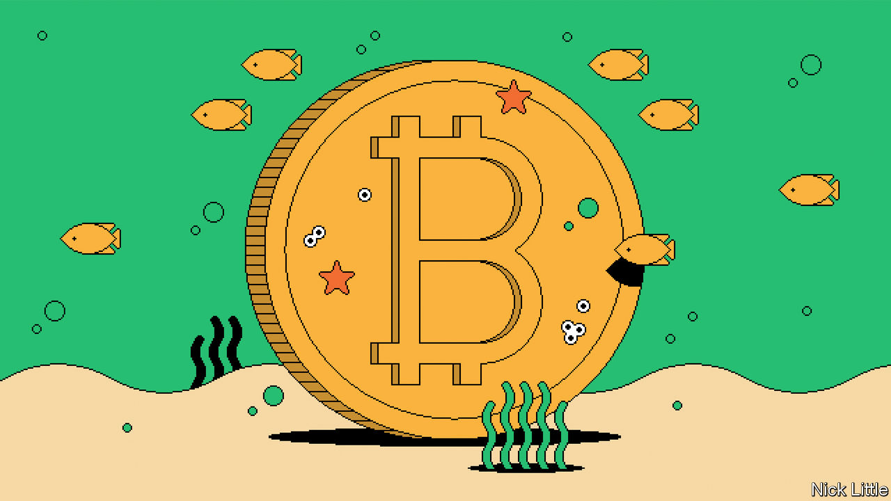
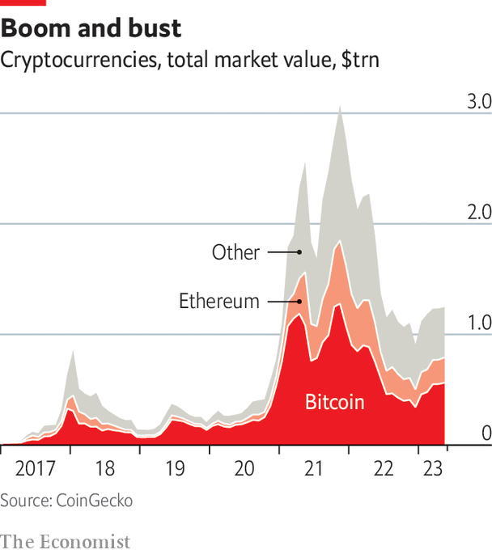

###### Cryptocurrencies

# The promise of crypto has not lived up to its initial excitement 

##### A crypto-finance revolution looks further off than ever 

 

> May 15th 2023 

“Two years ago everyone wanted to be us. Now everyone hates us,” laments a 24-year-old crypto founder at a gathering in New York. After once seeming as if it might threaten to remake the entire financial system, crypto has gone through a spectacular decline. The market value of all cryptocurrencies ballooned from $250bn at the start of 2020 to $3trn by late 2021. But it has since fallen back to just $1.3trn. Even more important, public trust in crypto has hit rock bottom after a string of high-profile swindles and crashes, notably the downfall of FTX, a popular cryptocurrency exchange, in November 2022.

Yet in Dubai, crypto talk remains boisterous. The emirate has opened its doors to the industry by creating a regulatory body dedicated to crypto that has created “much needed clarity”, argues Alex Chehade, the local boss of Binance, the world’s largest crypto exchange. Binance and other exchanges such as Crypto.com and Bybit set up shop in Dubai in 2022. Big questions still hang over the industry. At one meeting in Dubai this correspondent met an indignant response when he asked if crypto would ever find its “killer app”. “We already have it,” snapped a developer.

Attitudes to crypto have polarised. To some, its promise of revolutionising finance has been shattered. It was meant to sidestep a stodgy rent-seeking financial system that was expensive, inaccessible to many and possibly untrustworthy. Yet the financial system is not static: it is actively adopting new technology. And regulators are belatedly acting. Singapore, once a leading crypto hub, asked Binance to pause operations as of December 2022. It had issued just ten licences out of some 600 recent applications to set up crypto businesses. As many as 25 out of 45 countries looked at by the Atlantic Council, a think-tank, have imposed partial or complete bans on crypto. 

Pockets of hope remain. The price of bitcoin is up almost 70% this year, including a surge after the collapse of Silicon Valley Bank. There is some evidence to suggest that cryptocurrencies win more adherents in weak countries that are afflicted by high inflation or currency depreciation, such as Argentina and Nigeria. That points to a deeper truth, which is that the strongest arguments for using crypto have always been where the alternatives are worse. 

 


In 2008 Satoshi Nakamoto said in his bitcoin pitch that “What is needed is an electronic payment system…allowing any two willing parties to transact directly with each other without the need for a trusted third party.” Crypto transactions promised more efficiency and the avoidance of irksome control by governments. Yet neither benefit has really come about. Transactions still have to be verified by computers that maintain a copy of the associated blockchain, one reason why Coinbase, a listed American crypto-exchange, charges a 1% fee for payments. Add the expense of moving money in and out of crypto and overall costs are quite high. Why pay fees to transact on the Ethereum blockchain when India’s UPI or Brazil’s Pix is cheaper? 

It is not easy to avoid government oversight, either. To move from traditional currency into crypto, consumers must use on-ramps, which tend to be centralised platforms like Coinbase or Binance. The same holds for stablecoins that are pegged to the dollar. They must be trusted—exactly what crypto claimed not to need. Decentralised platforms like Uniswap exist, but they are hard to use and bring other risks, such as losing the private key, a password that can never be recovered. Mining bitcoin also brings huge environmental costs.


A sudden love of regulation

Crypto advocates now claim to want regulation to reduce uncertainty and regain consumer trust. But regulators often go a lot further than many had expected. The Reserve Bank of India’s governor, Shaktikanta Das, has said crypto has “no inherent value” and he may ban most of it. On January 5th American regulators (including the Fed and the Federal Deposit Insurance Corporation) declared that crypto-assets on decentralised networks were “highly likely to be inconsistent with safe and sound banking practices.” The government also seized Signature Bank, which was a prominent bank for the crypto industry, after it collapsed. 

As regulation comes for crypto, it will make transactions more expensive. Mr Poon of Hong Kong Polytechnic University says much of the cost of financial transactions comes from complying with regulations like know-your-customer and anti-money-laundering laws. Yet friendlier regulation could help the industry. Binance and other crypto firms are in Dubai precisely because of the regulatory cover it provides. The question then is: if crypto faces the same regulation as fintech firms, does it offer anything uniquely valuable?

There are places where crypto may still be useful. Kim Grauer, head of research at Chainalysis, which researches data from blockchains, finds hotspots of crypto adoption “in places that suffer from currency depreciation…or severe inflation.” Crypto can act as a hedge. “Bitcoin in Lebanese currency is up something like 6,000%,” notes Mr Chehade of Binance. Governments can also raise demand. Ms Grauer says Nigerian capital controls and Argentinian restrictions on holding dollars offer reasons for people to move funds into stablecoins and bitcoin. Their governments might detect a risk to financial stability. Their citizens see an alternative to incompetent or corrupt officials.

Another commonly cited case is cross-border payments, particularly for illiquid currency pairs. “Globalisation today has been capped at $10,000,” says Navin Gupta, a banker who is now at Ripple, a crypto firm that does international payments. Cross-border fees take a greater share of value for smaller payments because of high fixed fees, which deter some transactions entirely. Ripple’s network allows cryptocurrencies to intermediate trades between traditional currencies, reducing costs. The firm, worth $15bn at the start of 2022, has processed some $30bn through its cross-border service in five years.

By comparison Wise (formerly TransferWise), a cross-border fintech, processed $33bn in the first quarter of 2023 alone. It reduces costs by doing parallel domestic transfers in place of two cross-border ones. A study by the World Bank finds that cross-border remittance costs have fallen from 7% a decade ago to 5%. And if consumers are savvy enough to use the best option (often a new-age fintech)? Transfer costs may then fall to just 3%.

In 2015 Vitalik Buterin, co-founder of Ethereum and crypto’s philosopher king, wrote a blog post conceding that crypto had not yet found a “killer app”. Mr Buterin’s post went beyond the payments and finance parts of crypto. Yet his point still rings true. Crypto will not remake the global financial system because it has proved neither efficient nor immune to regulation. Instead, a stronger candidate for digital change may be central banks.■

