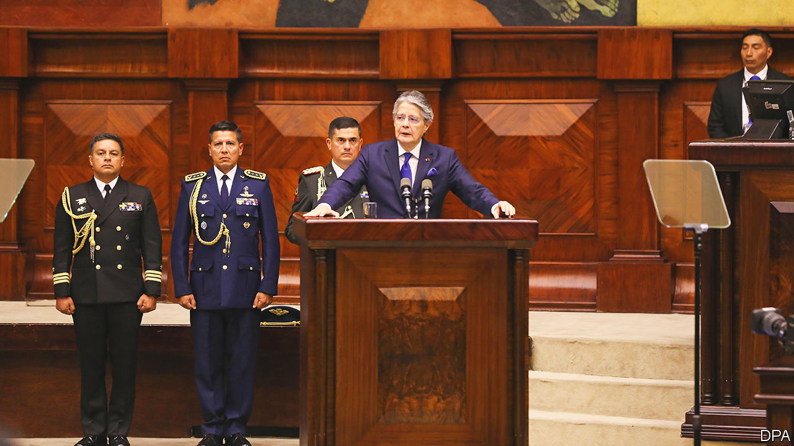

###### A desperate measure

# Ecuador’s president dissolves Congress to avoid impeachment 

##### Guillermo Lasso faces a backlash for wielding the previously untried rule 

 

> May 18th 2023 

On May 17th Guillermo Lasso, Ecuador’s conservative president, used a previously untried constitutional rule known as  (“mutual death”) to dissolve the National Assembly, after it looked poised to impeach him. “I am obliged to respond to the political crisis in which the country is mired,” he said in a nationwide address. He accused the National Assembly of having a “political project to destabilise the government, democracy and the state”. Snap presidential and parliamentary elections will follow within 97 days. Until then Mr Lasso will rule by executive decree. The president started off by signing an order which lowered income taxes. He said this would help around half a million families. 

The standoff between Mr Lasso and the National Assembly is only the latest iteration of a power struggle between the executive and legislative branches, which has frequently destabilised Ecuadorean politics. From 1997 to 2005, no elected president managed to serve out a full term. A new constitution, introduced in 2008 under Rafael Correa, a left-winger who was then president, made impeachment trickier. The trial against Mr Lasso has taken three months of wrangling.

Even so, the case appeared flimsy from the start. It was the second impeachment attempt against Mr Lasso by the National Assembly, which is controlled by the opposition. The constitutional court, which reviews any charges before an impeachment can proceed, discarded most of the accusations originally made against the president. These included operating a corruption ring at state-owned enterprises, the sale of positions in government and ties to Albanian drug gangs. Instead the court landed on a potentially iffy contract at the state oil-shipping company, Flopec. However, the deal in question was signed three years before Mr Lasso took office, under his predecessor, Lenín Moreno.

The driving force to unseat Mr Lasso was Mr Correa’s party, Citizens’ Revolution, which had the largest bloc of seats in the legislature. Mr Correa, who lives in self-imposed exile in Belgium, was convicted in 2020 in absentia of corruption (which he denies and calls “lawfare”). Even so, candidates associated with him won mayoral elections this year.

Mr Lasso has been unpopular for months, despite the fact that the economy is buoyant. Last year GDP grew by 3%, faster than the regional average. Inflation is low, at 2.4%. In December Ecuador completed an agreement with the IMF, the first in two decades, allowing it to retain access to cheap multilateral loans. But a crime wave related to drug-trafficking has seen the country’s homicide rates race past those of Colombia and Mexico, to more than 25 per 100,000 people. The opposition has claimed that Mr Lasso’s constitutional gamble is illegal. Protests are likely. But by guaranteeing elections relatively soon, the president may ensure that the country avoids the political violence that has beset neighbouring Peru. ■

