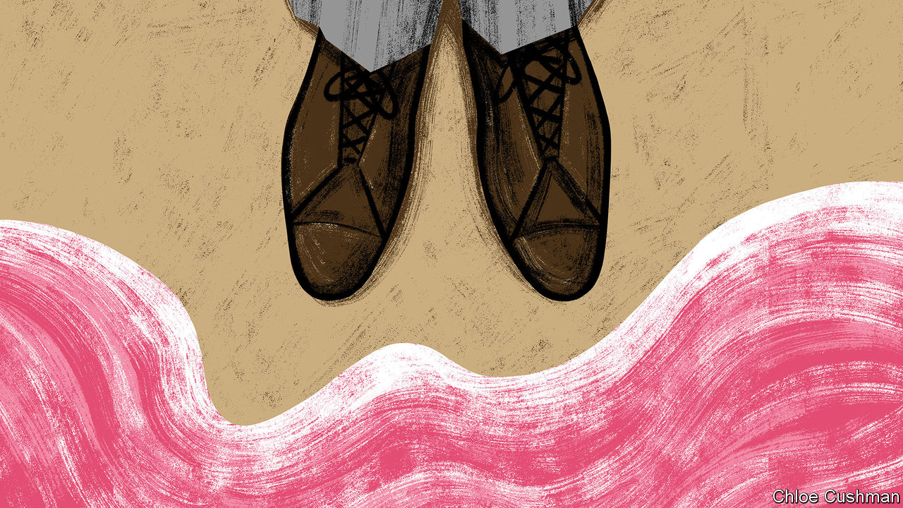
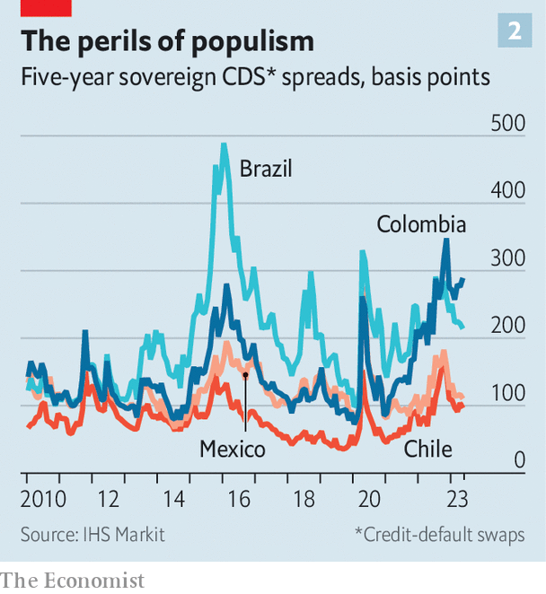
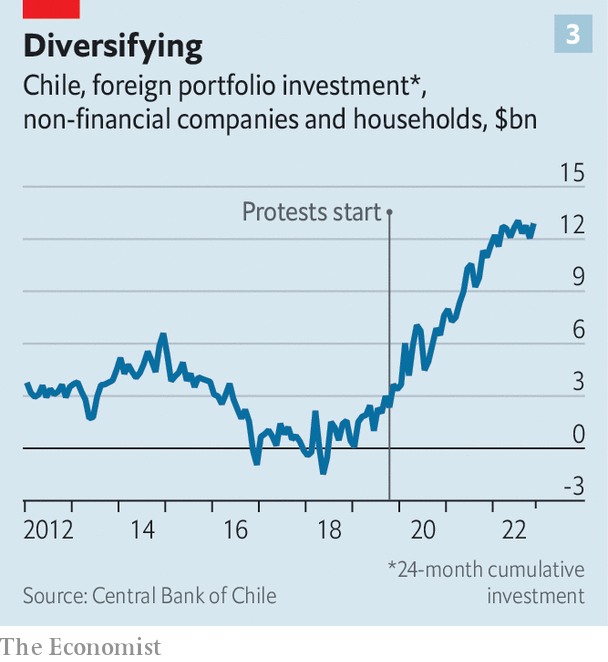

###### A polarising pendulum

# Latin America’s left-wing experiment is a warning to the world 

##### The region has some of the most left-leaning politicians on the planet. And they are scaring off investors 

 

> May 18th 2023 

Over the past year or so a majority of Latin Americans have gone into a polling booth and put their mark next to the candidates who most represent change. As a result, left-wing presidents have come to power in Brazil, Chile and Colombia. They join a swathe of established left-wingers in Argentina, Bolivia, Mexico and Peru, and the autocratic left in Cuba, Nicaragua and Venezuela. Across Latin America, 12 of 19 countries are now run by left-wing governments. They represent 92% of the region’s people and 90% of its GDP. This group is a diverse bunch. And yet they all promise big results. Can they deliver? As the world moves towards more state intervention, Latin America’s experiment offers several cautionary lessons.

The region has tended to lean to the left in recent decades. Under the so-called pink tide from around 1998 to 2015, much of it was led by a mix of left-wing democrats and demagogues. Generous social handouts and redistributionist politics were backed by a commodities boom. Hugo Chávez, the autocratic left-wing president of Venezuela from 1999 to 2013, had the bravado—buoyed by plentiful oil revenues—to give Barack Obama, then president of the United States, a copy of Eduardo Galeano’s “Open Veins of Latin America” in 2009. Mr Galeano’s book, first published in 1973, rails against intervention in the region by the United States and institutions such as the IMF, along with “merchants, bankers, marines, technocrats, Green Berets, ambassadors and captains of industry”. It became a bestseller.

Now the turn to the left is spurred by a sense that the region has fallen behind. The commodities boom has faded, and economic growth has stagnated. According to Goldman Sachs, a bank, annual GDP growth in the LA7 (Argentina, Brazil, Chile, Colombia, Ecuador, Mexico and Peru) averaged 3.4% between 2011 and 2013 and just 0.9% between 2013 and 2019. This year Goldman Sachs reckons it will be 1%. By comparison, the IMF predicts that East Asia will grow 4.3% this year. Over the past decade GDP per head in Latin America has remained broadly flat in real terms. 

Inequality remains stubbornly high. “This is what characterises Latin America,” says Carolina Tohá, Chile’s interior minister. “It has achieved democracies with levels of inequality that would never have been possible in Europe.” 

When polled, many in the region say that they remain fond of globalisation. In Brazil, Colombia, Peru and Mexico a majority of respondents to a recent survey by Ipsos Mori, a pollster, say that it has benefited their country. Even so, voters are becoming less partial to democracy. This is particularly the case among the young. Those between the ages of 16 and 40 are more likely than their elders to think that there is no difference between a democratic system and an authoritarian one, according to Latinobarometro, a regional survey. In 2021 Colombia, Peru, Brazil and Chile were the highest scorers in the “System is Broken” index by Ipsos, which is based on respondents’ statements such as “we need a strong leader who is willing to break the rules”. Mexico and Argentina were also above the global average. (In the survey from 2022 sentiment in all those countries had slightly improved.)

One result of this low-growth disillusionment with democratic norms is a shift to the right. In El Salvador Nayib Bukele, a modern-day  who has locked up 2% of the adult population in the past year in order to crack down on crime, is immensely popular. Before Brazil’s recent left-wing turn, Jair Bolsonaro, a right-wing populist, was president from 2019 to 2022. Mr Bolsonaro lost the election to Luiz Inácio Lula da Silva, a left-winger previously in office from 2003 to 2010, with just 1.8 percentage points between them. He still has plenty of supporters who think the election was stolen by Lula (as he is known). In Chile a recent election for a body to rewrite the constitution—an idea supported by Gabriel Boric, the 37-year-old social democrat who came to power last year—was dominated by a far-right party. But although the political pendulum swings back and forth, for now it seems the left is winning.

What do these left-wing governments want to do? Broadly, they want bigger government, with more state-owned firms, higher spending and a greater degree of intervention in the market. They all want to reduce inequality through higher taxes on the rich, bigger welfare systems and more state-funded health care. Unlike the earlier pink tide, protecting the environment is one area where these recently elected left-wingers tend to agree that far more needs to be done. The left-wing consensus is also becoming more protectionist and more determined to stop foreign exploitation of green resources, such as lithium.

Southpaw, not sinister

But there are huge differences. Andrés Manuel López Obrador, the president of Mexico since 2018, is an uneasy mix of left-wing rhetoric—talking of “hugs, not bullets” to deal with gangs—with fiscally hawkish policies. Although Mr López Obrador has criticised the central bank for high interest rates, he has generally let the bank get on with matters. Unlike the new crop of left-wingers Mr López Obrador is also far less bothered by climate change: indeed, last year he opened a big oil refinery in Tabasco, his home state, and has pursued a nationalistic and deeply un-green energy policy. He has tried to undermine the Supreme Court and the electoral body. 

By contrast Mr Boric is far more concerned about democracy, social rights and the environment. He is one of the few left-wing politicians in the region to call out human-rights abuses in Nicaragua and Venezuela, and to steadfastly criticise Russia’s invasion of Ukraine. Younger than most of his counterparts, his priorities are not shaped by socialist teachings. According to one of his close friends, he and his circle do not tend to read Karl Marx, but take their cues from social media. 

Even so, like Mr López Obrador, Mr Boric is keen on nationalising Chile’s vast lithium reserves. He is also fiscally responsible, mostly thanks to Mario Marcel, his finance minister and former head of the central bank. Government spending has been cut by about 25% in real terms, and the deficit has fallen from 7.5% of GDP in 2021 to a surplus of 1.3% of GDP last year. Chile is on course to be the only country in Latin America to go into a recession this year. Still, Mr Boric has not questioned the independence of the central bank.

Lula and Gustavo Petro, Colombia’s first avowedly left-wing president, are flirting with the more radical end of left-wingery. When Lula was elected in 2002 his first term was marked by a fiscally cautious stance. Third time round—and after a stint in prison for charges of corruption, which he denies and which were subsequently annulled—he is unleashed. His pick for finance minister, Fernando Haddad, a long-time member of Lula’s Workers’ Party, initially spooked markets. But Mr Haddad appears moderate compared with his boss. 

One of Lula’s first acts as president was to reverse Mr Bolsonaro’s plans to privatise various state-owned companies. He has said he wants to “change the logic” of tax in the county by raising the income-tax threshold, in order to exempt those who make up to 5,000 Brazilian reais ($1,015) a month from paying any (about 70% of the population). He also wants to increase the minimum wage. 

In March Mr Haddad announced plans for a new fiscal framework which, though not as radical as investors feared, is more complex than the current rule, and is likely to lead to higher spending. Lula has repeatedly criticised the central bank for raising interest rates. On May 8th he tapped an ally to join the monetary policy committee, causing the Brazilian real to depreciate. 

Mr Petro is more extreme. At the end of April he dissolved his cabinet and called for an “emergency government” after several members disagreed with aspects of his agenda, including boosting state intervention in the health system. He has also faced resistance towards his pension and labour reforms. Mr Petro replaced the cabinet, including José Antonio Ocampo, the moderate finance minister, with his allies. But he still faces opposition from Congress.

 


In order to fund higher social spending, Latin America needs higher growth. There is little sign of it picking up. Investment, one driver of rising living standards, is tepid. For the past three decades the region’s share of global foreign-direct investment flows has declined (see chart 1). Red tape, inconsistent policies and volatile politics put off investors, though not all: in 2021 Chinese companies invested $6bn in Brazil, the largest amount since 2017, according to the China-Brazil business council.

Portfolio flows have fared a little better recently, as investors look for other opportunities away from eastern Europe or China. But even so, it is not the case “that Latin America is shining bright”, says Alberto Ramos of Goldman Sachs. “More like: the darkness around it makes it a more interesting opportunity.” According to the Institute of International Finance (IIF), an American trade association, non-resident portfolio investment in the region increased from 20% to 25% of all total portfolio flows to emerging markets in 2020-23, up from 15% to 20% in 2016-19. That can partly be explained by a move away from China along with an uptick in commodity prices because of the war in Ukraine, says Martín Castellano of the IIF. But it is still below the share between 2010-15, of 30% to 40% during the commodities boom.

 


One danger is that there is a financial blow-up. Risk spreads on debt in the region are generally tolerable. But in some cases they have risen, and in general they are slightly higher than in emerging markets in Asia (see chart 2). Colombia has clearly got worse, while Brazil is higher than it used to be. Mr López Obrador’s fiscal conservatism has endeared the country to investors, particularly in contrast to Brazil. It helps that Mexico is also close to the United States, and so is well placed for American “friendshoring” of manufacturing jobs. Even so, many analysts suspect that Mexico is not benefiting as much as it would be if Mr López Obrador had not started his term by canning several big investments. In Chile, local investors are wary: since 2019 Chileans, who tended to invest at home, have preferred to take their money out of the country (see chart 3). 

 


Another danger is that left-leaning agendas can morph into constitutional struggles—especially if fuelled by public mistrust of the status quo. In the most extreme case, in Venezuela, Nicolás Maduro, Chávez’s hand-picked successor, has ridden roughshod over democratic institutions. Nearly 7m citizens have voted with their feet; those who have stayed are increasingly likely to be disillusioned with democracy. In Peru, Pedro Castillo, a left-winger elected as president in 2021, was booted out of the job by his cabinet after he attempted to shut down Congress before he could be impeached. (Several left-wing leaders, such as Mr López Obrador and Mr Petro, sympathised with Mr Castillo, and argue that he is the victim of a coup.) Since then, chaos has ensued, with most Peruvians clamouring for a new constitution. 

Similarly, both Mr Petro and Mr López Obrador display worrying signs of authoritarianism. Rafael Correa, a former left-wing president of , may be in exile, but his party helped cause a constitutional crisis there.

If these left-wing politicians fail, it could further stoke inequality and discontent. In Chile Mr Boric came to power after huge, and at times violent, protests in 2019. These were partly fuelled by dismay at the perception that, although GDP had grown over the past few decades, it had benefited elites rather than ordinary people. In reality, the proportion of those living on less than $3.25 a day (at 2017 purchasing-power-parity prices) had fallen from 36% in 2000 to 11% in 2020, and the Gini coefficient from 55 to 44.

And if they are voted out, their replacements could be worse. The recent constitutional election in Chile was won by the party of José Antonio Kast, an ultra-conservative politician who ran against Mr Boric in 2021. Mr Kast is an admirer of Augusto Pinochet, Chile’s former dictator. He appeals to Chileans’ increasing fear of crime. Similarly, in Argentina Javier Milei, a libertarian right-winger, is gaining popularity for his extreme views. If the new left-wingers lose support there are plenty of populists of different political stripes waiting to sweep up their votes. ■

