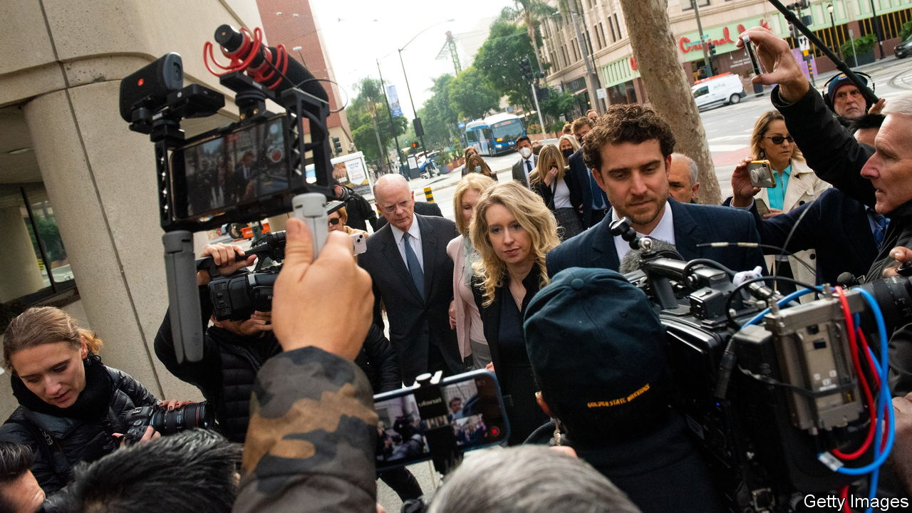

###### Corporate scandals

# What to read about villains in business 

##### Four books and a TV show on corporate crooks 

 

> May 16th 2023 

THE TELLING OF a juicy corporate scandal is like a detective story. The investigator, usually a journalist, must examine the clues, interrogate those suspects who are willing to talk and, with luck, determine a solution: “It was the finance director in the annual accounts with the fake revenues!” 

This collection of four books and a television documentary covers a wide range of industries and countries, from Silicon Valley to 18th-century India. The common factor in four of these cases is the enormous difficulties faced by those who try to investigate. It is not just that outsiders will always struggle to find detailed information on the inner workings of a business. Companies have lots of weapons to fight back, from legal action to silence whistleblowers to enlisting the help of friendly regulators. The struggles involved in bringing these stories to light suggest that many more corporate scandals have yet to be uncovered.

The incentives for corporate malfeasance are as great today as they were when humble clerks could become wealthy “nabobs” by working for the East India Company. Create the right business model (or the appearance of one) and you can join the global elite. But the more successful the fraud, the harder it becomes to maintain as the company grows; ever greater trickery is needed to create the illusion of continued progress. All too often, it is the executives’ hubris, as much as the investigators’ tenacity, that brings them down in the end.

By John Carreyrou. 

Bill Gates described this book as a “thriller” and it is easy to understand why. It is the extraordinary story of Theranos, a health-care company led by the charismatic Elizabeth Holmes (pictured), which claimed to have a product that could diagnose all sorts of diseases with a tiny blood sample. The company managed to attract luminaries such as Henry Kissinger and General James Mattis to its board and lured Rupert Murdoch as an investor. But its technology never actually worked and its elaborate security was designed not to protect its secrets but to disguise its lack of progress. Whistleblowers were fired, or silenced with non-disclosure agreements, and doctors were intimidated, making it hard for the author, a reporter for the , to uncover the story. We . The saga is also compellingly recounted in “The Dropout”, a docu-drama (first shown on Hulu, then on Disney+) based on a separate podcast. It stars Amanda Seyfried as Ms Holmes and features a wonderful cameo from Laurie Metcalf as a sceptical academic. 

By Patrick Radden Keefe. 

The Theranos scandal is relatively small compared with the opioid crisis that has affected America in recent decades. In his meticulously researched book, Patrick Radden Keefe, a reporter for the , recounts the history of the Sacklers, the family behind Oxycontin, the drug that many blame for the crisis. It is hard for the reader not to become angry as this tale unfolds. Regulators fail for years to prevent the marketing of an addictive drug, and members of the Sackler family escape serious personal consequences. . The Oxycontin story is also the subject of a TV series, “Dopesick” (based on a different book), with Michael Keaton as a small-town doctor who eventually becomes horrified at the drug’s toll on his patients.

By Bethany McLean and Peter Elkind. 

Both the Theranos and the Sackler scandals concern the products that the companies offered; the collapse of Enron is more to do with accounting. The energy company owned and operated gas pipelines and electricity plants, and traded derivative contracts. But its opaque accounting practices in effect enabled the group to inflate its revenues and hide its debts, while investors believed that the deregulation of the energy market gave the company the potential for endless growth. When it all collapsed, Enron took down its auditor, Arthur Andersen, and prompted Congress to pass the Sarbanes-Oxley Act to reform corporate governance. This book is an excellent example of business reporting. For a dramatic version, there is nothing better than “Enron”, a play by Lucy Prebble, which brilliantly imagines the hidden debts of the company as dinosaurs in the basement that need constant feeding.

. Directed by James Erskine. Netflix

The collapse of Wirecard, a German payments processor, is another case of accounting shenanigans. A book by Dan McCrum, a journalist for the  whose reporting helped to uncover the fraud, was featured in our  Mr McCrum also tells the tale in this lively Netflix documentary. What makes it stand out is that the  did not just have to face counter-measures by the company (which included hiring private detectives) but also the wrath of the German corporate establishment, which saw the stories as an attack on a national champion. It is nice for once to see short-sellers appear in a heroic light rather than as bloodsucking villains, which is how the media normally portray them. 

. By William Dalrymple. 

Modern accounts of corporate scandals tend to focus on the harm done to shareholders and customers. But perhaps the most astonishing example of corporate power was the way that a British company managed to take over much of the Indian subcontinent. When the company’s emissaries first visited the Mughal empire in the early 17th century they were awed by its wealth. By the mid 18th century, they could take that wealth for themselves; the word “loot”, from Hindi, referred to the fortunes amassed by company officials. The English used their superior military technology, and a strategy of “divide and rule”, to overwhelm the Mughals, who had already been weakened by attacks from inside and outside their empire. In the process, the Indian people were exploited and impoverished. We 


In 2022 we set out why times of high interest rates can reveal .  from May 2023 looks at why America’s financial regulator has paid out more than $1bn to whistleblowers since 2010. And we’ve rounded up five of the 

