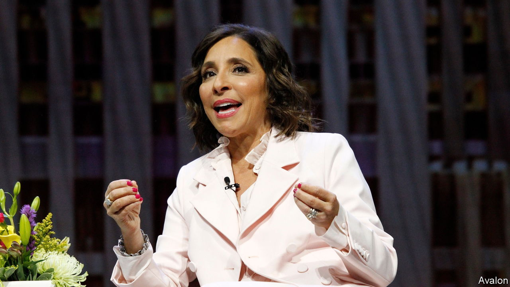
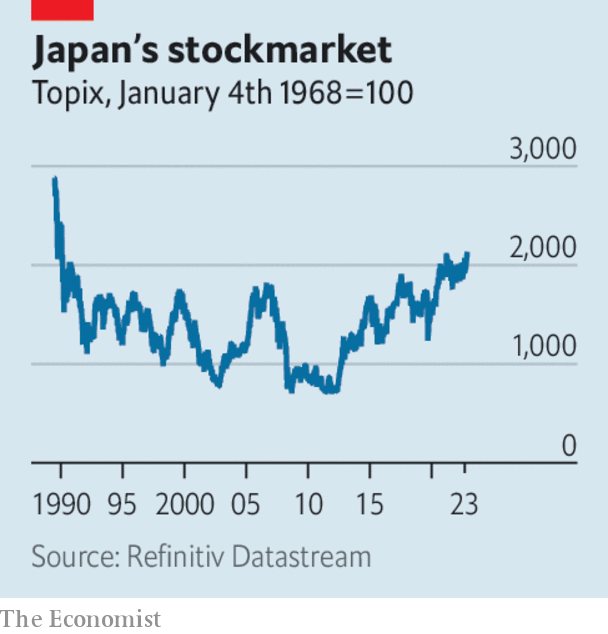

###### The world this week

# Business 

#####  

 

> May 18th 2023 

Elon Musk appointed Linda Yaccarino as chief executive of , five months after he said he would relinquish the role. Mr Musk took over the company last October. Ms Yaccarino comes from NBCUniversal, where she was in charge of advertising. Mr Musk said his new hire will focus on day-to-day operations while he concentrates on product development, as he strives to “transform this platform into X, the everything app”. 

Act now, before it’s too late

The chief executive of OpenAI, the firm behind the ChatGPT chatbot, called for tighter regulation of rapidly developing , such as by forcing disclosure on images that have been generated by AI. Sam Altman told American senators that “if this technology goes wrong, it can go quite wrong”, pointing to the near-term potential for its use in the 2024 elections. Some senators did wonder whether regulating AI now would solidify power among companies that dominate the market.

America’s Federal Trade Commission filed a lawsuit to block the $28bn takeover of  by . It is the FTC’s first challenge to a drugs merger in recent memory. It said consolidation in the industry was “rampant”, and that its suit is a signal that it won’t tolerate mergers that entrench monopolies. Separately, the EU cleared takeover of , a contrast to America and Britain, where antitrust regulators want to block the deal.

 is planning another public offering of its shares, according to reports. The IPO of just 1.5% of its stock in 2019 raised $25.6bn, the most ever in a market debut. A second offering would be of a similar size. 

 from covid lockdowns may be weaker than had been thought. Fresh economic data fell far short of forecasts. Industrial production rose by 5.6% in April, year on year, and retail spending by 18.4%. Although those figures are strong on the surface, they are measured against a low point last year when Shanghai went into lockdown. 

 


 grew by 0.4% in the first quarter over the previous three months. On an annualised basis it expanded by 1.6%, outpacing America’s GDP growth by that measure. Domestic demand has picked up, but the country is also benefiting from a recovery in tourism. The bullish mood has pushed the benchmark Topix index to a 33-year high. 

A boom in construction helped  eke out a 0.1% rise in GDP in the first quarter over the final three months of 2022. The insipid performance is in line with updated forecasts from the Bank of England, which thinks the economy will now stagnate in the first half of this year, rather than fall into a recession. 

 hit 8.3m barrels a day in April, according to the International Energy Agency, the most since the invasion of Ukraine in February last year. This also far exceeds Russia’s average for 2022 and 2021. Russia has found willing buyers for its oil, notably India and China. The IEA reckons that China will account for 60% of the growth in oil demand this year. 

Final approval was given in the EU to the world’s first comprehensive framework for . The new rules come into force next year and will require firms that issue, trade and oversee cryptocurrencies, tokens and stablecoins to obtain a licence. Crypto transfers will be easier to trace and firms will be liable if they lose customers’ assets. 

It has emerged that the French government is seeking €2.5bn ($2.7bn) in penalties from banks for illicitly trying to avoid tax on . The headquarters of several banks in France were raided by prosecutors in March as part of the investigation. 

 central bank raised its main interest rate by six percentage points, to 97%, as it tries to battle inflation topping 100%, the highest level since the early 1990s.

 filed for bankruptcy protection. Lauded for being an upstart that disrupted the traditional media industry with its digital-focused content, its TV news investigations also scooped up Emmy nominations. In the end the company failed to turn its web traffic into profit. It was valued at $5.7bn in 2017. 

Following a lengthy legal battle,  was extradited from Britain to America, where he faces charges of fraud related to the acquisition of Autonomy, a software firm he founded, by Hewlett-Packard in 2011. Mr Lynch denies any wrongdoing. 

The dire straits of Taiwan

Berkshire Hathaway disclosed that it has sold its remaining stake in , Taiwan’s biggest producer of semiconductors. Warren Buffett has been offloading the holding in recent months, warning of the threat to Taiwan from China. “I don’t like its location,” he told analysts recently. 

