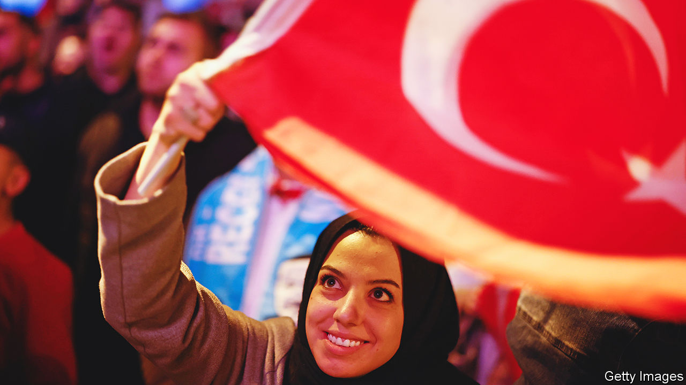
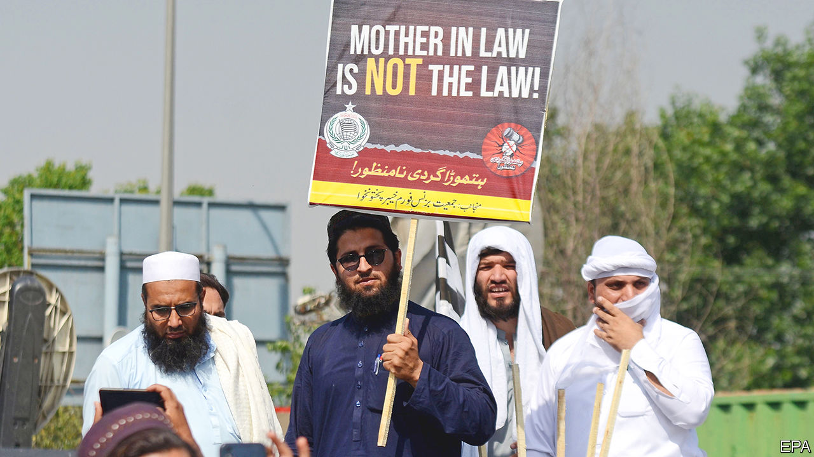

###### The world this week

# Politics 

#####  

 

> May 18th 2023 

 will head to a run-off on May 28th, after Recep Tayyip Erdogan, the incumbent, fell just shy of 50% in the first round of voting. Kemal Kilicdaroglu, the candidate of an opposition alliance of six parties, got 45%. Mr Kilicdaroglu may now struggle to unseat Turkey’s strongman, who has presided over rampant inflation. In a bad night for the opposition Mr Erdogan’s Justice and Development (AK) party retained a comfortable majority in parliament. 

On a wing and a prayer

Volodymyr Zelensky paid brief visits to Britain, France, Germany and Italy to drum up support for a “”. France said it would train  pilots to use combat aircraft. Germany promised €2.7bn ($2.9bn) in military aid and is to build a tank-repair factory in Ukraine. Britain pledged more air-defence systems and Storm Shadow missiles, Ukraine’s first long-range cruise weapons. Mr Zelensky also met Pope Francis in Rome. 

 launched more intense waves of missile attacks against Ukraine. One assault was described by officials as being “exceptional in density”. They said six hypersonic missiles had been shot down. Russia is increasing its bombardments ahead of an expected Ukrainian offensive. 

A deal that allows Ukraine to  safely across the Black Sea was extended by two months. The deal was first brokered by Turkey and the UN last July. Russia had threatened to pull out. It agreed to the last-minute extension, but said its conditions for taking part are still unmet. 

Gunmen opened fire on an  convoy in Nigeria’s Anambra state, killing two policemen and two Nigerian embassy employees. Nigerian authorities blamed the attack on a Biafran secessionist group.

A BBC investigation into  presidential election in February uncovered significant discrepancies between the total number of votes cast at individual polling stations and the official results. The BBC’s own count in Rivers state suggested that Peter Obi had the most votes; the official result declared the state was won by Bola Tinubu, the president-elect. 

The commander of  army visited Russia to discuss military co-operation and how to improve the combat readiness of both countries’ armies. The visit will further strain South Africa’s relations with America after accusations that it had sent weapons and ammunition to Russia in breach of its stated position of neutrality.

A court in  sentenced Rached Ghannouchi, a prominent opposition politician, to a year in prison. Human-rights groups accused Kais Saied, the president, who has suspended parts of the constitution and assumed authoritarian powers, of trying to dismantle Mr Ghannouchi’s Ennahda party.

The number of reported  around the world increased sharply in 2022, after a big jump in the Middle East, according to Amnesty International, a human-rights group. Iran executed 576 people last year, up from 314 in 2021. Saudi Arabia put 196 people to death, up from 65. (China does not report how many it carries out.) 

 president, Guillermo Lasso, dissolved the opposition-controlled National Assembly and called elections, after he faced an impeachment trial over allegations regarding oil-shipping contracts, which he denies. Mr Lasso used a “mutual death” clause in the constitution to dissolve the assembly. His opponents insist his actions are illegal. 

Pro-democracy parties trounced the military and royalist coalition in  parliamentary election. Move Forward, which is dominated by liberal activists, and Pheu Thai, the party of Thaksin Shinawatra, a former prime minister in exile, won the majority of seats. Forming a government will be difficult, however. The army has rigged the constitution in its favour to give it an advantage in appointing a prime minister. 

 


In  20,000 pro-government supporters held a rally outside the Supreme Court calling for the resignation of the chief justice. He had ordered the release of Imran Khan, finding that the arrest of the former prime minister on graft charges had been unlawful. The rally was backed by parties that removed Mr Khan from power last year, raising fears of violence between pro- and anti-Khan factions. 

The opposition Congress party in  won an , a southern state that includes the tech hub of Bangalore. Its victory was a rare sliver of good news for the party. It fared badly in local elections in Uttar Pradesh, India’s most populous state. 

At least one person died amid communal clashes in the Indian state of Maharashtra sparked by the release of , a fictional film about three women who join Islamic State. The movie has found approval among leaders of the ruling Hindu-nationalist Bharatiya Janata Party, including the prime minister, Narendra Modi. 

In America , a pandemic-era measure allowing for the swift removal of illegal migrants, ended on May 11th. There was little sign of a surge in crossings. Alejandro Mayorkas, America’s homeland-security secretary, said there had actually been a 50% drop in crossings compared with the days before May 11th. 

The FBI’s investigation into and his alleged ties with Russia was sharply criticised in an official report. John Durham was appointed as a special counsel to review the case during the Trump administration. He accuses the FBI‘s investigation of being “seriously deficient” and relying on “uncorroborated intelligence”.

Republicans in Congress stepped up negotiations with the White House to avoid a  on government debt. The Treasury reiterated that it would soon run out of money to pay the government’s bills.

The governor of Montana signed a bill that bans . It is the first statewide prohibition of the platform, which is owned by a Chinese company. The ban comes into effect in January, but will face legal challenges on free-speech grounds before then. 

No wokeism allowed

Ron DeSantis,  governor, signed a bill that stops colleges in the state from spending money on diversity, equity and inclusion programmes. Critics said free speech on campus will be curtailed. “If you want to do things like gender ideology, go to Berkeley,” retorted Mr DeSantis, who is reportedly on the verge of announcing his candidacy for president. 

