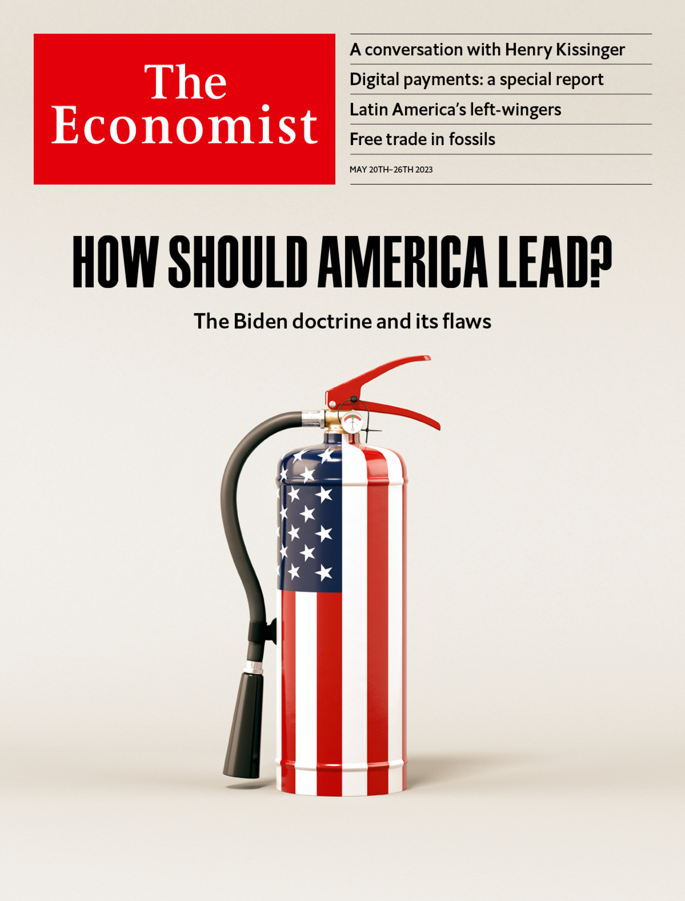

###### The Economist

# This week’s cover 

##### How we saw the world 

> May 18th 2023 

This week’s worldwide cover contemplates the Biden doctrine, which aims to preserve American pre-eminence and reduce the risk of conflict. After the chaos of the Trump years, President Joe Biden’s commitment to diplomacy is welcome, but his doctrine is flawed. Its diagnosis of America’s problems is too pessimistic, and some of its prescriptions would make America weaker.

 


: 

: 

: 


