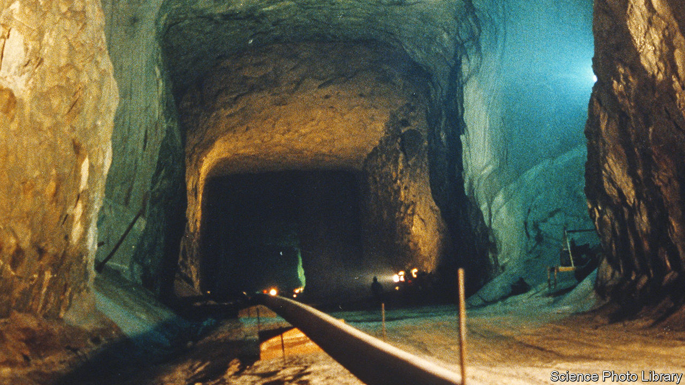

###### Sweet and salty

# Anoint my caverns with oil 

##### The Strategic Petroleum Reserve runneth low 

 

> May 18th 2023 

SIXTY CAVERNS extend deep into the subterranean salt that composes the substrate along much of America’s Gulf Coast, at four sites, two each in Texas and Louisiana. They are huge; the typical cavern can hold two Empire State Buildings stacked atop each other. These caverns hold America’s Strategic Petroleum Reserve (SPR), the world’s largest stockpile of crude oil. All told they can hold 714m barrels, but today, after the largest-ever drawdown last year to  in the wake of Russia’s invasion of Ukraine, they hold just half that capacity—the SPR’s lowest level in 40 years. On May 15th the Biden administration announced a 3m-barrel purchase for August delivery. But that is just the first step in a long, fraught process.

The SPR was born from crisis. In 1973, Arab members of the Organisation of the Petroleum Exporting Countries imposed an oil embargo on the United States and other Western countries in retaliation for supporting Israel during the Yom Kippur War. Gas prices shot up; fuel was rationed. Two years later, then-president Gerald Ford signed the Energy Policy and Conservation Act, which authorised the creation of a stockpile of up to 1bn barrels of oil. It has never risen quite that high, but at its peak, in December 2009, the SPR held 727m barrels. Pipelines carry oil into the SPR from around the country, and from it to nearby refineries.

The SPR is designed to respond to domestic and international supply disruptions, either through sales or, more frequently, exchanges. The former is straightforward: by either presidential or congressional directive, oil is sold at competitive auctions to the highest bidder. Big oil firms often use the latter. Much of America’s refining capacity sits on America’s natural-disaster prone Gulf Coast; when hurricanes halt or impede production, oil majors can request loans from the SPR, which they sometimes repay at a premium. 

This much everyone agrees on. Where things get hairy is with the Biden administration’s withdrawals—not just the 180m after Russia invaded Ukraine, but with the additional 70m barrels since Joe Biden took office in January 2021. That is more than any previous administration has taken. Republicans contend this was done for political purposes: “to cover up historically high gas prices in an election year,” as Cathy McMorris Rodgers, a Republican congresswoman from eastern Washington, charged on the House floor.

She introduced a bill to bar non-emergency SPR withdrawals unless an administration submits plans to open more federal lands for oil and gas drilling (it passed the House on a near-party-line vote; the odds the bill passing the Senate and Mr Biden signing it are about as good as the odds that the president sprouts wings). Republicans also claim the withdrawals “may have caused structural damage to the SPR’s pipelines and caverns”; Sandia, the private company that monitors the SPR’s caverns, says this is untrue, though Republicans have still asked the Government Accountability Office, Congress’s nonpartisan watchdog, to evaluate the administration’s management of the SPR.

For the moment, the refill price is right: West Texas Intermediate (WTI) was around $70 per barrel on Monday and the administration has set $67-72 per barrel of WTI—well below the 2022 average price of almost $95—as its target repurchase price. But uncertainties abound. Buying oil for future delivery may tempt producers when oil prices are low, as they are now, due in part to sluggish demand and industrial activity in China. But the International Energy Agency, an official forecaster, expects demand to rise steeply this year, even as supply is constrained.

That combination could send prices soaring, leaving the Biden administration with an uncomfortable choice: continue refilling the SPR and get pilloried for overspending; or delay, and face Republican criticism for endangering national security by leaving the reserve low. Environmentalists will doubtless grumble about spending on fossil fuels, though the SPR is probably too obscure to generate much political heat from the left.■


