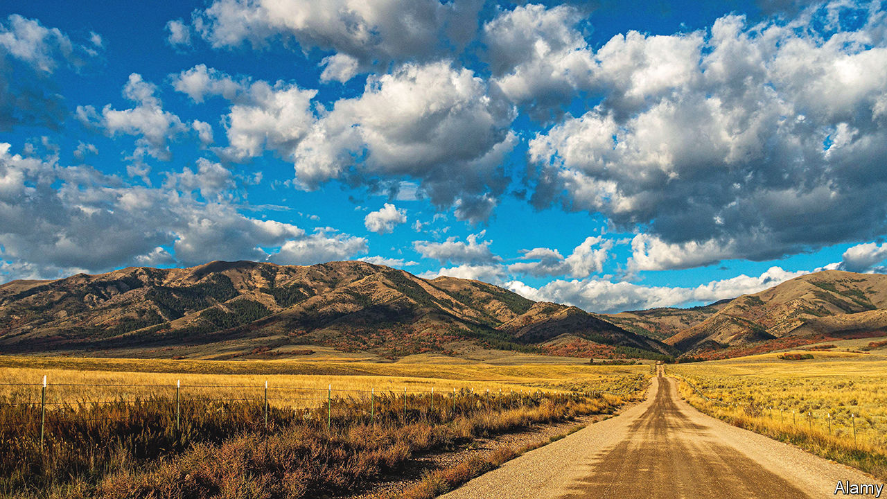

###### Aftershocks

# Congress should fund the BLM (no, not that one) 

##### How Donald Trump’s changes to the Bureau of Land Management are still slowing the energy transition 

 

> May 18th 2023 

A MEMORABLE scene in season one of HBO’s hit series “The White Lotus” shows Tanya McQuoid (Jennifer Coolidge) asking her date how he got involved with the BLM, and why he decided to devote his life to activism. Greg Hunt (Jon Gries) is bewildered. Tanya, like many Americans, assumes that the initials stand for Black Lives Matter, an anti-racism group. “Black Lives Matter? I’m not involved in that,” he replies. Now it is Tanya’s turn for bewilderment. Finally, Greg reveals that he works for a distinctly different BLM: America’s Bureau of Land Management. 

The Bureau of Land Management (the BLM from here on) is not one of America’s better-known federal agencies. It is just one of 11 bureaus within the Department of the Interior, and is responsible for managing 10% of America’s lands, or more than 245m acres, mostly in the western states. It issues permits for development on the country’s public lands. For a long time, that meant approving oil and gas drilling. 

But under President Joe Biden, it increasingly means granting permits for renewable-energy projects. The Biden administration aims to approve at least 25 gigawatts of solar, wind or geothermal energy on federal lands by 2025, and so the BLM finds itself at the very centre of . But the bureau will struggle to thrive in the limelight. When asked about the state of the BLM, current and former staffers describe an underfunded agency tormented by an increasingly difficult mission and hobbled by staffing shortages. 

In 1976 Congress passed the Federal Land Policy and Management Act, or FLPMA. The agency was tasked with balancing extraction, recreation and conservation, in perpetuity. Land-use conflicts are multiplying as the agency tries to deploy renewables, protect critical habitat, respect tribal sovereignty and manage a boom in outdoor recreation all at the same time. “I’ve been in a lot of angry public meetings,” says Linda Price, the BLM’s field manager in Salmon, Idaho. “They don’t get any more angry than when there’s renewable energy involved.” 

Idaho is a case in point. The proposed Lava Ridge Wind Project in the state’s Magic Valley, near a Japanese prison camp from the second world war, has united greens, history preservationists, tribes, local officials, ranchers and farmers in opposition. Not only are locals sceptical of these specific turbines; some reject the idea that renewables belong on public lands at all. 

The BLM is used to getting beaten up at public meetings. But the listening tours needed to solicit local input and dispel disinformation take time. That is something America does not have in abundance if it wants to decarbonise fast enough to avoid the worst effects of . Last month, for example, the BLM approved the construction of a high-voltage transmission line from Wyoming’s High Plains to southern Nevada. The project was first proposed in 2007, but was delayed by a legal battle over whether the line could traverse ranchlands that were also protected habitat for the ever-imperilled sage grouse. 

Grousing sagely

The bureau’s broad mission also makes it vulnerable to big political swings. The Trump administration, for example, prioritised fossil-fuel development over other land uses. “The last administration didn’t want you to even think about conservation,” says Mary Jo Rugwell, who retired as the BLM’s Wyoming boss in 2019. “It’s hard for employees to make that pivot all the time,” she adds wearily. 

The second reason the BLM is struggling is because the agency was crippled by President Donald Trump’s efforts to “drain the swamp”. In 2019 Mr Trump announced that the agency’s headquarters would move from Washington, DC, to Grand Junction, Colorado, ostensibly so the BLM’s bureaucrats would be closer to the lands they managed. More than 300 jobs were reassigned to western field offices. Just 41 people moved and only three ended up in Grand Junction. The rest quit or retired. 

Baby-boomer retirements and a national labour shortage aren’t helping things. Tracy Stone-Manning, the agency’s director under Mr Biden, argues that too few people, and the loss of expertise that accompanied the headquarters move, explain the BLM’s inefficiency, not an over-onerous permit process. When your correspondent asked which projects had suffered for lack of bodies, Ms Stone-Manning was not picky. “I’d point to 120 projects that are waiting in line, they’re literally sitting on desks,” she said. “It’s hard to say to a company ‘See you in two years’.” 

It is not hard to find specific examples of pain caused by the labour crunch. Agents working on the Lava Ridge wind-farm proposal say the controversial project is sucking up all their time and resources. They want to hire more people to focus entirely on renewables. Farther north in Salmon, Ms Price is trying to prioritise. “If you doubled my staff, we would not run out of things to do,” she says. 

The BLM is dreaming of a bigger budget, too, and has asked Congress for more funding to hire nearly 500 employees. Its headquarters is moving back to the Beltway. But some of the bureau’s far-flung agents think the agency’s redemption will happen in the valleys and the mountains of the West, rather than in Washington. “The number and diversity of conflicts is growing,” says Ms Price. “On the ground, in the little immediate field offices, we try to work through them one by one.”■


