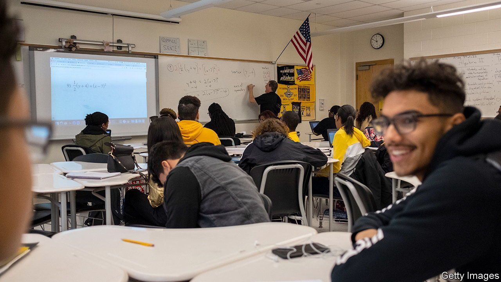

###### The woke maths experiment

# San Francisco’s “woke maths” experiment 

##### How the pursuit of racial equity provided a lesson in unintended consequences 

 

> May 18th 2023 

San Francisco’s school district was in trouble. Only 19% of tenth graders had passed the state maths exam and were not required to repeat a maths course. That number dropped further, to 1%, among black pupils. And so, in 2014 San Francisco decided to move Algebra I from eighth grade (about 13 years old) to ninth grade for all pupils, hoping that an extra year of maths would leave pupils better prepared.

Nearly ten years later, after much controversy, the first evaluation of the change was released in March by researchers at Stanford University. Disappointingly for both enthusiasts, who had hoped to improve racial equity, and detractors, who regarded the scheme as yet another attack on excellence by woke educators, it showed the programme had almost no effect.

“Our students…are most definitely NOT being served equally,” said Richard Carranza, San Francisco’s school superintendent at the time, back in 2015. “That will stop!” In response to a rhetorical question asking why no other district was doing something similar, he replied: “San Francisco always goes first, the rest eventually catch up.”

The research provided bad news at a bad time–a lawsuit was filed against the policy on the same day of the study’s release. In the class of 2018–the last class untouched by the reform–37% of pupils enrolled in calculus and statistics Advanced Placement (AP) courses, which allow pupils to earn college credit. In the next class, only 32% enrolled (a 15% reduction). Asian-American and Pacific Islander pupils were the most affected–and for the worse.

Some might interpret these results, and the subsequent backlash, as a reason to go back to square one. But the Stanford researchers caution against such conclusions. After the district offered accelerated courses and summer school, AP enrolment rebounded. Looking beyond AP maths also helps to see the bigger, and less gloomy, picture. More pupils earned advanced maths credits just below AP level, such as pre-calculus. And while all pupils earned more credits in probability and statistics after the reform, black pupils saw the largest gains. Offering AP maths in all of the city’s high schools would be a good next step as San Francisco sorts through the mess.■


