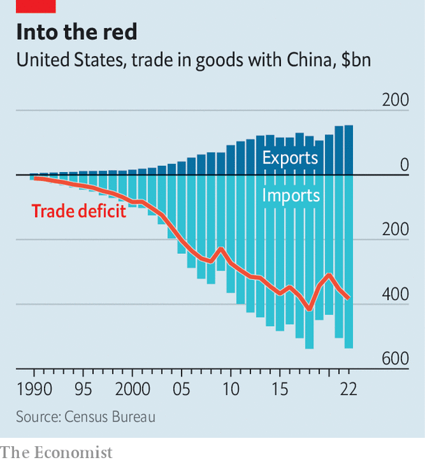

###### Decoding the detente

# The fault lines in America’s China policy 

##### How to make sense of the cacophony inside and outside the White House 

 

> May 16th 2023 

The contest between America and China has a postmodern look to it. Whereas presidents tried to isolate and contain the Soviet Union, America is economically entwined with China, the current would-be hegemon. The official government posture on  is “strategic ambiguity”, a line so confusing that President Joe Biden has rewritten it several times. Perhaps that is why Jake Sullivan, the president’s national security adviser, reached for the example of the world’s most famous postmodernist architect when trying to explain the administration’s industrial and trade policies. “The way that we are going to build an international economic architecture is not going to be with Parthenon-style clear pillars as we did after the end of the second world war, but something that feels a little bit more like Frank Gehry.”

Mr Sullivan met Wang Yi, a senior Chinese foreign-policy official, for more than eight hours in Vienna last week, which suggests a mutual willingness to prevent the  from getting even worse. That meeting followed speeches by Mr Sullivan and Janet Yellen, the treasury secretary, outlining the administration’s thoughts about China. Both speak for the same boss. But parse the remarks closely, and differences within the administration are clear. 

Whereas Mr Sullivan is already sketching his curvilinear “new Washington consensus”, Ms Yellen says that America is simply calling for “the very same international order that helped make China’s economic transformation possible”. Mr Sullivan resoundingly criticised the trade liberalisation of the 1990s and the “China shock” to manufacturing jobs that followed. No such critiques can be found in Ms Yellen’s thinking, which aims for “healthy economic engagement that benefits both countries”. 

The two are on opposite ends of the administration’s approach towards China—with Ms Yellen the (lonesome) dove and Mr Sullivan the (influential) hawk. And yet both in their own way are trying to sound notes of conciliation. The Biden administration, perhaps fearing that it has let relations with China sour too quickly, is publicly trying to pull back.

The low point came in late January, after a  was spotted in American airspace, loitering around sensitive nuclear-weapons bases before Mr Biden ordered it shot down off the coast. America’s military leaders were unable to reach their Chinese counterparts through the kinds of hotline channels that were in regular use during the cold war with the Soviet Union. The incident nixed a trip to China that Antony Blinken, the secretary of state, had been planning, which would have included a meeting with President Xi Jinping. The thaw in tensions that followed Mr Biden’s meeting with Mr Xi in Bali in November 2022 proved brief. 

There is now a desire to return to something like the “spirit of Bali”. But members of the administration have complicated aims: to prevent China invading Taiwan, to preserve trade but with more carve-outs for national security, and to lead the world in managing climate change and debt crises in emerging markets. They believe America and China can work together on Ukraine. To explain this in a non-threatening way they resort to soothing slogans: “competition not conflict”; “de-risking not decoupling”; leaving trade open except for “a small yard and high fence”. 

 


What do these phrases actually mean? Export controls on high-end semiconductors that could be used in Chinese weapons systems are one thing. But the  with the aim of maintaining a lead on AI, quantum computing, clean-energy production and biotechnology are a sign that the small yard may be larger than advertised. Military hawkishness and protectionist impulses are strong in America. Even if Mr Biden seeks a middle road, he may find himself pushed by these forces, particularly as the presidential election of 2024 looms.

Another difficulty for the White House in setting a national China policy is that America’s politics are decentralised and raucous. State lawmakers can go it alone, burnishing their credentials by sounding hawkish. On May 8th Ron DeSantis, the governor of Florida and possible presidential candidate, signed a law to expunge “the malign influence of the Chinese Communist Party” by limiting the ability of Chinese nationals to buy land in the state and barring state universities from accepting foreign funds from countries “of concern”.

Nor does the executive branch have any control over the legislative one. Last August Nancy Pelosi, then speaker of the House, visited Taiwan over Mr Biden’s objections. Kevin McCarthy, her Republican successor, has proceeded with more caution, meeting the Taiwanese president, Tsai Ing-Wen, during a visit to California rather than inflaming tensions by repeating Ms Pelosi’s stunt. “Discerning…the real nature of US policy towards China, I do think has become harder for Beijing,” says Christopher Johnson of the Centre for Strategic and International Studies, a think-tank. “You hear from Chinese counterparts a lot of concern about what they see coming out of the Hill.”

In January a group of 19 House Republicans introduced a resolution to end the formal “One China” policy that America adheres to and recognise Taiwan as an independent country. A bipartisan bunch of senators have proposed legislation that could allow the secretary of commerce to ban TikTok, a wildly popular Chinese-owned social-media platform. 

House Republicans have set up a select committee on the Chinese Communist Party that has been gathering evidence on sensitive matters like forced labour for Uyghurs and the Communist Party’s efforts to install police stations abroad. So far there has been rather unusual agreement between the committee’s Republican chairman, Mike Gallagher of Wisconsin, and the senior Democratic member, Raja Krishnamoorthi of Illinois.

One member of the committee who hopes to introduce some serious debate is Ro Khanna, a Democrat from California. “I would argue right now that the Democratic response has been rudderless on the committee…It’s been dominated by a vision that presupposes a cold war,” he says. “I think there are three places you can be,” he adds. “One is Donald Trump: let’s just have a complete ban and decoupling. The other …is Janet Yellen, which is: no decoupling, we just need to continue almost status quo economically. And then the ground I’m trying to articulate is: we need a rebalancing…the status quo didn’t work.”

Mr Khanna, who recently gave a speech on China at Stanford, wants to reduce the bilateral trade deficit to near-zero over the next decade, and renew China’s most-favoured-nation trading status annually, instead of allowing it to be permanent. Free-marketeers argue that this would backfire. “The common mistake of Khanna and Trump and some of the people advising the Biden administration is the idea that the US alone determines the world,” argues Adam Posen, president of the Peterson Institute for International Economics.

It suits the administration to give prominence to Ms Yellen when it is trying to reduce the risk of a miscalculation and to . She may visit China before long, as may Gina Raimondo, the commerce secretary. Yet the White House is trying to balance contradictory impulses. To stretch Mr Sullivan’s architectural analogy to breaking point, the result could turn out to be like Mr Gehry’s weird but harmonious concert hall in Los Angeles. Or it could be so impractical that, like Mr Gehry’s computer-science school at MIT, the building leaks and its architect gets sued. ■


