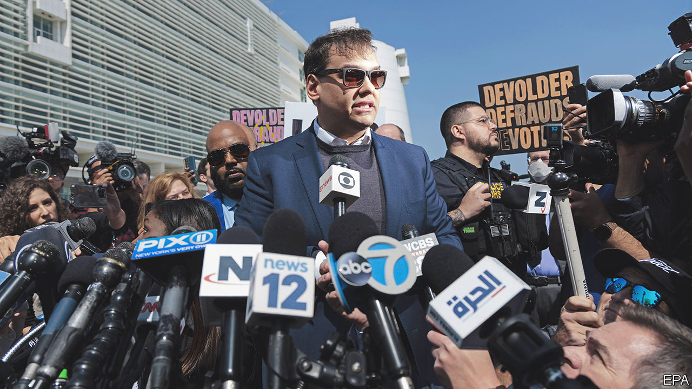

###### New York’s hottest venue

# What do George Santos, R. Kelly and FIFA have in common? 

##### Brooklyn prosecutors’ aggressive tactics net the Eastern District of New York an outsize share of high-profile cases 

 

> May 17th 2023 

MELBOURNE, FLORIDA, a city on the banks of the Indian river, is a nice place to do business. Just ask George Santos. The  from New York chose Melbourne as the headquarters for his company, Devolder Organisation, LLC, which, federal prosecutors allege, he used to defraud campaign donors. The Middle District of Florida, Melbourne’s federal court, could have lassoed its jurisdictional powers onto this geographical hook. Instead, on May 10th, Mr Santos walked into a courthouse on Long Island. He pleaded not guilty to charges filed by the Eastern District of New York (EDNY), as so many extraordinary defendants have done before him. 

EDNY’s jurisdiction covers Brooklyn (where its main courthouse sits), Queens, Staten Island and Long Island—a diverse constituency of 8m people plus an international airport. Home-grown crimes abound. But the court’s striking list of high-profile indictments reveals a prosecutorial wanderlust possibly unmatched by EDNY’s 93 peer district courts. 

“There are other prosecutors who will proudly proclaim ‘The eagle doesn’t fly’,” says Seth DuCharme, former acting US attorney for EDNY. Brooklyn’s eagle logs serious miles. Carlos Watson who ran Ozy, a scandal-ridden media company, lives in California. But from an inopportune outing Mr Watson took to the US Open, a tennis tournament in Queens, enterprising EDNY lawyers found legal jurisdiction, or “venue”, to indict him for fraud.

, a singer convicted of sex abuse, committed most of his crimes in Chicago, but EDNY scored the first trial. Still further afield, the court has brought cases against Joaquín “” Guzmán Loera, a Mexican cartel kingpin; , a boss of Huawei, a Chinese firm; and  from the Caribbean and South America. (Mr Watson of Ozy and Jack Warner, formerly of FIFA, deny wrongdoing.)

Newsworthy defendants are not easily quantifiable, but international terrorism cases are. In such investigations, venue is often unclear. There is no default court to try the murder of an American diplomat in Niger by a man from Mali, as was done in Brooklyn in 2016. Since 2003 EDNY’s prosecutors have tried more international terrorism cases than any other district court, according to the Transactional Records Access Clearinghouse, a database. 

In the 1990s, Brooklyn’s well-heeled counterpart in Manhattan, the Southern District of New York, brought big cases against members of al-Qaeda, such as after the  of America’s embassies in Kenya and Tanzania. After September 11th, Kelly Currie, the former deputy chief of the department overseeing terrorism investigations, says that a “sea change” in resources allowed EDNY to focus on disrupting plots. Prosecutors worked alongside FBI agents as they uncovered threats, travelling widely to chase evidence.

Mr DuCharme reckons he visited about 20 countries in his tenure; another former prosecutor, Zainab Ahmad, worked cases from at least 16. Another, Shreve Ariail, travelled to Sicily in 2011 after getting a tip that an al-Qaeda operative had turned up on a passenger ship from Libya. (EDNY ultimately convicted him for killing American soldiers in Afghanistan.) FBI agents around the country began to approach EDNY with their cases.

Brooklyn’s reputation for treating the FBI almost like a client is one reason agents bring their high-profile cases to EDNY. Brooklyn alumni in Washington are inclined to tap their old colleagues who, according to an EDNY prosecutor, are “intensely motivated and creative”, a description that could raise eyebrows.

Steve Vladeck of University of Texas’s law school points out that, for a defendant like the al-Qaeda operative, the alternative venue used to be , which is surely progress. In fact, EDNY’s success in prosecuting international terrorism in domestic courts strongly suggests that so-called national security courts need never exist. As for EDNY’s hustle, Mr Santos harbours a similar complaint. The swift unfurling of his indictment, he protested, simply “makes no sense”.■


