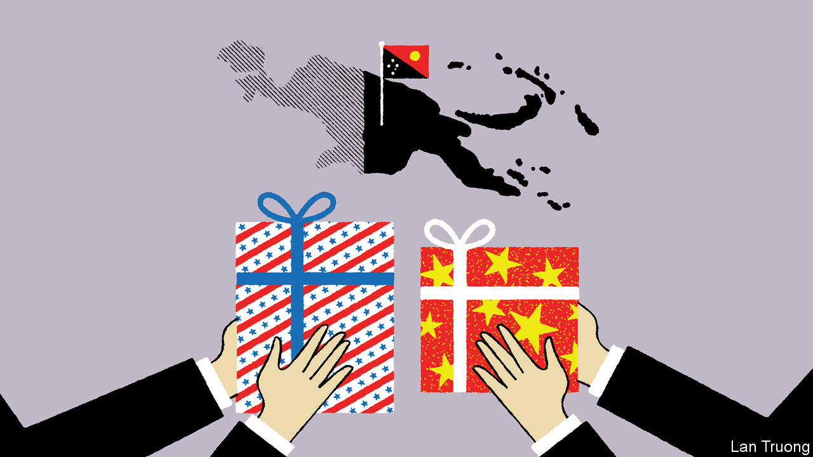

###### Banyan

# America is lavishing attention on Pacific island states 

##### Anthony Blinken is the most significant American official to visit Papua New Guinea since General Douglas MacArthur 

 

> May 25th 2023 

THERE ARE two ways of looking at the security pact that Antony Blinken, America’s secretary of state, signed with the prime minister of Papua New Guinea (PNG), James Marape, on May 22nd. The obvious one is as further evidence of the great-power contest between America and China that is playing out in ever-expanding ripples across the Pacific Ocean. In that contest, America had, by its own reckoning, previously neglected the role of Pacific island states, of which PNG, a diverse land with 10m people, is by far the biggest.

America is now making amends. It opened an embassy in the Solomon Islands and Tonga, and has plans to do so in Kiribati and Vanuatu. While in Port Moresby, PNG’s capital, Mr Blinken also signed renewed “compacts of free association” with Micronesia and Palau, island states between PNG and America’s dependency of Guam. A renewed compact with the Marshall Islands will follow. These states hand over their defence exclusively to America in return for aid guarantees and other benefits.

Yet the pact with PNG, the most striking evidence of renewed American engagement with the region, also represents a significant new opportunity for its island states. President Joe Biden had been due to travel to PNG to sign the pact. America’s fraught internal debt-ceiling negotiations nixed that. Even so, Mr Blinken is surely now the most influential American official to have visited png since General Douglas MacArthur.

The strategic thinking is this: if America is to deter China from invading Taiwan (or if it is to defend Taiwan if China invades), Guam will be a crucial American military base. It is outside the range of many Chinese missiles. But Guam’s resilience rests on safe seas and skies around it. Hence the importance of these other island states. In addition, were China to control the waters around PNG, Australia, an important American ally, could be bottled up. Some of the bitterest fighting of the second world war took place in PNG, where MacArthur was supreme allied commander, precisely because of its strategic importance.

America’s view of a titanic, superpower contest is officially deplored by China—but shared by it. Its envoy to the Pacific, Qian Bo, accuses America of possessing a “cold-war mentality”, of trying to sabotage China’s relationships, and of being blinded by “ideological prejudice”. Perhaps. But China has a cold-war mentality, too. It vies unbendingly with Taiwan for influence with the Pacific’s smaller states. In 2019 its financial inducements, some of them underhand, persuaded the Solomon Islands and Kiribati to switch diplomatic allegiance. A security pact that China signed with the Solomons last year led a panicked America to realise how much ground in the region it had lost. 

Untrammelled competition between the two big powers is met by some islanders with foreboding (Port Moresby saw protests against the new pact). The Pacific islands’ history as hapless victims is seared into the collective memory; they were objects of colonial exploitation, then bloody battlefields and finally post-war sites for nuclear tests. But for those minded to see the upside for the Pacific states, as well as the risks, in their renewed geopolitical relevance, there are many opportunities to point to.

The island states are no longer victims. It has been years, says John Blaxland of the Australian National University in Canberra, since they enjoyed such favours from outside powers, in terms of high-level visits, offers of investment and other commitments (the $45m Mr Blinken promised impoverished PNG will help it fight transnational crime and climate change).

Great-power competition can mean growing options. The PNG deal underscores a level of comfort among Pacific states with outsiders that have English, Christianity and history in common with them. Last year they flatly rejected China’s attempts to create a new geopolitical bloc. Yet they are happy to take Chinese investment. Mr Marape says PNG will not stop working with China; indeed it is negotiating a free-trade deal with it. PNG, says Mihai Sora of the Lowy Institute, a Sydney think-tank, is “very deft at compartmentalising relationships”—security and development with America, trade and investment with China.

Other Pacific states are, too. Seen from a local perspective, the island countries are increasingly binding America and China into a web of Pacific obligations. It could make the region stronger—and, by restraining the adventurism of both powers, perhaps even safer. ■


