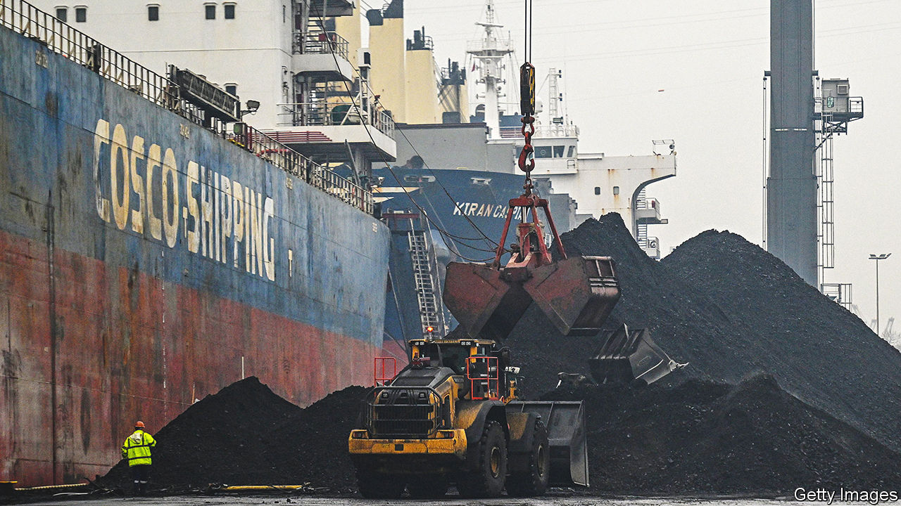
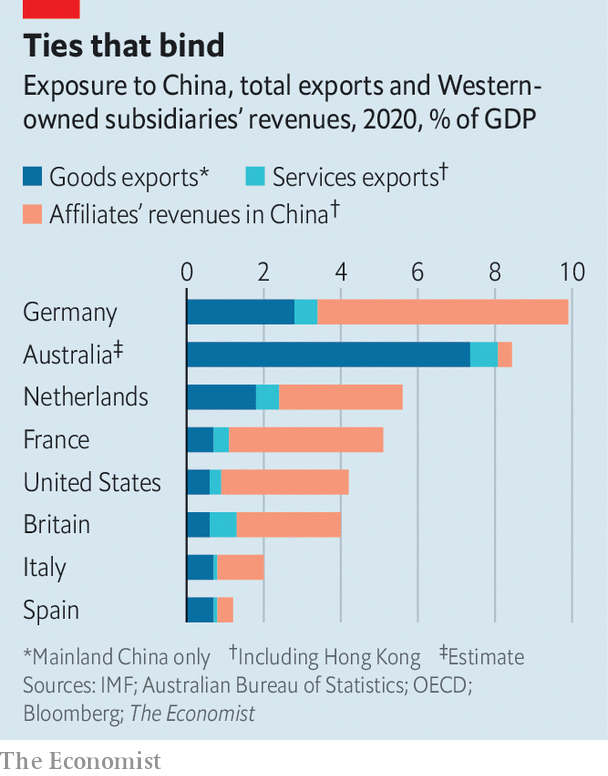

###### Surviving the dragon

# Australia has faced down China’s trade bans and emerged stronger 

##### The “lucky country” may be uniquely able to endure Chinese bullying 

 

> May 23rd 2023 

WHEN China launched a campaign of economic coercion against Australia in 2020, Communist Party bosses thought they had crushing leverage. The economies of the two countries—resource-rich Australia and commodities-hungry China—were complementary and closely connected. By massively curbing shipments of everything from timber to coal, lobsters, barley and wine, on pretexts including exaggerated concerns about trade practices and pest infestations, China imposed a A$24bn ($16bn) hit on Australia, representing 5.5% of its total annual exports. Yet it did not succumb. And like a surfer surviving a shark attack with no more than a lightly gnawed board, Australia is now emerging from three years of Chinese bullying in remarkably good shape. 

Its exports briefly suffered under the strictures, then surged—culminating last year in Australia’s biggest-ever trade surplus, equivalent to more than 7% of gDP. And the trade blocks, imposed after Australia’s then-conservative government dared call for an inquiry into the origins of Covid-19, are coming off. On May 18th, after a meeting between the two countries’ trade ministers in Beijing, China lifted a de facto ban on Australian timber. (“Serious study” by quarantine officials had allayed its concerns about bug infestation, explained Xiao Qian, China’s ambassador in Canberra.) Since January, Chinese importers have been quietly buying Australian coal: in the first quarter of 2023 Australia sent them A$1.2bn-worth of the stuff. Australia’s centre-left Labor government says cotton and copper exports are also resuming. China is reviewing tariffs on barley, Australia having suspended its case against them at the World Trade Organisation (WTO). 

 


After years of unchecked Chinese bullying, on Asia’s seas, in its multilateral forums and beyond, Australia’s escape is being widely understood as a significant win. And so it is. Yet it involved, as well as strong nerves, a large dose of luck.

Chinese leaders were only half-right. As their boycott began, Australia’s economy was indeed reliant on China. Exports of goods and services to China accounted for 11% of outbound trade in 2005. By 2020, the share stood at 37%. Mitigating its reliance, Australia’s bet on China was chiefly a wager on international trade. Australia has relatively few multinationals that manufacture and sell inside China. But even without vast China-based subsidiaries, Australia was vulnerable. ’s  of China exposure adds goods exports to China, services exports to China and Hong Kong, and the revenue of foreign multinationals’ affiliates operating in China and Hong Kong. Australia’s exposure, at 8.2% of GDP in 2020, was double that of America, and close to that of Germany.

Luckily for Australia, however, the two economies were such a good fit that China’s firms felt as much pain from the curbs as Australia’s, if not more. And some commodities, such as Australian iron ore, were so hard to replace China chose not to target them. Also luckily, many of Australia’s bruised exporters found other markets.

After China slapped a tariff of up to 80% on Australian barley, its producers sold it to South-East Asian countries. They also planted other crops. And Chinese beer-makers had to buy other countries’ barley, which was not as good. When China blocked shipments of Australian coal, similarly, it had to buy more from Russia and Indonesia. That left India and Japan short, so Australia sold to them. Meanwhile, rising world prices made Australian miners lots of money. Australian pain, though not insignificant, was concentrated: lobster fishermen struggled; wine exports to China’s middle classes plunged.

Australia’s efforts to manage the crisis politically were assisted by Chinese overreach. China’s propaganda machine fiercely denounced Australia, and almost all official contacts were frozen. In November 2020 China’s embassy in Australia made public a list of 14 grievances with the country’s then conservative government. Ranging far beyond economic questions, China moaned that members of Australia’s parliament were allowed to criticise the Communist Party and that the country’s news outlets published “unfriendly or antagonistic” reporting on China. The then-prime minister, Scott Morrison, suggested that these complaints were essentially against “Australia just being Australia”.

Encouraged by such missteps, Australia held its nerve. The election of a new government, led by Anthony Albanese, then gave China an excuse to climb down.

Mr Albanese’s government has been careful not to crow. Dispelling talk of a big win for the West, it claims to be steadfastly respectful and pragmatic in its dealing with China. The idea, ministers say, is to “co-operate where we can, disagree where we must”—meaning no gratuitous poking of the dragon. “Disagree behind closed doors, but don’t amplify your differences,” warns another Australian official. “China responds well to this.”

Alongside such caution, Australia also understood its strengths. China relented because it “saw that we wouldn’t capitulate”, the same official argues. Australia resisted demands to change laws, overturn investment bans and muffle critics. Rather, under its previous and current government, it tied its security policy tighter to America through AUKUS, a trilateral submarine-building pact that also includes Britain, and a policy of deterrence. It is also doing more diplomatically to counter China’s influence in the Pacific. The trade bans have in this sense backfired.

Australia set another useful example at the wto. China agreed to review its barley tariffs just as Australia’s case against them was concluding. Rather than force the issue to a judgment, Australia suspended its action. “China does not want to be shamed in the international arena,” says Matthew Goodman of the Center for Strategic and International Studies in Washington.

Australia was additionally helped by the fact that China wants to join the Comprehensive and Progressive Trans-Pacific Partnership (CPTPP), a vast regional trade deal. As a CPTPP member, Australia could block China’s accession. It accordingly made clear there was no possibility of accession talks so long as China was trampling economic rules and its pre-existing free-trade agreements with Australia. 

How will Australia guard against the risk of a repeat? Decoupling is not on the agenda—China still accounts for almost a third of its total goods and services exports. But three years of Chinese bullying have left a mark. Australia is trying to reduce its reliance on China by signing free-trade agreements with India and Britain. Another, with the EU, is in the works.

China’s aggression has concentrated minds among Australia’s partners and allies, too. At meetings in Japan on May 20th, leaders of the Group of Seven (G7) countries voiced concern at the “disturbing rise in incidents of economic coercion” and promised, for the first time, to collaborate against attempts to “weaponise economic dependencies”. There is more talk of solidarity and co-ordination, so countries do not profit by selling more to a bully when a friend or neighbour is being targeted. America’s ambassador to Japan, Rahm Emanuel, talks of his country offering “support and countervailing opportunities to partners in their times of need”.

China is the largest trade partner of a long and growing list of countries. Very few have the wealth and natural resources that protected Australia, the “lucky” country. Even so, many are studying the lessons of Australia’s escape from China’s grip. ■

