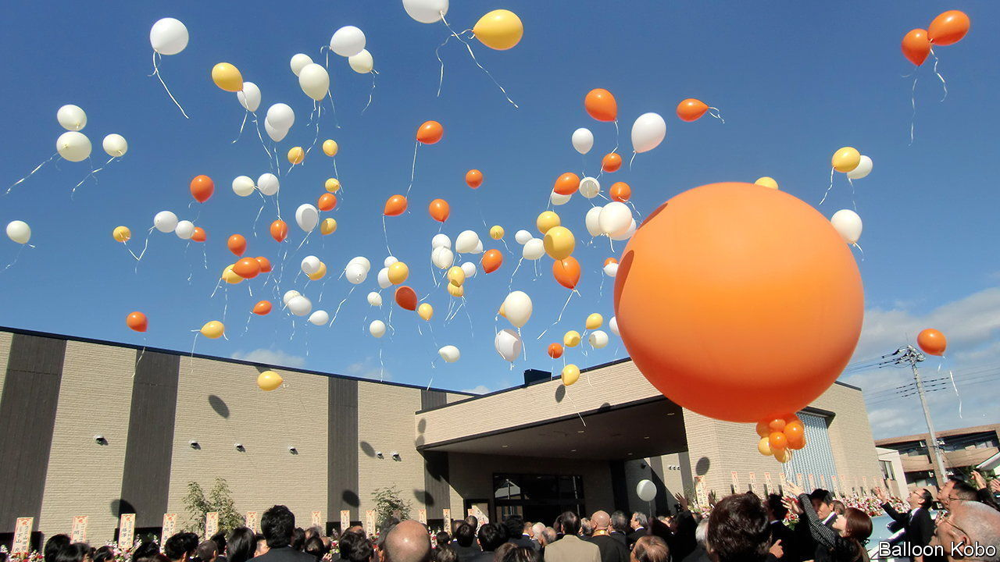

###### Up and away

# Japan’s ageing society is finding creative ways to dispose of its dead 

##### A new craze for funeral planning is disrupting the way Japanese think and speak about their demise 

 

> May 25th 2023 

The Sakashitas gather in front of a gigantic red balloon. Inside it are the ashes of their late father, Haruhiko, and his late dog, Fuu-chan. On a count of three, Saiko, the dead man’s daughter, snips the string tethering the helium-filled orb. It shoots into the sky, with a dozen smaller balloons in pursuit. The family members watch—some waving—until the balloons disappear into the clouds. “Our father was a calm man, always travelling the world,” says his oldest son, Kohei. “Whenever we look at the sky, we will think of him.” 

In Japan, people are traditionally cremated after death and their ashes buried. But in a crowded, ageing and largely secular society, this is becoming trickier and less desirable. Japan’s death rate is soaring—in 2022 the country logged 1.5m deaths, the highest figure since the second world war. Grave sites are running out of space. There are fewer grieving relatives around to perform funeral rites, or to tend graves. As a result, the rituals surrounding death in Japan are changing.

The “balloon funeral” chosen by the Sakashitas was invented in 2011 by a Japanese firm called Balloon Kobo, which has performed 300 such funerals to date. Scattering ashes in the sea or mountains used to be frowned upon, but it has become widely accepted in recent years. “Tree burials”, whereby buried ashes are marked by a sapling instead of a gravestone, are even more popular. A survey showed that half of those who purchased graves in 2022 chose tree burial sites. People are increasingly attracted to the idea of “becoming one with nature”, says Inoue Haruyo of Ending Centre, a non-profit that helps put people in touch with cemeteries. The new methods also tend to be much cheaper than purchasing tombstones, which typically cost at least a million yen ($7,200). “Most people don’t want to bother their children after death,” says Onodera Yoshihiro, the president of Balloon Kobo.

Traditionally, Japanese graves are inherited by a family member, usually the eldest son, who is then charged with paying fees to the temples that manage them. Since the 1990s, as Japan’s birth rate has declined, there has been a growing shortage of such custodians. For many city-dwellers, visiting graves in their or their ancestors’ rural home towns (as is expected during certain holidays, such as  is also increasingly troublesome. Many ashes have been dug up and transferred as a result. In 2020 nearly 120,000 graves across Japan were thus “closed”. 

Japanese families traditionally hold a days-long wake for their dead relative and then the funeral service. But even where the old ways are hewn to, funerals are shrinking for lack of mourners or funds. In Japan, where life expectancy is over 80, many outlive their friends and close relatives. Partly to save money, it has become more normal to dispense with formalities such as lavish funeral altars and decorations. “The scale of one death has become smaller and smaller,” says Ms Inoue. Funerals and mourning are increasingly being combined into day-long affairs. Simply cremating bodies without any gathering or funeral rite is also becoming more common. While funerals are traditionally Buddhist (and marriages Shinto), non-religious funerals are also on the rise.

These disruptions are not only easing the burden on bereaved families. They are also changing the way Japanese think and talk about their impending demise. Selecting from a growing number of funeral options necessitates conversations about death, once a taboo. “Shukatsu”, or “death planning”, a term that combines the words for “end” and “activity”, has entered the lexicon. Beyond funeral preparation it often entails taking greater care over bequests and posthumous instructions than was once the norm.

“When he was alive, my husband said he would like to fly in the sky,” says Sakashita Akiko, Haruhiko’s wife, explaining why the family opted for a balloon funeral. Their son Kohei echoes the sentiment. “We knew what our father wanted, and we wanted to respect that.”■

