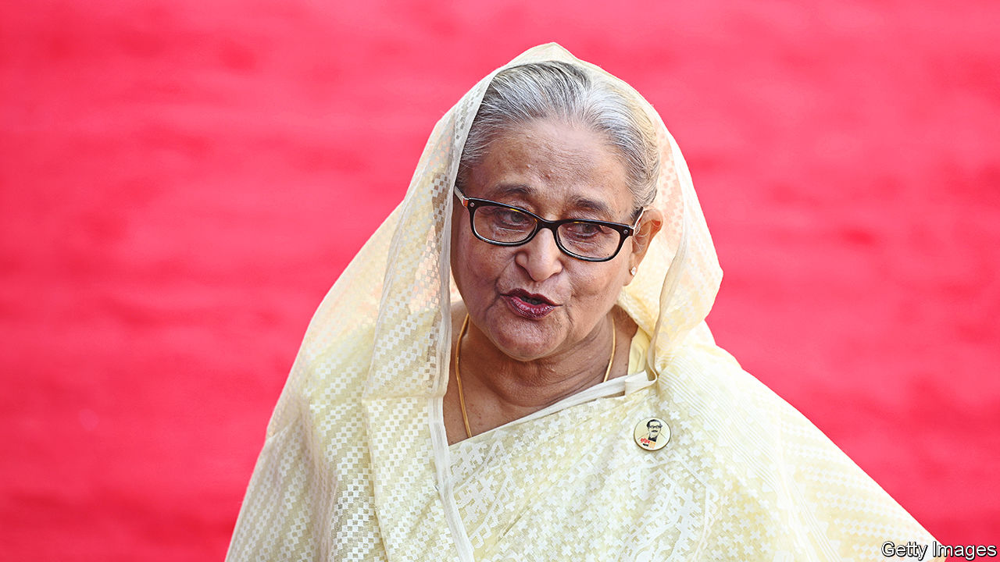

###### An interview with Bangladesh’s prime minister

# Sheikh Hasina is Asia’s iron lady 

##### Her tragic past now threatens Bangladesh’s future 

 

> May 24th 2023 

Bangladesh’s prime minister, Sheikh Hasina, is the world’s longest-serving female head of government, and one of the most significant of either sex. During two decades in office she has presided over momentous poverty alleviation in her country of 170m, fuelled by average  of 7% for much of that time. The 75-year-old has led her party, the Awami League, to victory in three consecutive polls, and four in all—one more than Indira Gandhi or Margaret Thatcher managed. With an election due early next year, which she is expected to win, asked her, in an interview in her northern Virginia hotel suite, what ambitions she had left.

“I want to make this country a hunger-free, poverty-free developed country,” she says—then abruptly switches tack. “Can you imagine that they killed my father?” she asks, referring to the grim history that launched and still shadows her career. 

Her father, Bangladesh’s first president, Sheikh Mujibur Rahman, was assassinated in an army coup in 1975, four years after the country’s bloody split from Pakistan. Seventeen of his close relatives—almost all except Sheikh Hasina, in Europe at the time—were murdered too. “They killed my brother, my mother, another brother—only ten years old! My two sisters-in-law, my only uncle, a disabled person,” says the prime minister, her eyes wet with tears.

Her advisers had primed this interviewer to ask about that long-ago tragedy. He had not, but Sheikh Hasina raises it anyway, as she often does. This illustrates the great sense of loss and destiny she exudes—and on which she has built an imposing personality cult. A huge portrait of Sheikh Mujib, schlepped around the world by her 100-man retinue, leans by her chair. She nods towards it, as if bringing the murdered man into the conversation.

The question confronting Bangladeshis is whether their leader’s feelings of grievance and dynastic entitlement are becoming a threat to her legacy and their future. The interview provides little reassurance.

No politician likes criticism. But the prime minister bristles at the slightest suggestion that her record is imperfect; and in response offers rapid-fire criticisms of almost every Bangladeshi government except her own. Asked about corruption, she blames it on the military government that replaced her father, accuses the World Bank of inventing a recent scandal allegedly involving members of her government, then claims the problem does not exist. “Maybe in the down level, but not that much nowadays. They dare to do it and I will take action!”

Bangladesh has long been rated South Asia’s most corrupt country after Afghanistan. Thanks to the Taliban’s steps, it may now be the most corrupt. Some of its graft looks symptomatic of the de facto one-party state that Sheikh Hasina, fulfilling one of her father’s ambitions, has made.

Before she was re-elected in 2008, power switched repeatedly between the League and the Bangladesh Nationalist Party (BNP), run by another charismatic dynast, Khaleda Zia. Amid the political tumult, the country’s institutions, including the media, police and courts, had a degree of independence. Now Mrs Zia is under on-off house arrest, her party’s activists are hounded, the media is cowed and the police and courts are suborned to Sheikh Hasina’s party. Not coincidentally, they are two of the country’s most corrupt bodies.

The coming election will not offer the bnp a way back. Although Sheikh Hasina claims to be committed to a free vote, she says that only a “real political party” should be permitted to compete—and that her opponents do not fit the criteria.

She accuses the BNP, formed under army rule half a century ago, of being “constituted by a military ruler illegally”. She alleges that the country’s biggest Islamist party, a former ally of Pakistan, is “almost all war criminals”. “Our point is that there is no such party [apart from the League] who can really contest the election.”

In some ways, Bangladesh has probably benefited from her iron grip. It has not obviously boosted the growth rate, which hit a high gear before her extended spell in office and is largely a product of pre-existing factors: such as the country’s garment industry and services provided by its elite NGOs. Yet she has wrought policies, including infrastructure investment, that have helped maintain the boom, which a weaker government might not have sustained. 

But authoritarianism has diminishing returns. Overly reliant on garments, Bangladesh needs to develop new exports, a reality its government is hardly grappling with. (Sheikh Hasina says it is looking to develop handicrafts and food processing—an insufficient solution.) Bangladeshis, a disputatious people, are bridling at her strictures. Several hundred were protesting rowdily outside the hotel. Rights groups say the election could be violent.

America might once have warned Sheikh Hasina to let Bangladeshi democracy breathe. Now it is mainly concerned that she should not accommodate China, which her government is courting for investment. India, where she has close personal ties, takes a similar view. Sheikh Hasina appears adept at mollifying all three, a success she attributes to pragmatism. “The relations between America and China are their own matter. Why should I poke my nose there?” Yet she makes a dig at America, because it was once close to Mrs Zia. “They say they are the democratic country…But in our country they don’t exercise that. Why don’t they support me?” 

Actually they do, but perhaps shouldn’t. Sheikh Hasina’s long career has been a story of courage and the ruthless use of power, with some policy successes that she can lay claim to, and epic national growth that she cannot, but does. It is hard to see how the story will end well. She is growing increasingly authoritarian and resented and, as she confirms, has no plans to retire.

Her government’s latest plan is entitled Vision 2041. She will not see it out, she concedes. But as she broaches a third decade in power, succession planning is not on the agenda. “Because if I’m not there…I don’t know who will come to power.”■

