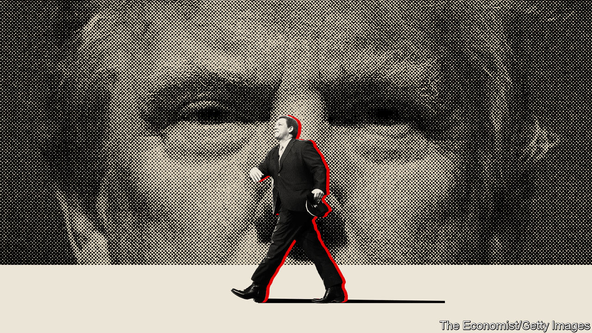
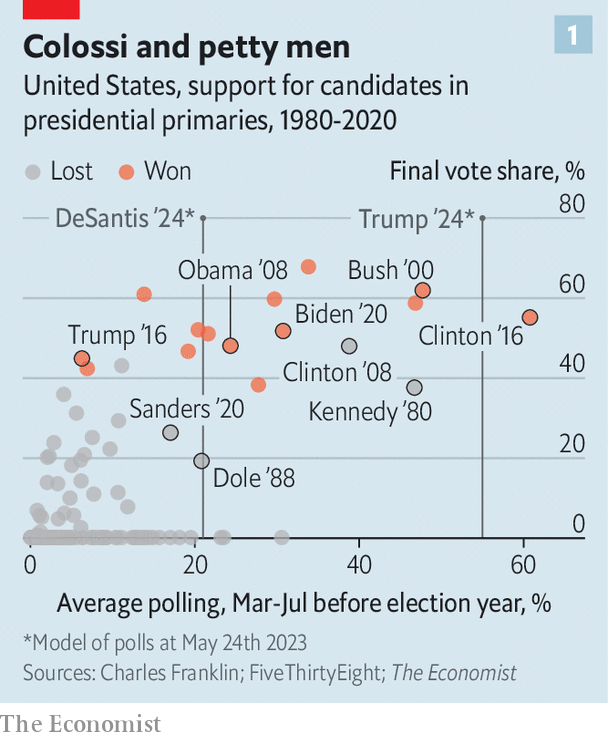
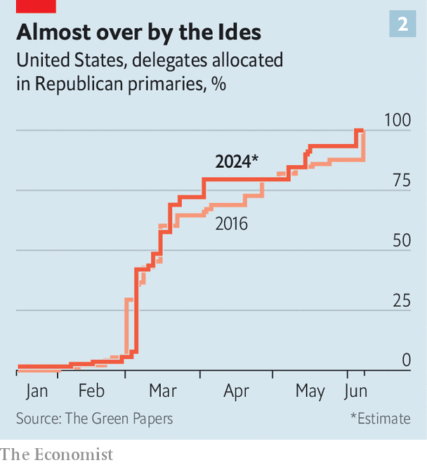
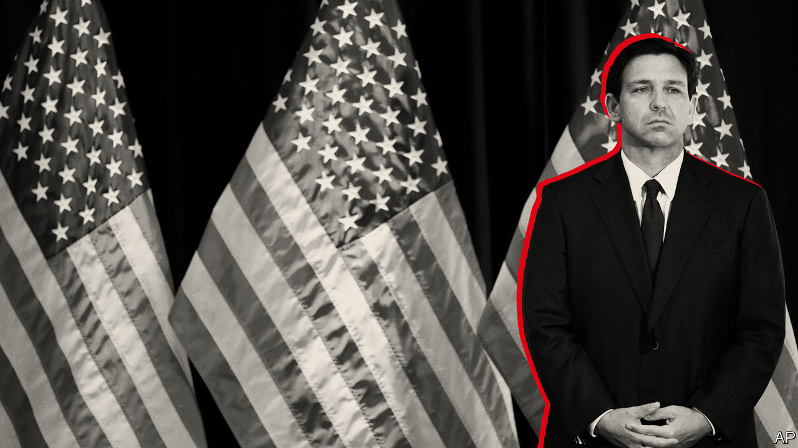

###### A bungled coup

# Ron DeSantis has little chance of beating Donald Trump 

##### Hopes of depriving the former president of the Republican nomination are fading 

 

> May 24th 2023 

BELATEDLY and nervously, the would-be assassins have been lining up. On May 22nd Tim Scott, a senator from South Carolina, became the latest Republican to announce a run for president. Greater fanfare accompanied the official declaration (on Twitter) on May 24th that Ron DeSantis, the governor of Florida, is joining the race for the Republican nomination. He has been widely heralded as the candidate with the best chance of defeating the favourite, Donald Trump. But even as more plotters step forward, the chances of a successful coup to overthrow Mr Trump are growing slimmer by the day.

Just a short while ago Mr DeSantis seemed successfully to have engineered a form of Trumpism without Trump. In November he won re-election in Florida by a resplendent 19-point margin. In damning contrast, Mr Trump’s attempts to play kingmaker in the midterm elections went disastrously wrong, with many of the candidates he endorsed losing races that the Republican Party had considered in the bag. Mr Trump appeared suitably deflated when he launched his presidential campaign on November 15th at Mar-a-Lago, his estate in Palm Beach, Florida. Back then some opinion polls put the two candidates neck-and-neck among primary voters. 


Six months later it is Mr DeSantis who has been stumbling. He has been criticised as an isolationist for dismissing the war in Ukraine as a mere “territorial dispute”, as an anti-corporatist for picking fights with Disney and as an extremist for signing a ban on abortion beyond six weeks of pregnancy. Mr Trump, meanwhile, has recovered his step, making a triumphant return to the campaign trail. He and his team have spent months pummelling Mr DeSantis. In retrospect, the governor’s decision to wait until Florida’s legislature had completed its annual session earlier this month before announcing his candidacy looks like a miscalculation, although the delay was in part to allow lawmakers to pass a bill permitting him to run for president without resigning as governor. During the long interlude he has endured a protracted beating on the airwaves without offering much defence. It is as if Brutus had overslept on the Ides of March, giving Julius Caesar a chance to put on his armour, but had tried to proceed with his hit job all the same. The plot to overthrow Mr Trump, which once seemed plausible, now looks forlorn. 

Lend me your cheers

In 2016 Mr Trump ran as an insurgent. In 2020 he ran as the incumbent. For 2024, he is running as a hybrid of the two—insurrectionist and institutionalist all at once. It is proving to be a potent combination, which has helped to build a huge lead in the early polling. Among likely voters in the primary, Mr Trump retains the stature of a former president, but is also seen as the put-upon underdog, owing to his claims that the election of 2020 was stolen, his bans from social media and his . Early stumbles, such as his lacklustre campaign launch and an embarrassing dinner with a white supremacist, have been righted by a new campaign operation that is more professional than the chaotic family affairs of Mr Trump’s past runs.

What is more, the Republican Party has been thoroughly Trumpified. This is especially true at the state level, where most of the rules for primaries are set. Unlike 2016, when the party establishment shunned Mr Trump, today he dominates the race for elite endorsements. Many big donors have defected to alternatives such as Mr DeSantis, but this is not as damaging as it sounds. Mr Trump will have no trouble raising money from his army of small-dollar donors and will again be able to portray himself as the authentic tribune of the people, assailed by the henchmen of the out-of-touch elite. Among the Republican base, he has universal name recognition and near-universal admiration.

This reverence for Mr Trump makes it difficult for his competitors to attack him. Most of them come not to bury Trumpism, but to praise it. But the resulting muddle blunts their appeal. Jason Miller, a spokesman for the Trump campaign, puts it this way, “Why would you go to see a Rolling Stones tribute band, when the Rolling Stones themselves are still on tour?”

Are the primaries over before they have begun? Some think so. “Hope is not a strategy,” says Rick Wilson, a former Republican operative who now runs the Lincoln Project, an anyone-but-Trump outfit. He thinks Mr Trump would have to be incapacitated to lose. “Donald Trump will start taking DeSantis’s head off in debates and kicking it around like a soccer ball. And the Republican base voters want that show,” he says. Ask closeted anti-Trump Republicans around Washington how the primary will go, and many conjure scenes of brutality worthy of the Gallic wars.

More optimistic sorts, however, point out that there is still a long way to go, even if Mr Trump’s chariot is building speed. “We’re still months and months and months away from voting. National polls are pretty meaningless—they are going to mean something once voting has started,” says David Kochel, a Republican consultant based in Iowa (the first state to vote) who previously worked with Mitt Romney and Jeb Bush. Consultants for struggling campaigns swap Cinderella stories about late-breaking candidates who went from 2% in Iowa to 20% in the space of a month. 

 


Early polls, it is true, do not predict the final results as well as later ones. But that does not mean they are useless. There is a correlation between early strength and the final results (see chart 1). At present, Mr Trump commands the support of almost 55% of primary voters according to a polling average constructed by FiveThirtyEight, a data-journalism outfit. That is more than 30 percentage points more than Mr DeSantis’s average. In contested primaries over the past 40 years, six of the eight candidates who have polled above 30% this far ahead of the voting went on to capture their party’s nomination. The two candidates who failed to capitalise on such big leads were Ted Kennedy, who ran against an incumbent president, Jimmy Carter, in 1980, and Hillary Clinton, who was eventually upstaged in 2008 by the charismatic Barack Obama. The Republican candidate who comes closest to both Carter-like incumbency and Obama-like magnetism this year is, of course, Mr Trump.

The problem is not simply one of a divided field. Although there are already six declared, halfway plausible candidates, with more to come in all likelihood, even a two-horse race would favour Mr Trump. Recent polling conducted for  by YouGov finds that, in a head-to-head contest, Republican primary voters prefer Mr Trump to Mr DeSantis by 58% to 25%. And the former president’s support is not at all reluctant or half-hearted. Fully 64% of Republicans want Mr Trump to run again, despite the many alternatives. Democrats, by contrast, are much less energised about Joe Biden, their presumptive nominee: only 53% of them want the president to run again.

In 2016 Mr Trump’s opponents thought his outrageous statements and chaotic campaign would inevitably lead to political failure. That proved hopelessly Pollyannaish. Most now assume there is little that Mr Trump could say or do to alienate his base. But some opponents still hope that his campaign will implode because of the sort of messy infighting that characterised his entire time in the White House.

The hitch is that the chaos candidate is a bit more orderly this time. In 2016 Mr Trump’s campaign attracted a fair number of charlatans. Current management is more stable. Susie Wiles, one of its leaders, ran Mr Trump’s successful operation in Florida in both 2016 and 2020. She also headed Mr DeSantis’s run for governor in 2018, when he was Mr Trump’s protégé. There is little family involvement: Ivanka Trump and Jared Kushner, the former president’s daughter and son-in-law, who served as senior advisers when he was in the White House, are not expected to play any part in the campaign. Mr Trump also has much more personal experience: this is his third run for president (fourth if you count his abortive campaign with the Reform Party in 2000). His Republican opponents are all running for the first time.

 


Mr Trump’s team is assiduous. “Shortly after I got elected, the next day or a couple of days later, I received a voicemail from President Trump congratulating me,” says Mike Brown, the chairman of the Republican Party in Kansas. The Trump campaign has been “exceptional” in communicating about the primary in the state, he says. The rules that will translate the results of individual state primaries and caucuses (in effect, decentralised party conferences) into votes for contenders for the nomination at the party’s national convention are arcane and ever-changing. Unlike the Democratic primaries, in which a state’s votes are typically split among the candidates in proportion to their share of the vote, many Republican primaries follow a winner-take-all system. That can turn a relatively narrow lead in terms of the share of the vote into a crushing dominion over delegates. While Mr Trump was president, he encouraged states to adopt such systems or other rules that help the front-runner. And the dates of the primaries keep moving even further forward, giving insurgent candidates ever less time to build momentum (see chart 2). 

Mr Trump’s team has been seizing a march on its adversaries in other respects, too, diligently soliciting endorsements from senior figures in the party with calls and invitations to the imperial court at Mar-a-Lago. Such support was not forthcoming in 2016, but has been flooding in ahead of next year’s contest. Mr Trump has already racked up the endorsements of 51 of the 222 Republicans in the House of Representatives and ten of the 49 Republican senators. His opponents have just seven representatives and two senators among them all. The Trump campaign takes particular pride in its success with Florida’s delegation to Congress, who have largely spurned their state’s governor. Eleven of Florida’s 20 Republican representatives have endorsed Mr Trump, compared with just one for Mr DeSantis. Mr DeSantis and Mr Scott could not expect many endorsements before entering the race, of course, but they have a lot of catching up to do. 

Operationally, at least, Mr DeSantis can certainly hope to catch up. He is a prodigious fundraiser, taking in an astounding $217m during his gubernatorial run in 2022, much of which went unspent. Because Mr DeSantis is the favourite among deep-pocketed donors (though his stances on abortion, Disney and Ukraine have irked some), he will rely heavily on an organisation called “Never Back Down”, a so-called super PAC that can take unlimited donations as long as it does not co-ordinate with the official campaign. A person familiar with Mr DeSantis’s thinking says he could raise $250m between his official campaign and the super PAC. The mastermind of Never Back Down is Jeff Roe, the founder of a consultancy called Axiom Strategies, which worked on both the failed presidential campaign in 2016 of Ted Cruz, a Republican senator from Texas, and Glenn Youngkin’s successful bid for governor in Virginia in 2021. Never Back Down is expected to carpet-bomb television with advertisements and also pay for the canvassers and organisers who must traipse around early-voting states for months.

The official campaign will be run by members of Mr DeSantis’s inner circle in Florida. The likely campaign manager, Generra Peck, headed his most recent campaign for governor. His polling guru will probably be another homegrown talent, Ryan Tyson. Mr DeSantis is the favourite to win the arms race for donations. He will have plenty of campaign veterans who know how to spend his takings.

I came, I saw, I squandered

If cash were all it took to become president, America would be midway through the first term of Michael Bloomberg, a tycoon and former mayor of New York who lavished $1.1bn on a failed campaign for the Democratic nomination in 2020. Persuading Republican voters to defect from Mr Trump, as Mr DeSantis must now do, is a difficult task. Many obvious avenues of attack, the ones that might appeal to swing voters in a general election, are non-starters in the primary. Mr Trump’s encouragement of the mob that stormed Congress on January 6th 2021 hardly imperils his standing in the party, most of which believes that the election of 2020 was stolen. Nor can his opponents make hay from the inquiries, investigations and lawsuits that have dogged the president since he left office, from the FBI’s search for classified documents at Mar-a-Lago to his recent indictment by Manhattan’s district attorney for fraudulent book-keeping. These indignities, far from diminishing Mr Trump in Republicans’ eyes, have turned him into a martyr. Even political rivals like Mr DeSantis have felt obliged to come to his defence.

 


The party firmly believes in Trumpism, the blend of populism, protectionism, nativism and disdain for institutions and norms. The old neoconservative and business-friendly order has been swept away. The other candidates’ failure to present a “value proposition”, says Mr Miller of the Trump campaign, “will impede their ability to build coalitions and actually go and challenge the president…Saying that you’re Trump without the drama, which is kind of where it seems Ron DeSantis is going—that just doesn’t work.”

Presidential primaries are often popularity contests more than they are policy debates—and this one will be little different. All the candidates agree that Mr Biden is intentionally wrecking the country, that wokeness has run amok and that the southern border must be sealed. There are only modest signs of disagreement. Mr Trump is attacking Mr DeSantis from the left on fiscal matters, arguing that he will endanger Social Security (the state pension) and Medicare (free health care for the elderly), two sacrosanct programmes among older voters. Mr Scott is calling for less confrontational politics. More internationalist candidates such as Nikki Haley, a former governor of South Carolina, argue that continuing to back Ukraine is vital for America’s national security.

Others are more isolationist than Mr Trump. Vivek Ramaswamy, a wealthy Indian-American entrepreneur from Ohio, says, “We’ve got to be willing to ban most US businesses from doing business in China until the CCP [Chinese Communist Party] falls or until the CCP radically reforms itself.” That is a harder decoupling than the other candidates have proposed. He also wants to ban affirmative action, shut down the FBI and use the army to dismantle Mexican cartels that ship fentanyl across the border. Early polls show some success in peeling off Trump voters, but it is a delicate operation. “We rally behind America first for a reason. It’s not Trump first,” says Mr Ramaswamy. “I’m running against him, but to be clear, I still recoil at the idea that the nominee should somehow be the product of some plot of Republican donors.”

But the conspirators must at some point coalesce if they are to be rid of Caesar. In 2016 the fractured field, combined with winner-take-all primary rules, helped Mr Trump triumph. Whereas Democrats united behind Mr Biden in 2020 when it became apparent that Bernie Sanders, a left-wing ideologue, might secure the nomination, Republicans may be hard to corral. At the moment, Mr DeSantis certainly looks like the strongest rival to Mr Trump. But the other candidates seem much keener to attack him than the former president, for fear of alienating the base. Ms Haley has taken to denouncing Mr DeSantis for feuding with Disney, for instance. Other prominent Republicans, such as Kari Lake, a failed candidate for governor of Arizona last year, and Kristi Noem, the governor of South Dakota, have taken to swiping at Mr DeSantis as well. They may be auditioning for the job of vice-president to Mr Trump, and see such attacks as a quick way into his good graces.

Despite his stumbles in recent months, Mr DeSantis is a clever and driven man. He may regain his lean and hungry look and let slip the dogs of war. Many voters will pay close attention to the televised debates, the first of which will be held in August in Wisconsin (although the former president may not participate). Mr DeSantis could point out that the national debt soared by $8trn during Mr Trump’s presidency; that crime and illegal immigration both increased despite all the former president’s big talk on both scores; that covid-19 was poorly contained and that another epidemic, of wokeness, became more rather than less contagious during his presidency. It might help to point out that Mr Trump, a man famous for peremptory sackings, failed to dismiss Anthony Fauci, the public face of efforts to repress covid, who is about as popular in conservative circles as gun seizures and sharia law.

Such barbs could draw some blood. If wielded with enough force and frequency, they might even fell a man as mighty as Caesar. Luckily for Mr Trump, he is facing a fractious, squabbling and timid bunch. ■


