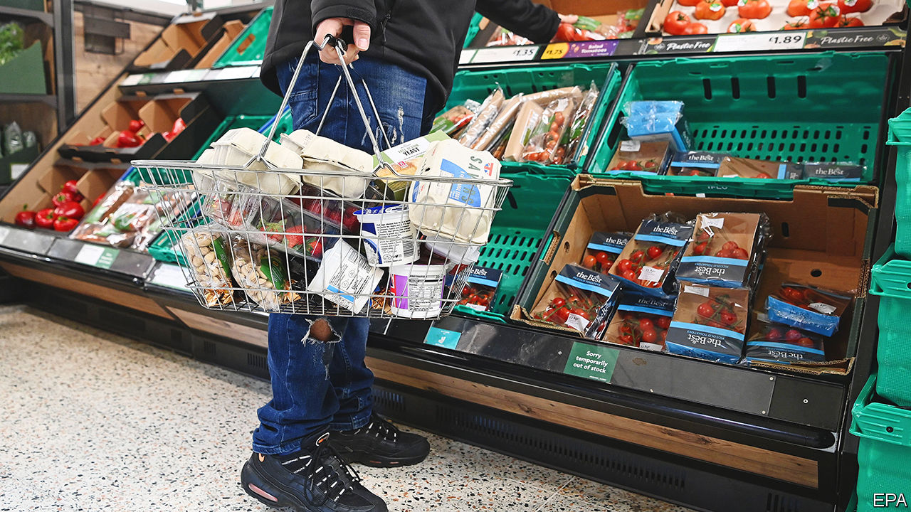

###### Bittersweet

# Britain’s economy may grow by more than expected, but inflation is stickier 

##### That makes the choice facing the central bank easier 

 

> May 24th 2023 

Britain’s economic outlook is a bit rosier. That at least is the verdict of the , a global financial watchdog, which on May 23rd upgraded its forecast for the country. Instead of falling into  this year, as it was predicting in April, the IMF now believes that Britain will eke out growth. The fund attributed the improvement to a trifecta of falling wholesale energy prices, improved financial stability and warmer relations with the EU, exemplified by Rishi Sunak’s  to reduce trade frictions in Northern Ireland. 

As a result the IMF reckons that Britain no longer looks like the sick man of Europe. The fund’s growth forecast of 0.4% for 2023 is hardly the stuff of champagne and cartwheels, but it is still better than the slight contraction it predicts for Germany. The fund thinks that Britain will also do better than France and Italy over the next few years. Those politicians who pointed out the fallibility of the IMF when it was predicting a recession now hail the technocrats’ prophecies as evidence that pessimism about Britain is overdone. 

At first glance inflation figures published on May 24th appear to be similarly encouraging for the government and its supporters. For the first time since the Russian invasion of Ukraine, the pace of price growth fell into single digits: the consumer-price index was 8.7% higher in April than 12 months previously. That is a big fall compared with the 10.1% rate in March.

In fact, there was little—if any—good news in the figures. The drop in the headline rate largely reflected “base effects”. Energy prices jumped in April 2022 as a cap on retail prices was adjusted to reflect higher wholesale prices following the start of the war in Ukraine. This April’s fall in the year-on-year comparison reflects a more favourable starting-point. 

The drop was also less than economic forecasters had expected. Economists working at banks and the like had predicted that the rate of inflation would drop even more steeply, to 8.2%. Higher food prices, increasing by 19% compared with April 2022, were partly responsible. So was a jump in the price of communication: many mobile-phone and broadband suppliers update their prices for annual contracts in April. 

Most concerning for the Bank of England, so-called core inflation, which strips out food and energy to give a less volatile picture of underlying inflationary pressure, rose to 6.8% in April, up from 6.2% in March. That means the core-inflation rate is at its highest level since 1992. A similar rise occurred in the rate of services inflation, a decent indicator of the domestically generated inflation that the bank has the greatest power to affect. 

Investors promptly raised their bets on an increase in interest rates when the bank holds its next meeting in June. Markets also predicted that the main policy rate will peak at 5.25% in November, compared with a peak of 4.5% before the latest data were released. The yield on government borrowing jumped to levels just below those seen in the chaotic aftermath of the disastrous mini-budget in September. 

The combination of better-than-expected growth prospects and worse-than-forecast inflation does make the bank’s decisions much easier: the economy both needs and can cope with higher interest rates. But rising mortgage costs and stubbornly high inflation mean that it will be a while before Britons share the IMF’s sunnier view of the country’s prospects. ■


