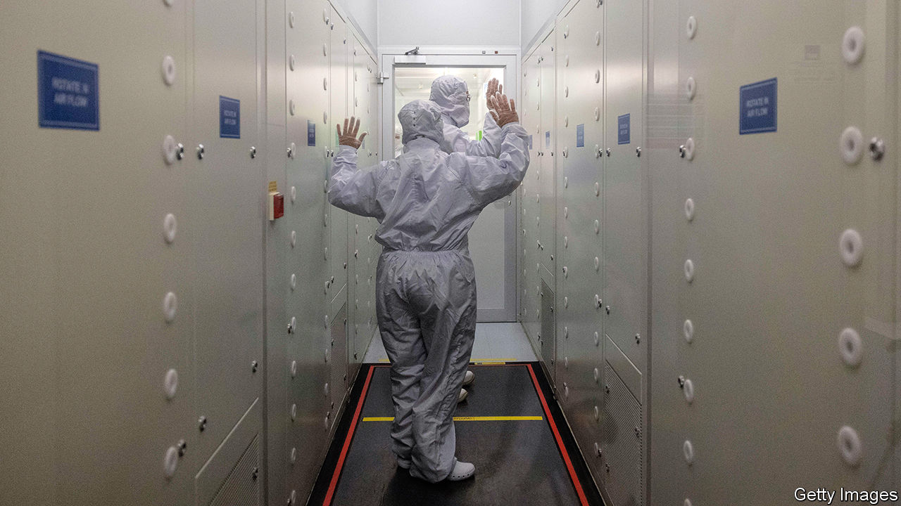

###### Dear as chips

# Britain’s semiconductor strategy shows the bind the country is in 

##### But a modest approach may be the sensible one 

 

> May 25th 2023 

It was the underwhelming announcement the industry had been waiting for. On May 19th the government unveiled a £1bn ($1.2bn) decade-long dollop of funding aimed at boosting Britain’s semiconductor sector. 

Industrial policy is back in vogue, especially when it comes to microchips, which power everything from washing machines to missiles. Spooked by shortages during the covid-19 pandemic, and worried that so much of the industry’s capacity is in Taiwan, which China regards as a rogue province, governments have been waving some very big chequebooks. 

America has announced $53bn of subsidies and bribes over the next five years to boost domestic firms and lure cutting-edge chipmakers from Asia. The European Union has likewise promised €43bn ($46.2bn) in handouts, in the hope of doubling its market share by 2030. Other countries have big-spending plans of their own.

Britain’s announcement looks anaemic by comparison. The opposition Labour party accused the government of lacking ambition, and also pointed out that the money is backloaded, with just £200m due to be spent by 2025 and the rest doled out by 2033. Simon Thomas, the boss of Paragraf, a chip firm based in Cambridge, pointed out that even the full £1bn would not be enough to fund the cost of a single modern chip factory or “fab”.

But Britain’s government is in a bind. Its stated aims are to build up Britain’s chip industry, mitigate the risk of supply-chain disruption and bolster national security. Yet it cannot hope to match the spending power of supersized economies like America’s and China’s. The chip industry is sufficiently globalised and full of high-tech bottlenecks that it is doubtful whether even a superpower can corral an entire supply chain within its borders. In any case, while Britain has a smattering of domestic chip firms, it lacks a big manufacturer, such as Intel, Samsung or TSMC, that could be a plausible national champion. 

Instead, the idea—at least in theory— is to focus on cheaper interventions. That includes more money for research and development, and a focus on companies that design chips but leave the business of manufacturing to others. One well-known example of that “fabless” strategy is Arm, a British-headquartered firm whose chip designs power the world’s smartphones. 

Another aim is to position the country to benefit from technologies that might become big in the future. Ministers are keen, for instance, to promote compound semiconductors. These make use of elements other than silicon, such as germanium or selenium, which have different electrical properties. The strategy also mentions photonics, which uses light rather than electricity to do computational work. Britain has small firms active in both areas.

National security is to be pursued partly via diplomacy. On May 18th, on a visit to Japan, Rishi Sunak, the prime minister, announced a new partnership to bolster supply chains. (Japan boasts several big suppliers of chip-making equipment.)

Some commentators think the government’s understated approach has merit. Malcolm Penn, who runs Future Horizons, a chip-industry consultancy, points out that the worldwide wave of subsidies to the industry now amounts to around $50bn a year, or nearly half the industry’s capital expenditure. That wall of money, he says, risks creating a long-term glut in capacity that could eventually leave state-backed factories struggling. 

And the British government’s fingers have been burned before. In the 1970s it funded the development of a firm called Inmos, whose chips anticipated many modern trends. That was not enough to save it. The firm was eventually swallowed up by STMicroelectronics, a Dutch firm. Subsidies powered the building of chip factories in Scotland and Wales during the 1980s and 1990s. Most have now closed.

Can the government’s latest, deliberately modest strategy move the needle? Even its defenders concede it is unlikely to transform things. But, says Mr Penn, it is probably more sensible than trying to match the financial firepower of economies ten times Britain’s size. “Just bribing someone to build a factory: that’s probably not the best strategy,” he says. ■


