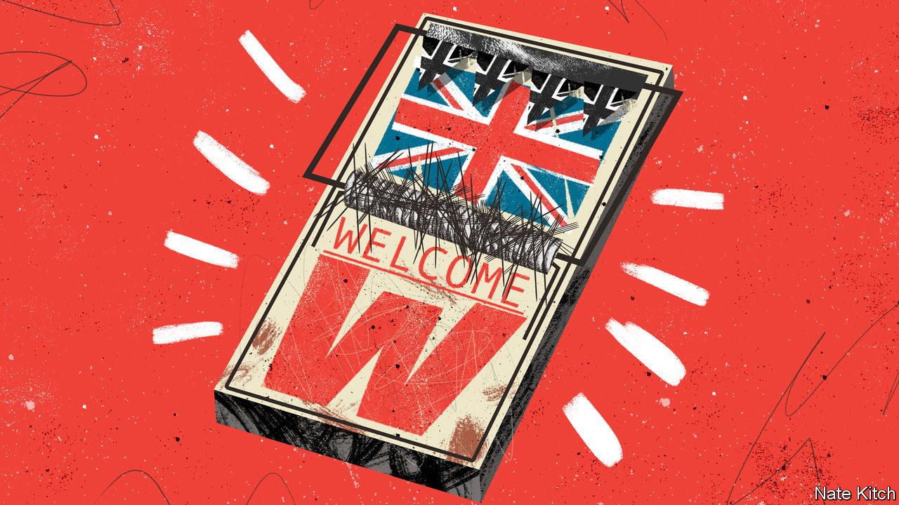

###### Bagehot

# British voters want more immigrants but less immigration 

##### The government’s immigration policy is incoherent because voters are incoherent 

 

> May 25th 2023 

The biggest lie in British politics is that voters want honest debate. Whenever a policy problem emerges, sensible types call for the trade-offs to be laid out before an informed voting public who will carefully weigh the options. Anyone who has sat through a focus group or gone canvassing with a politician knows this is nonsense. When faced with an either/or question, British voters usually give a decisive answer: “yes”. 

Nowhere is this more true than immigration. A majority of voters think migration is too high, according to most polls. Almost nine out of ten Conservative voters think this; a plurality of Labour voters agree. At the same time, British voters say they want more nurses, doctors and fruit-pickers. Carers, academics, computer whizzes and students are welcome, too. Big-hearted Britons thought the country was completely right to let swathes of refugees from Ukraine and Hong Kong into the country. Britons may not much like immigration, but they are keen on immigrants. 

If so, then the Tories have come up with an impeccably botched policy response. A Conservative government that has pledged to cut immigration at the past four elections has instead overseen an increase to a record level. Net migration hit 606,000 in Britain last year, according to figures published on May 25th, as people took advantage of a more liberal post-Brexit immigration regime. The British government has thrown open the country’s doors while complaining about the people who walk through them. It is utterly incoherent. But when it comes to immigration, so are voters. 

Public opinion on immigration was not always so confused. Attitudes used to move in lockstep with numbers. In the 1940s and 1950s Britain accepted workers from across the Commonwealth, who could enter the country as they pleased. By the 1960s eight out of ten people wanted lower immigration; hard-nosed and rather racist legislation followed. Likewise, when immigration increased during the 1990s and 2000s, so did concern. This trend reached its apex in 2016, when, with just a month to go until the Brexit referendum, the government announced a then-record net influx of 330,000 people. Britain voted to leave the EU, with immigration cited as one of the main reasons. 

This tidy relationship has broken down. Immigration has increased sharply since the Brexit vote but concern about it has, if anything, gone down in the past decade. In 2012 a quarter of voters thought immigrants boosted Britain’s economy; half thought immigrants harmed it, according to British Future, a think-tank. Now those proportions have reversed. The number of people who cite immigration as the number-one problem facing the country has plunged, while issues such as lousy health care and high inflation top the worry-list. 

Attacking immigration was once an easy win for politicians. In 2015 almost 70% of voters wanted immigration reduced. Now, only 42% do. At the same time, a hard-core minority of people now want migration to increase. In 2015 only one in ten wanted this. Now about a quarter do. James Dennison and Alexander Kustov, a pair of academics, label this phenomenon a “reverse backlash”. Politicians have tried to placate voters tempted by anti-immigrant populist parties and ignored others in the process. Once-silent liberal voters have started demanding to be heard. (Intriguingly, about half of people think the British public has become less tolerant overall, even though most polling points to the opposite; when discussing immigration, Britons think in irregular verbs: “I am tolerant; you are prejudiced; he is a complete bigot.”)

Conservatives are split on how to deal with this change. For some, the increasingly liberal views of British voters when it comes to immigration should be seized on. Dominic Cummings, the architect of the Vote Leave campaign in 2016, argued that voters would be happy with high levels of immigration as long as it was controlled. Judging by the positive shift in attitudes on immigrants, he was right. If the government can stop people crossing the English Channel in small boats (some 45,000 arrived last year in this manner) voters will not care about the larger numbers of migrants arriving through official channels. There are few benefits of Brexit. But Britain’s immigration policy could be one. 

For other Conservative advisers—including those currently in Downing Street—immigration simply must come down if the government is to have any chance of surviving. In their view, the liberal turn is a mirage. When voters eventually notice that immigration has, in fact, hit an all-time high they will be furious. People have mistaken a drop in salience with an increase in liberalism. This hypothesis is about to be tested in real life: if voters want control rather than reductions, what if more than half a million arrive every year? Rishi Sunak, the prime minister, thinks he knows the answer to that question, and has pledged to reduce the numbers. 

Welcome. Now get out

Taking numbers down a little is easy. Unless another war breaks out in Europe, there will be fewer refugees next year. Bringing them down a lot is harder. If the British government wants fewer people to come, it can change the law and suffer the consequences. Suella Braverman, the home secretary, has already tightened rules on the number of international students who can bring dependents, even though voters are broadly comfortable with people coming to Britain to study and universities rely on their fees. The government could crack down on fruit-pickers, but farmers in Lincolnshire would scream. Few voters would thank a government that turns away nurses. Cutting immigration comes at a cost that voters show no willingness to pay. 

Rolling out the welcome mat and then shouting at anyone who wipes their feet on it may be an imperfect approach. But from the government’s point of view, it will have to do. Voters do not want to live with the consequences of their opinions. When voters are hypocrites, politicians must be too. ■


