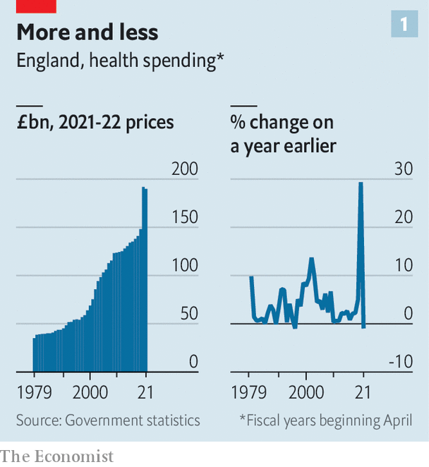
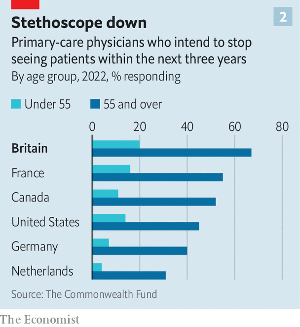
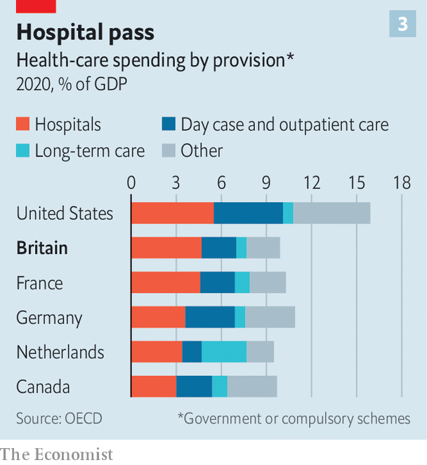
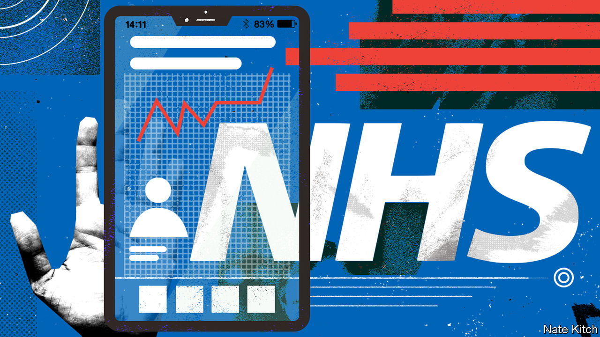

###### Ward mentality

# To survive, Britain’s NHS must stop fixating on hospital care 

##### Community care is the route to better health 

 

> May 25th 2023 

Britons still love the idea of the National Health Service (NHS). Its core principles—to provide health care that is comprehensive, universal and free at the point of delivery—are ones the public believes in. As it approaches its 75th birthday (in England) on July 5th, the service is still capable of providing outstanding care. 

But the NHS is also in grave difficulties. The fever dream of winter is receding somewhat, but few will forget how many patients died waiting for ambulances and lying in hospital corridors. Hospital waiting lists exceed 7m; efforts to curb them have been stymied by the largest wave of strikes in the service’s history. One in 11 posts in the NHS is vacant.

These problems cannot just be pinned on the aftermath of the covid-19 pandemic. Britain has fewer hospital beds per person than almost any other rich country, and fewer CT scanners. Its health outcomes lag behind its peers’. Among 18 rich countries, Britain has some of the worst five-year-survival rates for killer diseases such as lung, colon and breast cancers, and fares poorly on outcomes for heart attacks and strokes.  lags behind most other rich countries.

More than seven in ten of Britons now agree that their beloved NHS is “broken”. Politicians are increasingly willing to talk about the problems of the system. But there is less consensus about what should be done to fix things. Some argue that throwing more money at the NHS would be enough. Others think the time has come for root-and-branch reform. Others still believe that the existing system can be adapted and improved. Who is right?

 


It is true that more money will be needed. Since 2010 the NHS has done better than other departments but, save for a pandemic-related spike, the flow of money from central government has slowed (see chart 1). That has badly dented the finances of many NHS trusts, the organisational units which run health-care services. They balanced their books by raiding their capital budgets and by forgoing investment in medical equipment, buildings maintenance and digital records. 

A report in 2020 by the National Audit Office, which scrutinises public spending, found that across the OECD, a club of mostly rich countries, Britain invested the least capital per person in health care in 2015. The French and German systems respectively spent 21% and 39% more on health care per person than Britain did between 2010 and 2019, according to research by the Health Foundation, a think-tank.

 


Nurses, junior doctors and others who have suffered a decade of real-terms pay cuts have taken to the picket lines. The underfunding has been most apparent in general practice, the first point of contact for most patients and the most cost-effective part of the system. “General practitioners are paid £160 per year per patient: that is less than it costs to insure a gerbil,” points out James Morrow, a GP in Sawston, in Cambridgeshire. Many GPs have quit; many more intend to (see chart 2). 

But spending more money cannot be the only answer. At £160bn ($198bn) the annual budget the government gives NHS England to commission health services is already larger than the economies of all but four African countries. Health care is the biggest line item in the government’s budget: 38p of every pound the state spends on public services goes on the NHS. 

The King’s Fund, a think-tank, has calculated that if the 50 years from 2012 were to follow the trajectory of the previous 50 years, then Britain would be spending almost a fifth of GDP on the NHS and employing one-eighth of the working population. But by the 2060s Britain’s ageing population will resemble an ice-cream cornet rather than a pyramid. A narrowing cone of younger people, rather than a broad base, would not be able to provide that amount of labour and taxes. Resources are already being wasted. A report by the Institute for Fiscal Studies, a think-tank, found last year that, despite getting more money and more staff, the NHS is less productive than it was before the pandemic. 

Some conclude that what the NHS needs is a radical overhaul. “It’s electoral suicide to go against the NHS,” says Professor Stephen Smith, who used to run one of its trusts. “But we can’t go on like this.” 

No time for patients

One option for root-and-branch reform is to charge more patients at the point of use. Last September minutes leaked from a secret meeting between the chiefs of Scotland’s National Health Service showing that they had discussed the possibility of a “two-tier” system in which the wealthy would pay for their care. The introduction of small co-payments for overstretched services like general practice and accident &amp; emergency (A&amp;E) departments has also been mooted. 

To the charge that rationing has no part in a universal health-care system, proponents riposte that it already exists. Prescriptions are free for some patients, for example, but not for others. And whereas other health-care systems rely on price to manage demand, the NHS uses hidden mechanisms: administrative hoops, snarling receptionists and endless waiting lists. 

Co-payments might curb demand, but they would do so by deterring patients from seeking care. Some people, particularly the poor, would not seek treatment when they need it. In dentistry, where patients are already charged for appointments (with some exemptions), the government has ramped up patient charges while reducing its own funding over the past decade. England now spends the lowest share of its health budget on dentistry of any country in Europe. The underfunded dental contract has pushed thousands of dentists into private practice. That has created a two-tier system in which the rich go private and those who cannot afford or find an NHS dentist resort to DIY treatments involving pliers and alcohol.

Another suggestion for fundamental reform is that Britain should switch to a social-insurance model, similar to that operating in France, Germany or the Netherlands. At the moment the NHS is funded out of general taxation. Under a social-insurance model, employees and employers pay contributions into a not-for-profit fund which is then used to purchase health care. Advocates suggest that by earmarking money for the NHS, this system might make people feel more responsible for their own health. And by taking responsibility for financing health care away from the government, it might also reduce the temptation for politicians to meddle.

Yet meta-analyses suggest that there is no relationship between a country’s choice of funding system and its health outcomes. And all health systems have their own challenges. In the Netherlands GPs spend almost three times as much of their time on admin as their British counterparts, who already feel they are drowning in paperwork. 

Making changes of this magnitude would be a huge political gamble, too. A recent survey by Ipsos, a pollster, found that 90% of Britons believe the NHS should be free at the point of delivery, and 84% think the NHS should be funded primarily through taxation. Such consensus is not found on other issues. Trying to switch to a new model would be “like throwing rocks at Everest”, says Alastair McLellan, who edits the Health Service Journal, a website. “The NHS is a fixed fact. Clever policymakers work with that, not against it.”

If ripping up the NHS’s founding principles is not an answer, radicalism is nonetheless required. That is because the NHS is far too focused on one element of the health-care system—hospitals. Aneurin Bevan, the Labour politician who was the architect of the NHS, called hospitals the “vertebrae of the health system”. It is more accurate to think of them as sponges. 

 


In the three years to 2018-19, hospitals’ share of total NHS spending increased from 63% to 65%; the share accounted for by primary and community services fell from 20% to 19%. By current prices, 47% of all central- and local-government spending on health care in Britain goes on hospitals, compared with 44% of funding from comparable schemes in France, 36% in the Netherlands and 33% in Germany. Within the OECD, when comparing government-funded or compulsory schemes, only America spends a bigger share of its GDP on hospitals (see chart 3). 

A hospital-focused model worked well enough when the NHS was mainly there to provide urgent treatment for infections and injuries. Those days are long gone. The latest available data showed that half of all GP appointments and 70% of inpatient bed days were taken by those with long-term conditions, such as diabetes. Family doctors and community nurses are best-placed to manage these chronic conditions, yet only 8% of the NHS budget goes to general practice, down from 11% in 2005-06. Hospitals are plainly not the places to prevent things which contribute to ill-health, like obesity. Britain is the third-fattest country in Europe; if everyone was a healthy weight, a recent study found, the NHS could save up to £14bn a year. 

It gets worse. Hospitals are primarily paid on the basis of “activity”, which at times incentivises them to perform unnecessary treatments and not collaborate with other bits of the NHS. An estimated 10% of the cost of inpatient care in hospitals is spent looking after those in the final year of life, often on ineffective tests and treatments. Meanwhile, general practice and community services are often funded by fixed budgets in exchange for broadly defined services. They have little incentive to reduce referrals to other services. 

The system does not just suck patients into hospitals but also keeps them there for too long, in part because of a shortage of carers. More than one in ten beds are occupied by people who do not need them. To speed up delays in discharging patients, some hospitals are even giving money to cash-strapped councils to pay for social care. “If everything is focused on acute hospitals that have already spent nearly half of the entire NHS budget, the NHS will fail,” says Joe Harrison, who runs an acute trust in Milton Keynes.

Such warnings are not new. Nor are calls to shift money away from crisis management in hospitals and towards community care and prevention. “We are often not invited to meetings as it is seen as predictable what we will say,” says Kamila Hawthorne, the chair of the Royal College of GPs. “We’re constantly banging the drum on funding.” That might invite scepticism that anything will change. But two big building-blocks are moving into place. 

One gives regions more freedom to improve the health of their own populations. The NHS has long suffered from top-downitis, with the centre issuing a blizzard of orders and performance metrics. In his book “Zero”, Jeremy Hunt, a former health secretary and now the chancellor of the exchequer, recalls asking one hospital how many instructions it received related to patient safety: the answer was 108 documents a year. Such bureaucracy is hugely counterproductive—a classic case of hitting the target but missing the point.

The latest organisational shake-up of the NHS is therefore promising. In 2022 the Health and Care Act created 42 Integrated Care Systems (ICSs), each covering an average of 1.5m people. They bring together NHS bodies, local authorities and charities to plan and deliver health and care services in a more joined-up way. Each ICS also chooses longer-term goals to work towards, such as reducing health inequality. 

Bits of the NHS have already worked out the value of co-ordination. “It’s just completely bloody obvious that we all need to work together,” says Sir Jim Mackey, the boss of Northumbria Healthcare Foundation Trust, which has been working with other partners for decades. But ICSs should make that more common. To take one example, on average homeless people use eight times as many health services as other people (mainly A&amp;E and ambulances). Instead of trying to manage this demand, West Yorkshire’s ICS works to reduce homelessness—for instance, by helping tenants at risk of eviction to improve their mental health. “You have to start with the needs of the people, not structures,” says Rob Webster, its chief executive.

To be truly beneficial, ICSs will need to be made more “hard-edged”, says Axel Heitmueller of Imperial College Health Partners, a partnership of NHS providers. Data can already be used to measure a small set of population-health outcomes, such as healthy life expectancy. To incentivise improvements on these measures, he reckons ICSs should be able to “earn back” a proportion of the savings they make from helping people to get healthier and be allowed to reinvest this money.

The second crucial building-block for reform is technology. There is an awful lot still to do in this area. Less than half of ICSs have a data platform to help them manage their populations’ health. Privacy concerns and bungled implementation have impeded efforts to join up patient records—and to realise the potential of the NHS, which is unusual in holding cradle-to-grave information on a national population, as one of the most valuable repositories of health data in the world. 

But the NHS is taking steps towards a future of greater productivity and more personalised care. It has already had success rolling out virtual wards—for example, using pulse oximeters to monitor the breathing efficiency of recently discharged patients. It is carrying out breast-cancer scans in shopping centres and cataract surgery in car parks. In partnership with Our Future Health, a programme that aims to track the health of 5m Britons, blood samples are now being taken in the back rooms of Boots, a high-street pharmacist. In future the results will allow more targeted screening for cancer and the creation of individual risk scores. Genomic sequencing should help the NHS to spot diseases earlier, to the benefit of patients and taxpayers. 

 


Patients should soon be able to access personalised health advice on the NHS app, and receive nudges to eat better and exercise more, as already happens in Singapore, says Seb Rees of Reform, a think-tank. In future the app could become the new front door to the NHS, with options for self-referrals, self-monitoring and home testing. Through Patients Know Best, a software company, patients can already get access via the app to an individual patient record which shows them their results and their medical records. Fran Husson, a patient with multiple conditions, uses this service to make personalised plans for her care in conjunction with her consultant. “It has been transformative,” she says. 

The NHS has a long list of problems to tackle. Britons are getting older: that will drive up demand for health care. Culture is critically important: the NHS suffers from too much respect for clinical hierarchies, too much fear of blame when things go wrong and too little focus on the patient. Retention of staff is poor. Politicians are still liable to meddle, and to funnel money to the latest crisis. But community care, decentralisation and technology offer the NHS its best chance of delivering better results. That would also restore Britons’ faith in their most treasured institution. ■


