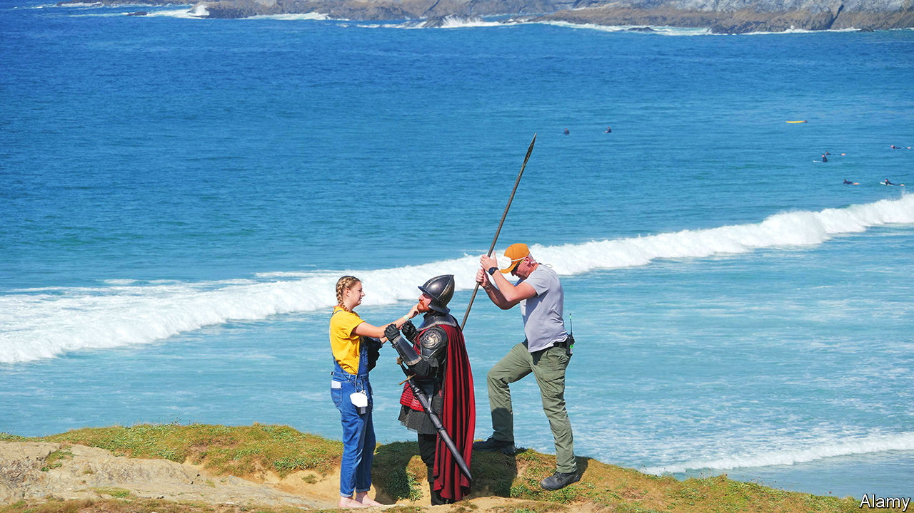
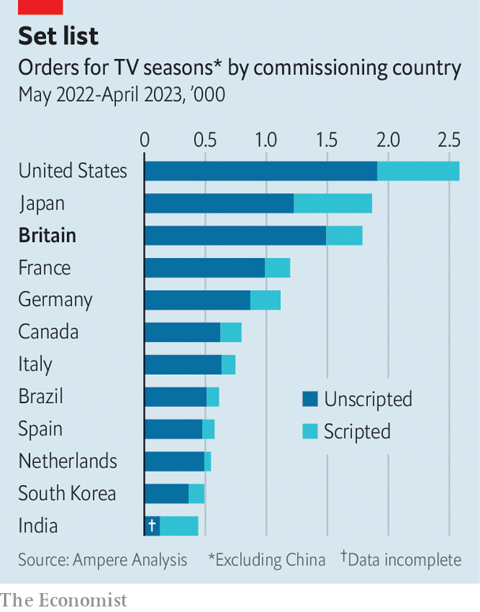

###### Best supporting actor

# With Hollywood on strike, foreign shows enjoy the limelight 

##### The strike spells disruption—and perhaps opportunity 

 

> May 21st 2023 

Indiana Jones has fought his way through jungles, snakepits and booby-trapped temples. But his latest cinematic adventure, due from Disney next month, took place just off the M25 motorway near Slough. Pinewood Studios, where “Indiana Jones and the Dial of Destiny” was shot, is not the only place in Britain to star at the movies. Barbieland, the bright-pink setting for the forthcoming “Barbie” movie, was created on the outskirts of Watford, where Warner Bros has its giant Leavesden Studios. “Andor”, the latest instalment in the Star Wars saga, was shot in locations around England and Scotland.

 


Britain is one of the world’s largest centres of video production. In the year to April, 1,788 new TV series were ordered by a broadcaster or streaming platform based there—more than in any country bar America and Japan, according to research by Ampere Analysis (see chart). As well as these local commissions, the bulk of which are “unscripted” (a category that includes reality tv, sport and the like), Britain hosts many high-profile—and valuable—scripted productions by American studios, which come for the talent, tax breaks and high-tech facilities. 

As an industrywide arms race for  forced Hollywood studios to go abroad in search of production capacity, Britain was one of the winners. But its popularity with American studios means it will also be among the losers of the  that has brought Hollywood to a halt. The Writers Guild of America (WGA) downed pens on May 2nd, complaining that the cut-throat economics of streaming had eroded writers’ pay and conditions. New scripts, and thus most new scripted productions, are on hold.

Though there is no strike in Britain, filming will be disrupted. American-made shows shot on British soil may continue only if their scripts are finalised—a tougher condition than it sounds, as big productions typically have writers on hand to fiddle with the script during filming. British-made shows commissioned by American firms can go ahead if contracts are already signed and under British law. But any new deals are off-limits—at least for anyone who wants to work in Hollywood again. The Writers’ Guild of Great Britain warns local writers against working for American studios during the strike: “You risk being blacklisted by the WGA, which could seriously damage your long-term career.”

Production is already drying up. Even before the strike was announced, there was “trepidation about committing to projects this year”, says David Gray, managing director of Lux Machina, a high-end visual-effects company. When filming wraps on titles that are already in production, like Warner’s next season of “House of the Dragon”, currently under way at Leavesden, the dearth of new projects will be felt more keenly. Mr Gray recalls that the previous WGA strike, which lasted for 100 days in 2007-08, knocked the British film business off course for a couple of years. The current strike seems nowhere near a resolution.

But there are two ways in which British film-makers may benefit. First, production costs stand to fall. The content-commissioning frenzy of recent years has inflated the price of everything from studio space to hairdressing, as Apple, Amazon and Co have arrived with their Silicon Valley-size chequebooks. It has been a bonanza for the people who do those jobs, but excruciating for anyone who needs their services. As demand from American studios cools, the likes of ITV and the BBC will find that their more modest budgets go further.

Second, locally made shows will command a higher price internationally. As the strike goes on, American streamers will run out of new content, without which they may lose subscribers. Though the dispute prevents British writers from working for American studios, there is no ban on the studios buying shows that are already made. If the strike continues, “the acquisitions market will heat up,” says Fred Black of Ampere Analysis, who expects British firms to push their shows harder to American distributors. Hollywood’s studio chiefs might not fear the unions. They may yet be brought to their knees by re-runs of “Midsomer Murders”.■


