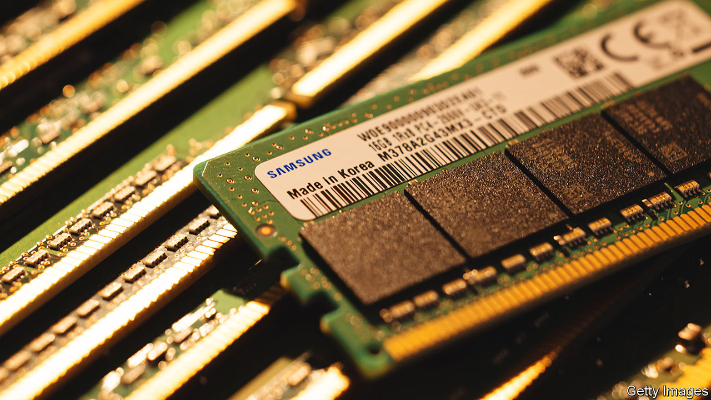

###### Muscle and memory

# Asian businesses are being dragged into the chip war 

##### China’s decision to ban Micron puts South Korea’s semiconductor manufacturers in an awkward spot 

 

> May 25th 2023 

UNLIKE LOGIC chips, which process information, memory chips, which store it, looked less vulnerable to the Sino-American techno-tussle. Such semiconductors are commodities, less high-tech than microprocessors and so less central to the great-power struggle for technological supremacy. That changed on May 21st, when the Chinese government banned memory chips made by Micron from critical-infrastructure projects. The restriction hurts the American chipmaker, which last year derived 11% of its revenue from mainland China. It also opens up a new front in the transpacific chip war—one which the countries that are near China but allies of America are being roped into. 

By opening a gap in the market, the ban creates an opportunity for the world’s two biggest memory-chip makers, Samsung Electronics and SK Hynix, both from South Korea. They made 16% and 44% of their respective sales in China in 2021. With Micron frozen out of critical infrastructure—and looking riskier to other Chinese buyers—the South Korean duo can pick up more contracts. That is what investors seem to have concluded: Samsung’s share price is at its highest since April 2022; SK Hynix’s was last this lofty in August.

The prospect of a windfall for South Korea’s chipmakers is, however, complicated by the country’s blend of American and Chinese interests. President Joe Biden’s administration has made no official demand asking its counterpart in Seoul to prevent the South Korean firms from jumping in to fill orders for which Micron will no longer be able to compete. But it is said to be lobbying for this behind closed doors. The 28,500 American troops stationed in South Korea to protect it against its despotic nuclear-armed neighbour to the north lend weight to such requests. 

At the same time, Seoul has little interest in damaging its commercial ties with China. South Korea exported $156bn-worth of goods, equivalent to 9% of its GDP, to the country in 2022, and imported roughly the same amount. That makes China its largest trading partner by some distance. On May 24th the South Korean government formally asked America to review the rules which limit American subsidies to chipmakers if the recipient expands its Chinese production capacity of advanced chips by more than 5% over ten years.

South Korea is, in other words, treading carefully. Any public attempt to guide Samsung and SK Hynix risks upsetting Beijing, which is already fuming: on May 22nd a spokesperson for China’s foreign ministry said America had “coerced other countries into imposing export restrictions on China for the sole purpose of maintaining its hegemonic interests”. The official line from Seoul is, for the time being, that it is up to the companies how they respond. That strategic ambiguity may not be viable for much longer. ■


