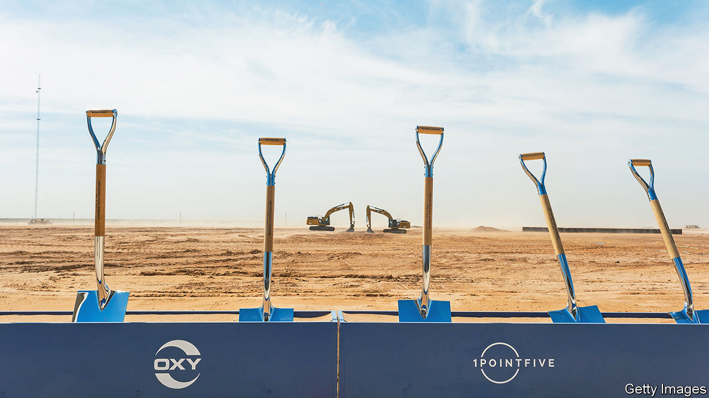
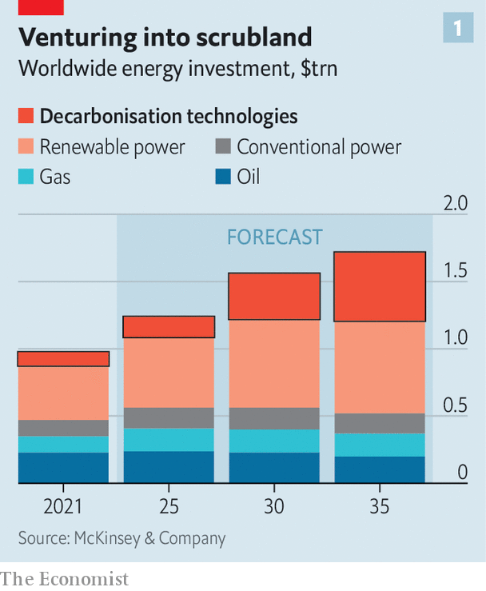
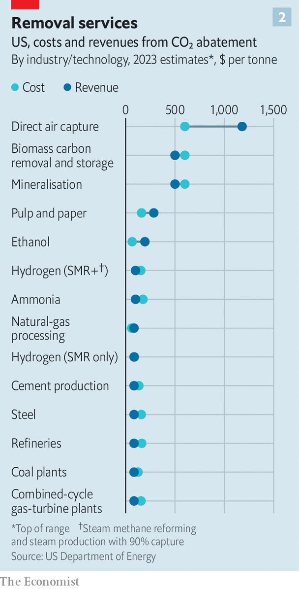
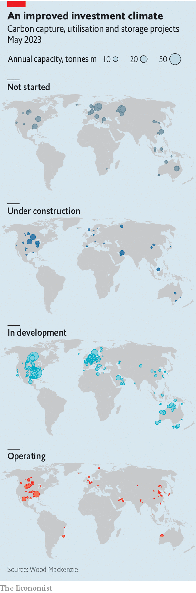

###### A giant sucking sound

# Can carbon removal become a trillion-dollar business? 

##### Quite possibly—and not before time 

 

> May 21st 2023 

“TODAY WE SEE the birth of a new species,” declared Julio Friedmann, gazing across the bleak landscape. Along with several hundred grandees, the energy technologist had travelled to Notrees, a remote corner of the Texas oil patch, in late April. He was invited by 1PointFive, an arm of Occidental Petroleum, an American oil firm, and of Carbon Engineering, a Canadian startup backed by Bill Gates. The species in question is in some ways akin to a tree—but not the botanical sort, nowhere to be seen on the barren terrain. Rather, it is an arboreal artifice: the world’s first commercial-scale “direct air capture” (DAC) plant. 

Like a tree, DAC sucks carbon dioxide from the air, concentrates it and makes it available for some use. In the natural case, that use is creating organic molecules through photosynthesis. For DAC, it can be things for which humans already use CO, like adding fizz to drinks, spurring plant growth in greenhouses or, in Occidental’s case, injecting it into oilfields to squeeze more drops of crude from the deposits.

Yet some of the 500,000 tonnes of CO that the Notrees plant will capture annually, once fully operational in 2025, will be pumped beneath the plains in the service of a grander goal: fighting climate change. For unlike the carbon stored in biological plants, which can be released when they are cut down or burned, CO artificially sequestered may well stay sequestered indefinitely. Companies that want to net out some of their own carbon emissions but do not trust biology-based offsets will pay the project’s managers per stashed tonne. That makes the Notrees launch the green shoot of something else, too: a real industry.

Carbon Engineering and its rivals, like , a Swiss firm, Global Thermostat, a Californian one, and myriad startups worldwide, are attracting capital. Occidental plans to build 100 large-scale DAC facilities by 2035. Others are trying to mop up CO produced by power plants and industrial processes before it enters the atmosphere, an approach known as carbon capture and storage (CCS). In April ExxonMobil unveiled plans for its newish low-carbon division, whose long-term goal is to offer such decarbonisation as a service for industrial customers in sectors, like steel and cement, where emissions are otherwise hard to abate. The oil giant thinks this sector could be raking in annual revenues of $6trn globally by 2050.

 


The boom in carbon removal, whether from the air or from industrial point sources, cannot come fast enough. The UN-backed Intergovernmental Panel on Climate Change assumes that if Earth is to have a chance of warming by less than 2°C above pre-industrial levels, renewables, electric vehicles and other emissions reductions are not enough. CCS and sources of “negative emissions” such as DAC must play a part. The Department of Energy calculates that America’s climate targets require capturing and storing between 400m and 1.8bn tonnes of CO annually by 2050, up from 20m tonnes today. Wood Mackenzie, an energy consultancy, reckons various forms of carbon removal account for a fifth of the global emissions reductions needed to emit no net greenhouse gases by 2050. If Wood Mackenzie is right, this would be equivalent to sucking up more than 8bn tonnes of CO annually. That means an awful lot of industrial-scale carbon-removal ventures (see chart 1).

For years such projects were regarded as technically plausible, perhaps, but uneconomical. An influential estimate by the American Physical Society in 2011 put the cost of DAC at $600 per tonne of CO captured. By comparison, permits to emit one tonne trade at around $100 in the EU’s emissions-trading system. CCS has been a perennial disappointment. Simon Flowers of Wood Mackenzie says the power sector has spent some $10bn over the years trying to get it to work, without much success.

 


Backers of the new crop of carbon-removal projects think this time is different. One reason for their optimism is better and, crucially, cheaper technology (see chart 2). The cost of sequestering a tonne of CO beneath Notrees has not been disclosed, but a paper from 2018 published in the journal  put the price tag for Carbon Engineering’s DAC system at between $94 and $232 per tonne when operating at scale. That is much less than $600, and not a world away from the EU’s carbon price. 

CcS, which should be cheaper than DAC, is also showing a bit more promise. Svante, a Canadian startup, uses inexpensive materials to capture CO from dirty industrial flue gas for around $50 a tonne (though that excludes transport and storage). Other companies are converting the captured carbon into products which they then hope to sell at a profit. CarbonFree, which works with US Steel and BP, a British oil-and-gas company, takes CO from industrial processes and turns it into speciality chemicals. LanzaTech, which has a commercial-scale partnership with ArcelorMittal, a European steel giant, and several Chinese industrial firms, builds bioreactors that convert industrial carbon emissions into useful materials. Some make their way into portable carbon stores, such as Lululemon yoga pants.

 


All told, carbon capture, utilisation and storage (CCUS in the field’s acronym-rich jargon) may attract $150bn in investments globally this decade, predicts Wood Mackenzie. Assessing current and proposed projects, the consultancy reckons that global CCUS capacity—which on its definition includes cCS, the sundry ways to put the captured carbon to use, as well as DAC—will rise more than sevenfold by 2030. 

The second—possibly bigger—factor behind the recent flurry of carbon-removal activity is government action. One obvious way to promote the industry would be to make carbon polluters pay a high enough fee for every tonne of carbon they emit that it would be in their interest to pay carbon removers to mop it all up, either at the source or from the atmosphere. A reasonable carbon price like the EU’s current one may, just about, make CCS viable. For DAC to be a profitable enterprise, though, the tax would probably need to be a fair bit higher, which could smother economies still dependent on hydrocarbons. That, plus the dim prospects for a global carbon tax, means that state support is needed to bridge the gap between the current price of carbon and the cost of extracting it. 

The emerging view among technologists, investors and buyers is that carbon removal will develop like waste management did decades ago—as an initially costly endeavour that needs public support to get off the ground but can in time turn profitable. Policymakers are coming over to this view. Some of the hundreds of billions of dollars in America’s recently approved climate handouts are aimed at bootstrapping the industry into existence. An enhanced tax credit included in one of the laws, the Inflation Reduction Act, provides up to $85 per tonne of CO permanently stored, and $60 per tonne of CO used for enhanced oil recovery, which also sequesters CO(albeit in order to produce more hydrocarbons). Clio Crespy of Guggenheim Securities, an investment firm, calculates that this credit increases the volume of emissions in America that are “in the money” for carbon removal more than tenfold. The EU’s response to America’s climate bonanza is likely to promote carbon removal, too. Earlier this year the EU and Norway announced a “green alliance” to boost regional carbon-capture plans.

Buyers of carbon credits are starting to line up. Tech firms, keen to burnish their progressive credentials, are leading the way. On May 15th Microsoft said it would purchase (for an undisclosed sum) 2.7m tonnes of carbon captured over a decade from biomass-burning power plants run by Orsted, a Danish clean-energy firm, and pumped underneath the North Sea by a consortium involving Equinor, Shell and TotalEnergies, three European oil giants. On May 18th Frontier, a buyers’ club with a $1bn carbon-removal pot bankrolled mainly by Alphabet, Meta, Stripe and Shopify, announced a $53m deal with Charm Industrial. The firm will remove 112,000 tonnes of CO between 2024 and 2030 by converting agricultural waste, which would otherwise emit carbon as it decomposes, into an oil that can be stored underground. 

Big tech is not alone. NextGen, a joint venture between Mitsubishi Corporation, a Japanese conglomerate, and South Pole, a Swiss developer of carbon-removal projects, intends to acquire over 1m tonnes in certified CO-removal credits by 2025, and sell them on to others. It has just announced the purchase of nearly 200,000 tonnes’ worth of such credits from 1PointFive and two other ventures. The end-buyers include SwissRe and UBS, two Swiss financial giants, Mitsui OSK Lines, a Japanese shipping firm, and Boston Consulting Group. On May 23rd JPMorgan Chase, America’s biggest bank, said it would spend over $200m in the coming years on buying credits from carbon-removal firms.

Maybe the biggest sign that the carbon-removal business has legs is its embrace by the oil industry. Occidental is keen on DAC. ExxonMobil says it will spend $17bn from 2022 to 2027 on “lower-emissions investments”, with a slug going to ccs. Its main American rival, Chevron, is hosting Svante at one of its Californian oilfields. As the Microsoft deal shows, their European peers want to convert parts of the North Sea floor into a giant carbon sink. Equinor and Wintershall, a German oil-and-gas firm, have already secured licences to stash carbon captured from German industry in North Sea sites. Hugo Dijkgraaf, Wintershall’s technology chief, thinks his firm can abate up to 30m tonnes of CO per year by 2040. The idea, he says, is to turn “from an oil-and-gas company into a gas-and-carbon-management company”. 

Saudi Arabia, home to Saudi Aramco, the world’s oil colossus, has a goal of increasing CCS capacity fivefold in the next 12 years. Its mega-storage facility at Jubail Industrial City is expected to be operational by 2027. ADNOC, Aramco’s Emirati counterpart, wants to increase its capacity sixfold by 2030, to 5m tonnes a year. 

The oilmen’s critics allege that their enthusiasm for carbon removal is mainly about improving their reputations in the eyes of increasingly climate-conscious consumers, while pumping more crude for longer. There is surely some truth to this. But given the urgent need to both capture carbon at source and achieve voluminous negative emissions, the willing involvement of giant oil firms, with their vast capital budgets and useful expertise in engineering and geology, is to be welcomed. ■


