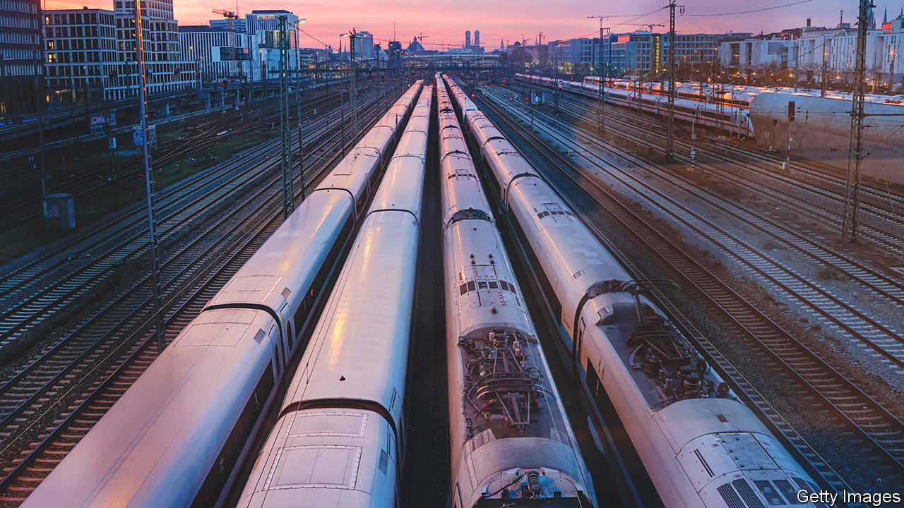

###### Deutsche Bahn

# It will take years to get Deutsche Bahn back on track 

##### Europe’s biggest rail operator has gone off the rails 

 

> May 25th 2023 

IN MID-MAY GERMANS were bracing for the third, and longest, national rail strike this year. Deutsche Bahn (DB) was locked in a dispute over pay with EVG, the union representing most German railway workers, including 180,000 at the state-run behemoth. At the last minute union leaders called off a 50-hour stoppage that was going to begin on the evening of May 14th. German travellers breathed a sigh of relief—and then gasped as DB failed to reinstate all of the 50,000 cancelled services. The next day roads were clogged by commuters who, worried about getting stuck at a train station, took the car instead.

On May 23rd DB and the union met for a fourth round of wage talks, with no long-term resolution in sight. And labour unrest is only one of many fronts on which DB is fighting. Once a source of national pride, it has become the butt of bad jokes (“We have one about DB but we don’t know whether it will work”). In April just 70% of its long-distance trains were on time. And even that was an improvement on the whole of last year, when only 60% were punctual; the company’s (unambitious) goal is at least 80%. DB services are “too crowded, too old and too ”, Berthold Huber, who sits on DB’s board, told the a daily, this month.

DB’s woes are the result of poor management, a bloated bureaucracy, political interference and years of underinvestment. In 2004 DB’s annual budget for the construction and upgrading of railway lines was cut from €4bn ($5bn) a year to €1.5bn, notes Christian Böttger of the University of Applied Sciences in Berlin. It has edged up since but last year was still only €1.9bn. This year it will be €2bn. The railway business has been bleeding money for years; in 2022 it made an operating loss of €500m. DB’s overall operating profit of €1.3bn, on revenues of €56bn, was all down to its logistics arm, DB Schenker, which has benefited from the uptick in e-commerce and now contributes nearly half of sales. 

Vowing to make up for the failings of its predecessors, Olaf Scholz’s newish cabinet has ambitious plans for DB. It wants to pump an extra €45bn into the network, hoping almost to double the number of passenger journeys by 2030 to around 4bn, and to increase freight volumes by 25%. This year DB is beginning to renovate and modernise 650 train stations, as well as upgrading 2,000km of tracks, 1,800 switch points and 200 bridges. It will also add another 500 people to its 4,300-strong team of security personnel, who are tasked with protecting train tracks against mischief-makers (last October DB was hit by suspected sabotage, causing the suspension of all services in northern Germany). And it is accelerating the digitisation of railway traffic, from signals and switches to digital “twins” of wagons ferrying goods.

In time this may improve passengers’ lot. But not soon. This year carriages may get more packed: since May 1st Germans can buy a monthly  ticket, valid on all regional and local trains, for just €49. Delays and missed connections are forecast to be worse than in 2022, in part owing to all those upgrade works. And DB may slip into the red. It is forecasting a loss of €1bn from operations in 2023, because of the investments, as well as high cost inflation that is politically tough to pass on to travellers (who, in a further drain on DB cash, can demand compensation for all the delays). “The pretence of running an economically viable business was abandoned …long ago,” says Mr Böttger. It is all about getting more cash from the state. ■


