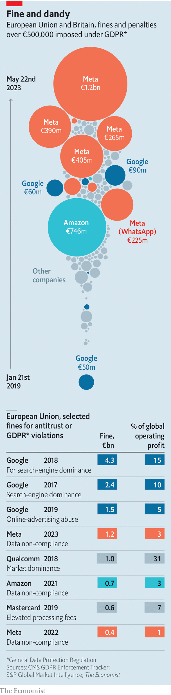

###### Fine and dandy

# Meta gets whacked with a €1.2bn penalty 

##### It is the biggest punishment yet for breaching the EU’s privacy rules 

 

> May 25th 2023 

 


On May 22nd the EU whacked Meta with a €1.2bn ($1.3bn) fine for transferring users’ data to America, in breach of European privacy rules (which turn five this week). The social-media giant is a repeat offender when it comes to privacy breaches. But the EU has reserved the biggest penalties for other sins. Between 2017 and 2019 Google was fined a total of over €8bn for abusing its dominance in search and advertising. Both Google and Meta can afford it; the fines represent a fraction of their profits.■


