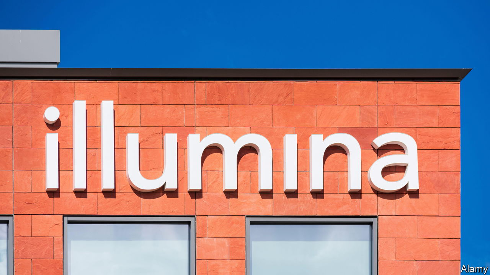

###### Reactivated

# Why activist investors are going to have a busy year 

##### If you think they have gone soft, think again 

 

> May 25th 2023 

CARL ICAHN owns 1.4% of Illumina, a genomics giant with a market value of $34bn. Mr Icahn’s modest stake belies his ambition. As the elder statesman of activist investing, the 87-year-old aims to convert small shareholdings into considerable influence. Mr Icahn has nominated three directors to the board of Illumina, whose share price has fallen by 60% since its peak in 2021, in part owing to hubristic dealmaking. On May 25th, after  was published, Mr Icahn’s colourful campaign against the firm’s bosses (16 letters, drawing on Shakespeare and Lincoln) will reach a climax at its annual general meeting. It is one of the hottest tickets in this year’s “proxy season”, when most American firms elect their boards of directors.

After a dismal year, when activist funds lost 16% of their value as stockmarkets slumped, many observers were expecting a spring offensive. Fund managers had a busy end to 2022, taking advantage of those sunken stockmarket valuations. New corporate-governance rules introduced last September make it easier for dissident investors to obtain board seats, by compelling firms to include all nominees on proxy ballots and allowing shareholders to mix and match those proposed by the company and by its detractors, rather than pick alternative slates. “Asked in December, I would have said this is going to be a proxy season for the ages,” says Kai Liekefett of Sidley Austin, a law firm. 

Five months on things are, at first blush, looking less epochal. In the first quarter of 2023 the number of new activist campaigns in America was a third lower than a year earlier, according to Lazard, an investment bank. With dealmaking at its most subdued in a decade, “transactional” funds, shorter-term investors which agitate for anything from spin-offs of units to the sale of the whole company, are finding little traction. Few big-ticket fights made it to contested votes for board spots. 

Yet the quietude may be deceiving. For one thing, many targets, worried that the new rules favour activists, have sought a truce rather than risk a painful proxy brawl. In February Trian, an activist outfit run by Nelson Peltz, ended its battle against Disney after the entertainment behemoth presented a restructuring plan. Elliott Management, another activist giant, called off plans to nominate directors to the board of Salesforce in March, two months after the software firm appointed the boss of ValueAct, another well-known fund, to its board. This month Shake Shack, a fast-food retailer, announced a settlement agreement with Engaged Capital, a smaller activist fund. Such truces may be less entertaining for outside observers than Mr Icahn’s antics, but for the activists they are wins nonetheless. 

Fifteen years of rock-bottom interest rates and cheap money have created a target-rich environment. As the cost of capital rises, activists spy plenty of management teams that could do with more discipline. On May 11th Elliott revealed it owned 10% of Goodyear, a tyremaker with a market value of around $4bn, along with a plan to sell retail stores and bolster margins. Four days later the hedge fund announced a 13% interest in NRG, an $8bn energy company, calling its recent acquisition of Vivint, a home-security firm, “the single worst deal” the power-and-utilities sector has seen in the past decade. Both campaigns attempt to focus managers’ minds and streamline the companies’ operations. The share prices of Goodyear and NRG jumped by 21% and 3%, respectively, on the news of Elliott’s stakes.

Activists are also pursuing larger prey. Campaigns involving companies with market capitalisations above $50bn made up a record share of activity during the first quarter of 2023. Some funds are taking aim at technology firms, which accounted for a quarter of campaigns in America last year. Tech’s retreat from the pandemic-induced boom in all things digital presents activists with an opportunity to force cost-cutting or shedding unprofitable businesses. Technology giants’ vast market capitalisations—Salesforce is worth $200bn—allow activists to deploy large sums without passing ownership thresholds that would trigger disclosures of their stakes before they are ready to launch the public-facing part of their campaigns.

Not even the biggest of big tech, hitherto largely spared the activists’ rod, is safe. This month Pershing Square and Third Point, two hedge funds, revealed investments in Alphabet, Google’s $1.5trn parent company. Third Point insists its stake is not an activist campaign. It and Pershing may still benefit from the earlier efforts of TCI, another fund already on the warpath against Alphabet’s high costs and cash-burning moonshots. 

American activists will also increasingly export their version of shareholder capitalism abroad. In addition to large regional players, such as Cevian Capital in Europe, high-profile American fund managers have become familiar faces in the world’s business circles, making it easier for them to engage with other shareholders. Even as new campaigns in America languished at the start of the year, activity in Europe and Asia has surged.

Take Japan. Many of those who picked fights there in the past, like T. Boone Pickens, a corporate raider who took on Koito Manufacturing in the 1980s, or TCI, which in 2008 dropped its investment in J-Power, an electric utility, came back bruised. Now, thanks to corporate-governance reforms over the past decade, Japan Inc has had no choice but to become more receptive. New stockmarket guidelines will go so far as to ask companies worth less than the book value of their equity to disclose their initiatives for improvement. 

Activists do not always prevail. On May 25th ValueAct lost a proxy battle to elect four directors to the board of Seven &amp; i, the Japanese conglomerate which owns the 7-Eleven chain of convenience stores. This month Mr Icahn himself became the target of an activist attack. A short-seller, Hindenburg Research, claims that his listed vehicle, Icahn Enterprises, is overvalued. In response to the assault, Mr Icahn denied Hindenburg’s allegations and defended the style of investing he pioneered. Activists, he argued, “breach the walls” of badly run companies. Whether or not Mr Icahn’s own firm deserves activist treatment, plenty of others certainly do. ■


