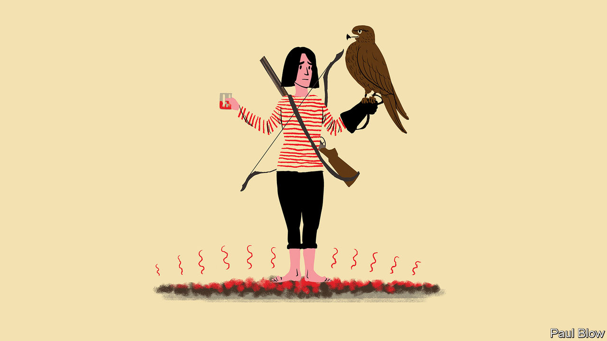

###### Bartleby

# Why are corporate retreats so extravagant? 

##### Companies’ summer camps get unnecessarily creative 

 

> May 25th 2023 

ICE BATHS, infrared saunas, white-water rafting, fly-fishing, archery workshops, whisky tastings, yoga at sunrise, shooting clay pigeons, go-kart races, mountain-biking in Norway, falconry in Ireland, climbing up a glacier in Alberta, singing “Kumbaya” around a campfire. These seemingly disparate activities have one thing in common: all of them are real examples of the contemporary corporate off-site.

Your columnist, a guest Bartleby, cringes at the idea of PowerPoint presentations followed by role-playing exercises and mandatory games. She prefers to let the ties with her colleagues deepen in organic ways. Still, the executive retreat has become an annual business tradition. The idea is that, by disconnecting employees from their day-to-day routine, companies can build camaraderie and foster creativity. And it has grown in importance.

A splashy, exciting getaway once a year may help retain executives in a tight labour market (and is cheaper than fatter monthly pay cheques). In the era of remote work—without the thousands of micro-interactions that happen in the office—team-building trips have also gained a structural role. Suddenly, off-sites are no longer an afterthought but lodged near the heart of corporate HR strategy. Not participating is not an option; so what if co-workers end up meeting in person for the first time wearing flip-flops?

It used to be barbecues and softball games. Retreats moved things a notch higher in style and expense. Just three months after Steve Jobs left Apple and started another company in 1985, he whisked his employees to Pebble Beach for their first off-site. As corporate psychology boomed in the 1990s, team-building retreats became entrenched. By 2015 Uber was reportedly offering Beyoncé $6m to perform for its employees (no, not the drivers) at a corporate event in Las Vegas (the pop star was apparently paid in the then-hot startup’s stock rather than cash). WeWork, an office-rental firm with tech pretensions, used to host raucous summer retreats around the world; employees were encouraged to dance the night away to electronic music. 

Given Uber’s lacklustre ride since its initial public offering in 2019, current management has gone easy on A-listers. WeWork revised its staff-entertainment policies after its party-loving founder and CEO, Adam Neumann, was forced out in the wake of its abortive IPO later that year. But the trend for the corporate getaway has, if anything, intensified. 

To stand out, companies try to make their retreats as bespoke and exotic as possible. Those firms that cannot afford pop stars can have an astronaut regale executives with tales of life in space—not Queen Bey, exactly, but potentially enthralling to the nerdier elements of the workforce. Many organisers opt for the great outdoors, perhaps in the belief that the sublime will unleash authenticity. Wineries around the world are now expanding to accommodate retreats featuring winemaking lessons; employees stomp grapes. A Montana ranch offers corporate clients paintball, flag-capturing and dummy-cattle-roping. Butchershop, a brand-strategy agency, held its second summit in Costa Rica; activities included zip-lining, horseback riding through the jungle and jumping off a cliff into the water. 

A sure-fire way for a business to make its retreat memorable is to thrust participants into adversity. Battling the elements together is supposed to foster team spirit, but zealous organisers have occasionally been known to overdo it. One large European company sent executives to the Arctic Circle in midwinter. They endured frigid temperatures for days, without a fresh change of clothes. Walking on hot coals—an ancient ritual recast as a team-building exercise—led to the injury of 25 employees of a Swiss ad agency in Zurich. 

It is unclear what many days away achieves, except for straining the expense budget and consuming valuable time. Returning to your desk with frostbite or burnt feet is unlikely to boost your productivity. Even if you escape injury you may have lost esteem for the co-worker who drank too much and delivered a maudlin monologue. Walking on fire with colleagues may be meant to encourage spiritual healing and to put employees and bosses on equal—and equally uncomfortable—footing. Yet it is walking through metaphorical fire which actually causes teams to bond. That happens not at a corporate retreat but after years of working together.■


