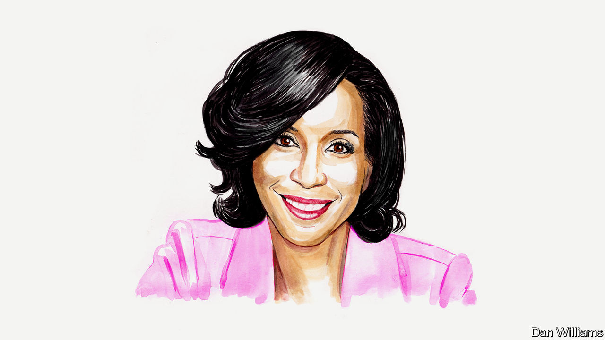

###### Financial crime

# A forensic-accounting expert on how to treat the fraud epidemic 

##### Encourage more insiders to spill the beans, says Kelly Richmond Pope 

 

> May 19th 2023 

IT MARKS A spectacular fall from grace for a one-time Silicon Valley star. This week a court in California ruled that, Hail Mary appeals notwithstanding, Elizabeth Holmes must report to prison on May 30th to begin serving an 11-year sentence for fraud. Theranos, the startup Ms Holmes had founded in 2003, was worth $9bn at its peak but crashed after its much-vaunted blood-testing technology was shown not to work, and she ended up in the dock for deceiving investors. 

Theranos is one of a long list of financial scandals that have made headlines in recent years. Also among these are the frauds at Wirecard, a German payments processor, and Abraaj, a Dubai-based private-equity firm, various crypto-heists, and a bonanza of misappropriation of government handouts to businesses during the covid-19 pandemic. So many frauds are there, and so big are the biggest, that pilfering a billion dollars does not guarantee a global headline. Chances are you haven’t heard of Outcome Health, a Chicago-based health-tech firm whose former CEO and president were recently convicted of defrauding clients, lenders and investors of roughly that amount of money.

Beneath the blockbuster frauds in the billions of dollars is an alarmingly long tail of smaller financial scams. Taken together, these add up to a huge global problem. Research by Crowe, a financial-advisory firm, and the University of Portsmouth, in England, suggests that fraud costs businesses and individuals across the world more than $5trn each year. That is nearly 60% of what the world spends annually on health care.

The drivers of fraud are many and complex. Sometimes it is down to pure greed. Sometimes it begins with a relatively innocuous attempt to paper over a small financial crack but spirals when that initial effort fails; some believe that’s how it started with Bernie Madoff’s giant Ponzi scheme. Market pressure and a desire to exceed analysts’ expectations can also play a part: after the global financial crisis of 2007-09, GE was fined $50m for artificially smoothing its profits to keep investors sweet. Accounting ruses like this, which fall in a grey area, are more common than outright fraud. Among tech startups there is even an established term for manipulating the numbers to buy you time to navigate the rocky road to financial respectability: “fake it till you make it.”

Fraud is an all-weather pursuit. Economic booms help fraudsters conceal creative accounting, such as exaggerated revenues. Recessions expose some of this wrongdoing, but they also spawn fresh shenanigans. As funding dries up, some owners and managers cook the books to stay in business. When survival is at stake, the line between what is acceptable and unacceptable when disclosing information or booking sales can become blurred.

World events can stoke fraud, too. At the height of the pandemic, an estimated $80bn of American taxpayer money handed out under the Paycheck Protection Programme, set up to assist struggling businesses, was stolen by fraudsters. The covid-induced increase in remote working has created new opportunities for miscreants. The 2022 KPMG Fraud Outlook concludes that the surge in working from home has reduced businesses’ ability to monitor employees’ behaviour. Geopolitics affects fraud, too. NATO countries experienced four times as many email-phishing attacks from Russia in 2022 as they did in 2020. Cybercrimes such as ransomware attacks have already transferred a staggering amount of wealth to illicit actors. The costs to businesses range from the theft of data, intellectual property and money to post-attack disruption, lost productivity and systems upgrades.

It is panglossian to think fraud can be eliminated, but more can be done to reduce it. Corporate boards and investors need to ask more questions. Investors are often too quick to take comfort from the presence of big names on the list of owners and directors. Some were clearly wowed by Theranos’s star-studded board, whose members included two former US secretaries of state and the ex-boss of Wells Fargo, a big bank.

Regulators need to be more sceptical, too. America’s Securities and Exchange Commission brushed aside a detailed and devastating analysis of Madoff’s business provided by a concerned fund manager, Harry Markopolos. Germany’s financial-markets regulator was similarly dismissive of the short-sellers and journalists who called out Wirecard. 

The most effective change would be to do more to encourage whistleblowers. Falsified financial statements must start with someone who notices fraudulent acts. When fraud happens, many people ask “Where were the auditors?”. But the question should be “Where were the whistleblowers?” 

As important as sceptical investors, regulators and journalists can be, much fraud would be undetectable without someone on the inside willing to spill the beans. Research shows that more than 40% of frauds are discovered by a whistleblower. The Wirecard scandal came to light largely because of the bravery of Pav Gill, one of the company’s lawyers, who went to the press with his concerns. The Theranos fraud was brought to the attention of the authorities and the  by whistleblowing employees (one of whom was the grandson of a former political bigwig on the board).

Too often, companies seek to silence whistleblowers, or portray them as mad, bad or both: Wirecard, for instance, fought back ferociously against Mr Gill’s allegations and the journalists who investigated them. Organisations need to create safe spaces where employees can voice their concerns about wrongdoing. Internal reporting channels need to be robust, and employees educated on how to use them. Creating an environment where whistleblowers are celebrated, not vilified, is critical. Companies should worry more about anyone who can circumvent the controls, such as senior leaders or star employees, than about those inclined to raise concerns.

Governments, too, could do more. Protections for whistleblowers have been recognised as part of international law since 2003 when the United Nations adopted the Convention Against Corruption, and this has since been ratified by 137 countries. In reality, legal protections are patchy. They are strongest in America, which offers bounties to whistleblowers who provide information that leads to fines or imprisonment. In much of Europe, and elsewhere, the law is still too soft on those who muzzle or retaliate against alarm-ringers. 

Fraud can be reduced. But first we must better understand who commits it, educate people on how to report it, and then ensure that policies protect those who choose to come forward. Until we do, financial crime will remain a multi-trillion-dollar scourge. ■


