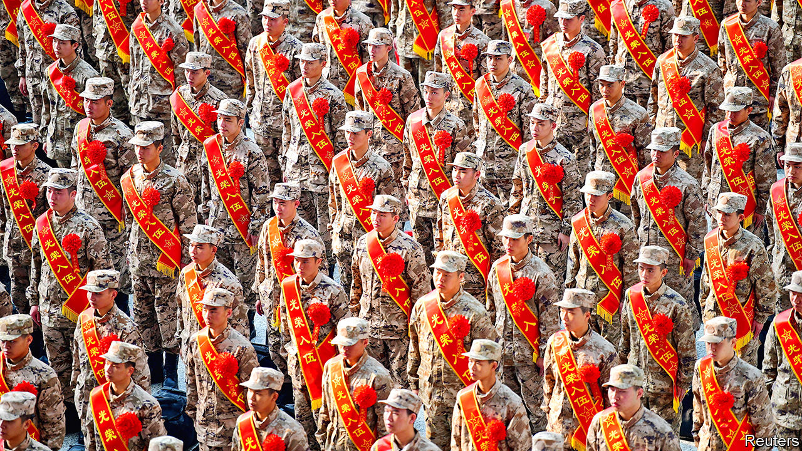

###### Dog’s dinner

# China’s cancel culture is nationalist, not woke 

##### One comedian finds himself unwittingly on the end of it 

 

> May 25th 2023 

Dog jokes are usually fairly inoffensive. The audience laughed when Li Haoshi, a Beijing-based comedian, wisecracked at a show on May 13th about seeing his two dogs chasing a squirrel. The dogs’ zeal, he said, reminded him of military slogans associated with the People’s Liberation Army (pla): “Forge exemplary conduct! Fight to win!” The slogans have become something of a motto for the armed forces (and are also favourites of President Xi Jinping). The incident may have ended Mr Li ‘s career.

His joke was recorded and posted on Weibo, a social-media platform. Nationalists claimed he was comparing the pla to dogs. Outrage built. Hashtags about the joke received over a billion views. Within days Beijing’s police had started an investigation. They have not said what Mr Li will be charged with, but he has already been banned from performing. The media company he worked for was fined $2m for “wantonly slandering the glorious image of the pla”. Its line-up of shows was cancelled. 

Since the incident, several other events have also been called off with little explanation. On May 20th, an open-air concert in Beijing (aptly named “What the Folkstival”) was about to begin when police arrived to shut it down. A Japanese band’s concert in the southern city of Guangzhou was also cancelled. 

The uproar around Mr Li’s joke sounds absurd. But it is just the latest example of a toxic loop between China’s angry nationalists and its paranoid authorities. Someone unwittingly insults China. Bloggers denounce the mistake. State-run media weigh in to attack the offender. Authorities punish them. Tougher standards are set for what is , squeezing China’s already cramped space for self-expression. 

Several well-known figures have fallen victim to this cycle in recent years. In 2022 Luo Changping, a former investigative reporter, was sentenced to seven months in jail for insulting “heroes and martyrs”. He had used a pun on social media to suggest that Chinese soldiers who fought in the Korean war were stupid. The year before, Zhang Zhehan, an actor, was purged from China’s film industry after a photo emerged of him standing outside the Yasukuni shrine in Tokyo, where war criminals involved with Japan’s invasion of China are commemorated. Mr Zhang said he was just there to see cherry blossoms.

The chilling effect is particularly visible in the entertainment industry. Comedians urge audience members not to record their shows. Performing abroad is not safe either. Wang Yuechi, a comedian who toured North America this year, has been deleted from Chinese social-media platforms because of politically sensitive material in his shows there. Wary venues ask performers to submit their jokes or songs in advance for approval. Industry associations urge actors and musicians to be more patriotic. 

In response, performers self-censor and pledge to spread “positive energy”. But the government still keeps a close eye. One Shanghai district sends volunteers to theatres. They are trained in “political awareness” and must report anything untoward. One described how she follows the approved version of a play’s script on her mobile phone to be sure actors are sticking to their lines. “I can’t relax, for fear of missing something,” she told state media. The stress is worth it, though, she says. “We’re doing our little bit to build Shanghai into the performing-arts capital of Asia.”

If people think things are going too far, it is hard for them to say so. Hu Xijin, a well-known nationalist commentator, denounced Mr Li’s dog joke, but said he should be given another chance. Mr Hu was scolded for being too soft. One woman in the coastal city of Dalian was bold enough to defend Mr Li on social media. She was detained by police. ■


