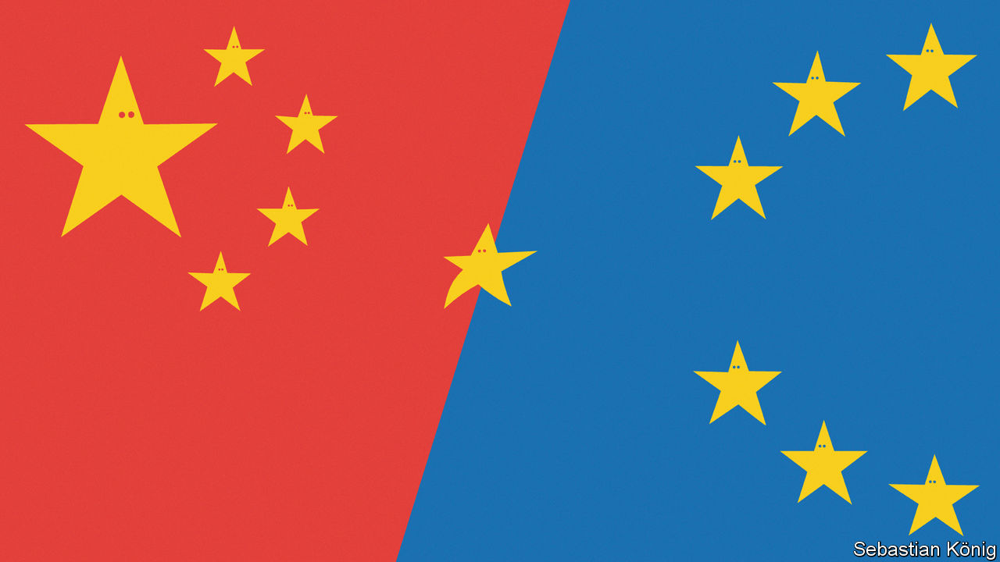

###### A toe-hold in Europe

# Hungary is becoming more important to China 

##### Viktor Orban and Xi Jinping bond over their anti-Americanism 

 

> May 24th 2023 

To ears accustomed to a swelling chorus of China-scepticism in the European Union, the language of Hungarian diplomats is striking. Not for them the common talk of European officials about the need to “de-risk” relations with China and to treat it as a “systemic rival”. Co-operation between Hungary and China presents “opportunities rather than risks”, said Hungary’s foreign minister, Peter Szijjarto, in Beijing on May 15th. Wang Yi, China’s foreign-affairs overlord, told him that relations between the countries had entered their “best period in history”.

As China surveys the grim landscape of its foreign policy in Europe, battered by differences over matters ranging from the war in Ukraine to human rights abuses in Xinjiang and China’s muscle-flexing around Taiwan, Hungary’s dogged friendliness towards China—and Russia—stands out. Hungary echoes China’s view that Western support for Ukraine is merely fuelling the conflict at Europe’s expense. Speaking to Bloomberg on May 23rd, Hungary’s prime minister, Viktor Orban, defended his blocking of a $540m package of EU financial aid to Ukraine. “There’s no chance to win this war,” he said. 

Other countries in eastern Europe, such as Poland, had shared Hungary’s fondness for close ties with China. But their enthusiasm has been dented by China’s support for Russia during the Ukrainian war, and a sense that the business rewards of embracing China politically have not been as great as expected. 

China sees good uses in friendship with Europe. The eu is a vital trading partner. Moreover the bloc could, if it wished, soften the impact of America’s rivalry with China by taking a less security-focused approach. Officials in Beijing are alarmed by a recent trend—seen not least in critical joint statements at a g7 meeting in Tokyo on May 21st—towards greater transatlantic co-operation on China, notwithstanding differences among eu members over how far this should go. During a trip to China last month France’s president, Emmanuel Macron, warned that European countries should not become “just America’s followers” regarding Taiwan. 

But Hungary is special. The worldviews of Mr Orban and of China’s leader, Xi Jinping, have much in common. They are both authoritarians (albeit to different degrees), who bridle at American power but believe the West is in decline. They are both fond of Russia. Mr Orban’s friends in the business world stand to benefit from deals with authoritarian regimes. 

Hungary is well-placed to serve China’s foreign-policy interests. As a member of the eu it has a veto over foreign and security policy. It has used it to dilute or scupper eu statements critical of China. It is also a member of nato, an alliance that China views with growing misgivings. Hungary has shown occasional willingness to thumb its nose there, too, for instance in its recent support for Turkey in blocking Sweden’s accession. 

So, as China sees it, a country of fewer than 10m people and one of the poorest in the eu has an outsize role to play. This was evident in February when Mr Wang went on his first overseas tour since taking over as China’s foreign-affairs chief (state media confirmed his promotion in January; it means he outranks Qin Gang, the foreign minister). He visited France, Italy and then Germany for the Munich Security Conference of global foreign-policy elites. Before heading to Moscow, he stopped in Hungary where he praised the country’s “China-friendly policy”, according to Hungarian media. Mr Szijjarto thanked him for China’s “absolutely indispensable” support during the covid-19 pandemic, including the supply of Chinese-made vaccines (which Hungary used in defiance of an eu consensus that covid vaccines deployed in the bloc should first gain eu approval). 

In the past couple of years, it might have been expected that events in Hungary would give China pause for thought. Mr Orban, who has ruled the country since 2010 and emerged even stronger after another victory in general elections last year, remains a dependable friend. Polls suggest that Hungarians are among the people most supportive of China within the eu (it helps that the country’s mostly pro-government media stifle China-sceptic views). But China-related protests in Budapest in 2021 and recently in Debrecen, the country’s second-largest city, have raised questions about how enduring this sentiment will prove. A survey published last year by Pew Research Centre, an American polling outfit, found that 52% of respondents in Hungary held negative views of China, a rise of 15 points since 2019.

South of Budapest’s city centre, in the semi-wasteland of an abandoned logistics hub, street signs recall the unrest in the capital two years ago that brought anxieties about China—at least briefly—into public debate. The names on them are pokes at China: “Uyghur Martyrs Street” and “Bishop Hszie Si-kuang Street” (after the late Xie Shiguang, a Catholic, imprisoned for 30 years). In 2021 the mayor of Budapest, Gergely Karacsony, gave the roads these new labels (also a Dalai Lama Street and a Free Hong Kong Street) in protest against a plan to build a campus of Shanghai’s Fudan University on the nearby land. Leaked official documents showed that construction would cost $1.8bn, with 80% of the money coming from a Chinese loan. 

Opposition position

The Fudan project helped to galvanise the government’s critics in Budapest, an opposition stronghold. Three days after the renaming of the streets, thousands joined a rally to denounce the campus plan. Complaints about it ranged from possible stifling of academic debate to the loss of land that had been earmarked for subsidised student housing. 

Mr Orban appeared to back down, agreeing to a referendum on the plan. But after his re-election in 2022 the Constitutional Court said such a ballot could not be held because it would involve an international agreement. It is unclear, however, whether the project will proceed. Some analysts in Budapest say China, alarmed by public anger, may have got cold feet.

Fractured after last year’s election, the opposition shows little sign of trying to revive public interest. But in the past few months in Debrecen, the government’s own supporters have joined a campaign that still simmers against another Chinese project. It involves a plan, announced in August by catl, a Chinese battery giant, to build a factory just outside the city in the village of Mikepercs at a cost of around $7.7bn. It would make batteries for electric vehicles (evs), the largest such facility in Europe. Hungary’s efforts to develop its ev industry have attracted others, too. Last year bmw, a German firm, began building a $2bn ev and battery factory in Debrecen. This month another Chinese firm, eve Energy, said it would set up a $1.2bn battery factory to supply bmw’s plant. 

Some residents worry about the potential impact of the catl project on the local environment and the area’s scarce water resources. They have staged protests and heckled local officials at public hearings. “Opening up to the East is a mistake,” says one activist, a 60-year-old retired medic, referring to Mr Orban’s policy of promoting business with China and other Asian countries. “Because Hungarian culture is European culture.” 

In Budapest, however, opposition supporters say they doubt the protests in Debrecen will pose a challenge to Mr Orban or to China’s government. The media give little coverage, they say. Any difficulty for his party, Fidesz, will remain largely local. Opposition politicians have attacked another multi-billion-dollar endeavour involving Chinese firms: a new rail link between Budapest and Belgrade in neighbouring Serbia (work on the Hungarian side began in 2021). They say it is overpriced and worry about favouritism in awarding contracts. But China regards the project as a highlight of its belt-and-road building in Europe, for which Mr Orban is a cheerleader. 

For all the shifts in European attitudes to China, it is likely that Mr Xi will make few adjustments. Despite Mr Orban’s political isolation in Europe, he shows no sign of distancing himself from China. As long as he remains in power, Hungary will be a useful ally. “Studying its position on China could offer lessons for developing good relations between China and other European countries,” wrote two Chinese scholars in a paper published this year in a Communist Party journal. One obvious lesson would be that pro-Russian, illiberal governments make solid friends. China’s options in Europe are narrowing. ■


