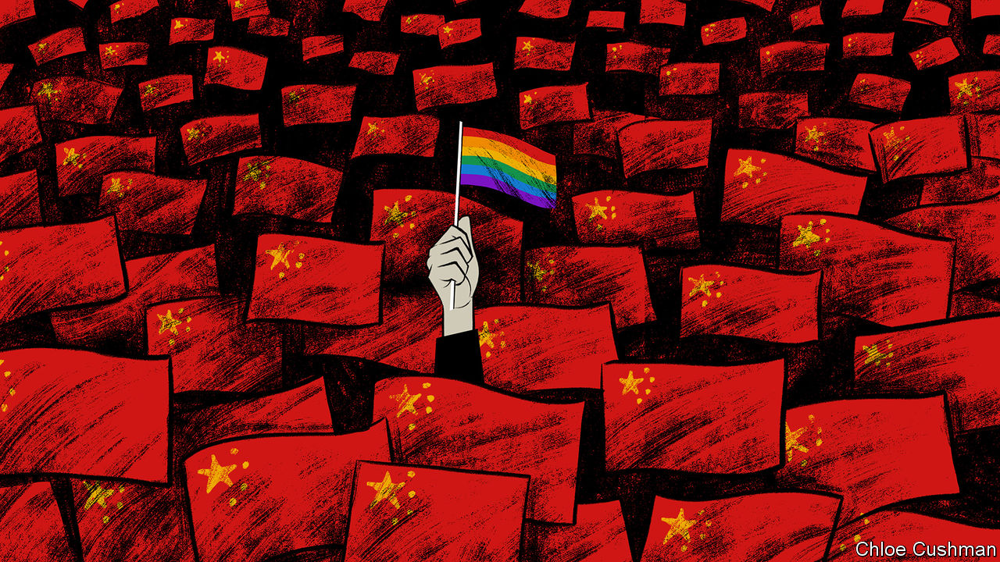

###### Chaguan

# Why the Communist Party fears gay rights 

##### Social conservatism plus paranoia about foreign infiltration prompts a crackdown 

 

> May 25th 2023 

These are grim and lonely times for China’s gay communities, as the country’s LGBT support groups are forced to close, one by one. This campaign of repression reveals a lot about President Xi Jinping’s China, a paranoid place in which security agencies and ideological commissars enjoy ever-greater clout. 

For the same message is delivered, time and again, whenever policemen question gay-rights advocates (and sometimes their family members). It is heard when university chiefs punish students for handing out rainbow flags, or when officials press landlords to evict non-profit groups. The message is that sexual minorities pose a political risk. True, some officials and state-backed scholars also call same-sex love an affront to mainstream Chinese morality, and a threat to young people whose patriotic duty is to marry and have more babies for the Motherland. But activists report that, during interrogations, national security is emphasised much more than morality. Despite the political chill, gay people (as well as bars and dating apps) enjoy far more tolerance than they did a generation ago—but only if they keep it quiet. In today’s China, forming a community is a graver offence than being gay. 

The latest casualty, the Beijing LGBT Centre, announced its closure on May 15th, citing forces beyond its control. Over 15 years in existence the centre had some high-profile successes, including a court victory in 2014 against a clinic offering electroshock therapy to “convert” gay patients. 

Activists talk of their cause being set back a decade or more. Within living memory, China denounced homosexuality as a mental illness imported by foreigners. Criminal penalties for gay sex were abolished only in 1997. During a first posting to Beijing in 2000, Chaguan heard a foreign government minister report, with disbelief, the claim of a Chinese counterpart that there were no gay men in China. Remarkable changes followed. Activists worked to persuade Chinese officials that social stability—the party’s great obsession—is strengthened by their activities. Some state media and institutions seemed to agree, offering praise for health-education campaigns or HIV-prevention work done by gay groups. 

By 2019, your columnist could meet a gay couple in a Guangzhou cafe as they cheerfully described their plans to register as one another’s legal guardians. This baby step towards gay marriage took advantage of a law initially drafted with the elderly in mind. Later it was adapted by creative lawyers to let same-sex couples take medical and some financial decisions for each other, should they grow infirm, undergo surgery or otherwise lose their faculties. That same year, over 180,000 members of the public submitted comments to legislators drafting new regulations on marriage in China’s civil code. Many suggested changing “husband and wife” to “spouses” as a first step towards same-sex marriage. A large number of petitioners were mobilised by legal-rights groups such as LGBT Rights Advocacy China. Since then, that petition drive backing same-sex unions has been cited by Chinese diplomats abroad as proof that their country allows free speech and bans discrimination against gay people, most recently at a hearing this February of a UN rights committee. What those smooth-talking envoys did not mention is that, back at home, civil society groups behind that self-same petition have been shut down, including LGBT Rights Advocacy China, which closed in 2021.

Large companies have bowed to political pressures, too. In 2020 a state-owned airline, China Southern, fired a gay flight attendant seen kissing a male pilot on a surveillance video that went viral on social media. The airline told an employment court that the attendant might provoke mid-air disturbances if passengers recognised him from the video. In 2021 WeChat, the omnipresent messaging, e-commerce and social media app, closed dozens of accounts on LGBT topics, especially those run by university students. In recent years, regulators have banned “effeminate men” from television shows, and denounced “boys’ love” dramas, a genre involving thinly disguised homo-erotic themes. 

Gay groups worked hard to avoid trouble. As a young Malaysian studying in China, Raymond Phang helped to co-found ShanghaiPRIDE, an organiser of gay celebrations and events. He and fellow volunteers grew used to assuring police that events would not feature political statements from foreign diplomats, or touch on such sensitive topics as Taiwan. No public parades or outdoor gatherings were attempted. The group eschewed slogans like “Gay Rights Now”, says Mr Phang. “We don’t do that in the mainland, it’s more about awareness, and ‘LGBT is not a sickness’.” He calls ShanghaiPRIDE lucky, because none of its volunteers or staff was taken into custody for 24 or 48 hours, as happened to some groups. Even so, the frequency of official visits became exhausting. In 2020, ShanghaiPRIDE announced that it was cancelling all activities.

Other groups were forced to close to secure the release of an organiser in detention, says a veteran campaigner now outside China. As spaces to talk about shared challenges vanish, the young are feeling isolated, he worries. “LGBT student groups or associations have become very underground.”

Tyrannies distrust minorities

Alas, in the party’s bleak logic, being vulnerable is grounds for suspicion. Early in the Xi era in 2012, Geremie Barmé, an Australian Sinologist, highlighted an essay published in the  by Yuan Peng, an expert on America and later head of a think-tank affiliated with the ministry of state security. Mr Yuan identified five groups that America might use to infiltrate Chinese society: rights lawyers, underground religious activitists, dissidents, internet leaders and—most chillingly— or “vulnerable groups”. A decade on, gay groups, feminists, labour activists and ethnic minorities are all treated as potential tools of subversion by a hostile West. In Mr Xi’s China, the marginalised represent a security threat, not an object for compassion.■


