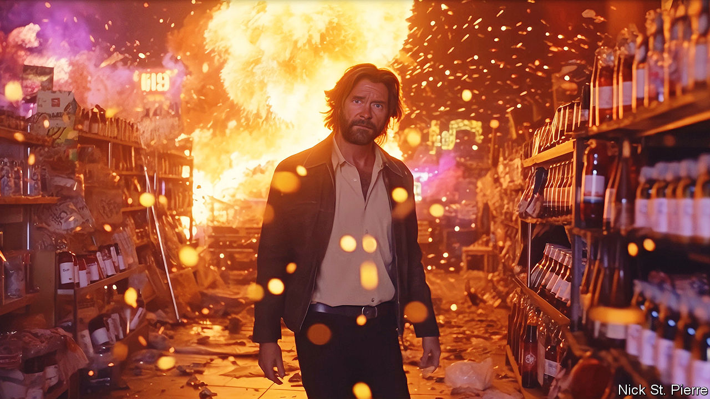

###### The robotic school

# Art made by artificial intelligence is developing a style of its own 

##### AI models not only reflect but magnify what they see in the images they are fed 

 

> May 24th 2023 

First prize in the creative category of this year’s Sony World Photography Awards was presented in April to Boris Eldagsen, who impressed judges with his ethereal, vintage-style portrait of two women in black and white. Mr Eldagsen, however, turned down the prize and revealed that his image had been created not by a camera but by artificial intelligence (AI). The German artist said he had “applied as a cheeky monkey”, to see if he could fool the panel.

“Generative” AI models make convincing mimics, whether they are producing vintage portraits or more modern images—like a purported photo of the pope in an improbable Balenciaga puffer jacket, which recently tricked half of Twitter. Yet their ability to produce original work is . “AI art has so far been exceptionally trivial,” a columnist in the recently huffed. It is intrinsically derivative, based on the millions of training images that are consumed, digested and regurgitated to order. “Plagiarism is a feature of the AI process,” declared the Writers Guild of America, one of many creative-workers’ unions that sees generative AI models as mere copycats.

Perhaps so. Yet there are signs that AI models are developing an artistic style of their own—and not just in drawing hands with more than five digits, as was common in their early output. By identifying and accentuating the patterns they see in their , generative models are not so much mirrors of contemporary styles as they are magnifying lenses. Slowly, a robotic school of artwork is emerging.

Computers have been making art for some time. Five years ago Christie’s auctioned its first work created by artificial intelligence, “Edmond de Belamy”, a blurry approximation of an 18th-century oil painting. Despite being unfinished and faintly alien-looking, the novelty fetched $432,500. “It may not have been painted by a man in a powdered wig,” Christie’s said, “but it is exactly the kind of artwork we have been selling for 250 years.”

Technology has since come far. Open platforms such as  generate images in seconds based on simple written prompts. No artistic skill is required, though there is a knack to getting good results. “The image I produce isn’t my work. My work is the prompt,” says Nick St Pierre, a designer in New York who got into AI last year when he saw it coming for his job. The image above, which he made using Midjourney, took hundreds of iterations, ending up with this prompt: 

35mm, 1990s action film still, close-up of a bearded man browsing for bottles inside a liquor store. WATCH OUT BEHIND YOU!!! (background action occurs)…a white benz truck crashes through a store window, exploding into the background…broken glass flies everywhere, flaming debris sparkles light the neon night, 90s CGI, gritty realism

The ability to order any image in any style, from action movies of the 1990s to papal paparazzi shots, seems incompatible with the idea of a distinctive AI look. Yet certain traits seem to predominate. One is nostalgia. The ability of AI models to recreate the styles they have been fed makes them adept at simulating the look of old media, or sometimes recreating past events in modern guise. One recent viral series imagined modern-day selfies taken in pre-modern times, with Vikings or cavemen grinning for the camera. 

As in previous eras of art, the prevailing subject matter is determined by whoever commissions the work. Western galleries groan with pictures of rich white men and their property, not because they looked good in oil paint but because these were the themes dearest to the hearts of patrons. Midjourney’s output is big on anime warrior princesses for the same reason.

AI models seem to favour particular techniques, too. Examining images produced by Midjourney earlier this year, Roland Meyer, a researcher at Ruhr University Bochum in Germany, noticed a common look. Many would “shine and sparkle, as if illuminated from within”. They combined this distinctive lighting with a colour palette that contrasted warm earthy tones with blue or green metallic ones. Many also displayed what photographers call “high dynamic range”, meaning a wide variation in light levels within the image, with pools of deep shadow and other areas brightly lit.

These traits are not coincidental. Mr Meyer attributes the distinctive “glow” to the way AI models handle lighting. Rather than using digital art techniques such as ray tracing, in which a computer calculates how light will fall on an object from a particular angle, AI imagines how things will look based on the images in its training data, which have been illuminated from many different angles. For this reason, even photo-realistic AI images seem to be lit in a way more akin to painting than to naturalistic photography, Mr Meyer says.

Painting by numbers

The favoured  schemes, meanwhile, often pair teal or turquoise with orange or magenta. That reflects a taste popularised on Instagram and from there across the internet, which is likely to have been well-represented in training data. (High dynamic range has been made similarly ubiquitous online by modern smartphone cameras, which produce such effects by taking several images at different exposures and stitching them together.)

With updates to AI models come changes to their oeuvre. David Holz, the founder and boss of Midjourney, rejects the idea that there is a single AI style. The latest version of the program, released in March, has reined in some of the tendencies of the previous one, he says. “The look of our images has radically changed five times now over the past 12 months and will continue to do so for quite some time,” Mr Holtz insists. “People want diversity.”

As the models evolve and improve, they will remain reliant on man-made training data. “No collection is ever neutral,” says James Coupe, head of photography at the Royal College of Art in London, where he is setting up an AI lab. “Image archives are indexes of a society’s changing ideological investments and political commitments.” And whatever the training data, “we are going to end up with a style that is a kind of lowest common denominator of art.” He compares AI-generated images to a project in the 1990s by a pair of Russian conceptual artists, Vitaly Komar and Alexander Melamid. They surveyed public tastes in 14 countries and produced artworks based on the results. Nearly everyone went for banal 19th-century-style landscapes.

By identifying and condensing prevailing styles in their training data, generative-AI models are playing a similar role. Mr Meyer thinks their ability to summarise visual styles or eras could make them  for art historians. Both their weakness and their strength is that, as he puts it, they are “cliché detectors”. ■


