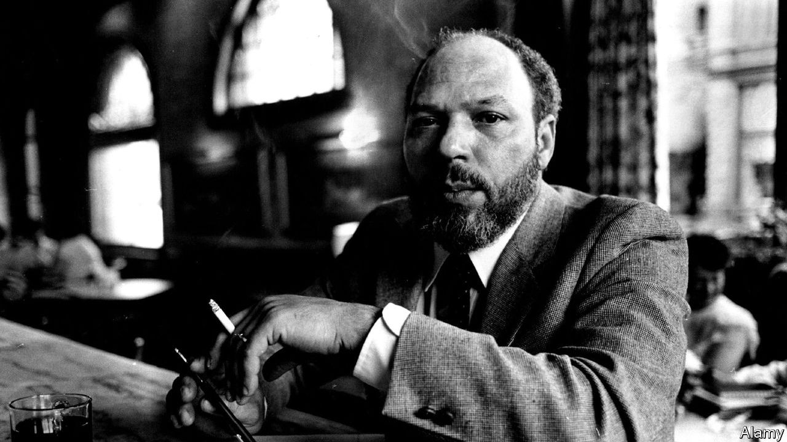

###### American drama

# August Wilson was and remains a bard of black life in America 

##### Plays such as “Fences” and “Ma Rainey’s Black Bottom” continue to find new fans on stage and screen 

 

> May 25th 2023 

When August Wilson first heard a recording of Bessie Smith singing “Nobody in Town Can Bake a Sweet Jelly Roll Like Mine”, he wrote later, “the universe stuttered and everything fell to a new place.” It was 1965, and he was a dish-washing poet of 20 with grand ambitions and a sense of injustice. In Smith’s proud, mournful voice, he heard a way to hold onto the past while moving forward; to rue fate yet embrace life. The , he thought, “is the best literature black Americans have”. Through the music he found what became his voice as a playwright.

 of liver cancer in 2005, aged 60, but his plays have lives of their own. The ten parts of his American Century Cycle—which, between them, won two Pulitzers and heaps of acclaim for chronicling the black American experience in each decade of the 20th century—are still finding new audiences on stage and screen. This year, as usual, his work has been performed across America: “Radio Golf” in Philadelphia, “Fences” in Jackson, Mississippi, “Two Trains Running” in Miami. “How I Learned What I Learned”, his autobiographical one-man show, recently closed in Seattle; “Jitney” comes to London in July. Meanwhile, Netflix has announced a screen adaptation of “The Piano Lesson”, with John David Washington and Samuel L. Jackson reprising their roles from a Broadway hit (nominated for a pair of Tony awards at the ceremony on June 11th).

These plays endure because Wilson achieved his goal of presenting black life “on its own terms…with all its richness and fullness”. Although the white world looms at the edges of these stories, it remains largely offstage. Wilson was concerned with the rituals and beauty of ordinary black Americans as they forged a culture in unpropitious circumstances. His characters are not slaves, but nor are they entirely free—denied the jobs and loans claimed by the European families who arrived in America at the turn of the 20th century. They hustle and dream, but know the game is rigged. As a frustrated musician says in “Ma Rainey’s Black Bottom”, which in 2020 became a film starring Viola Davis and : “Is you gonna be satisfied with a bone somebody done throwed you when you see them eating the whole hog?”

Most of these dramas unfold in the Hill District of Pittsburgh, which, when Wilson was growing up there, was a slum known as “Little Harlem”. Though he was originally named Frederick August Kittel junior after his mostly absent white German father, Wilson said he never questioned his racial identity because no one else seemed to: “All the things that were closed to Negroes at that time were closed to me.” As the only black student in his Catholic high-school class, he was greeted every morning by racist invective. He dropped out of formal schooling at 15 when a teacher accused him of plagiarism, on the presumption that his essay was too good for him to have written it himself.

A song for all seasons

Wilson read everything he could at his local library, then got another education listening to the banter of community elders at a nearby pool hall. He knew he was a writer, and sensed that it was a rare job he could do without being under someone’s thumb: “Nobody said, ‘Hey, you can’t do that.’ So I felt free.” He spent years scribbling poems and stories before turning to plays in earnest in his 30s. After a couple of false starts, he found his rhythm, writing “Jitney”, “Ma Rainey’s Black Bottom” and “Joe Turner’s Come and Gone” between 1982 and 1984. He learned to sit at his desk and wait for the characters to talk to him: “I could hear the music.”

His plays forgo outrage for sadness. During the Black Power era of the 1960s, Wilson and a friend had founded a theatre troupe in Pittsburgh that aimed to “raise consciousness” with dramas that put white characters on trial and occasionally murdered them. But he came to see that he could send a stronger message by reproducing the rhythms and nuances of black life on stage, along with its slang. With his anthropological ear for the vernacular, Wilson saw his history plays as a way for black Americans to finally tell their own story. “If we’re going to be pointed toward a future,” he reckoned, “we must know our past.”

The women in his plays are outnumbered by the men, but tend to be sturdier, more sensible and more memorable. Their wisdom seems to come from resignation: relegated to lives of laundry and cooking, they know better than to dream big. The men are the tragic figures, grasping for dignity in emasculating times. “I been wandering a long time in somebody else’s world,” says a recently freed slave in “Joe Turner’s Come and Gone”, Wilson’s favourite of his plays.

Although he dotes on the details of black lives, his history cycle has always enjoyed a wide following. Themes such as the trials of marriage, tussles between fathers and sons, and the hunger for redemption resonate with audiences of all backgrounds. By proving the commercial viability of African-American theatre, he opened the door for other black artists, such as Lynn Nottage and Suzan-Lori Parks, both Pulitzer-prizewinners. “I just want to say for the record: you are our king,” Ms Parks told Wilson in 2005.

Appetite for his work is unabated. After acquiring the playwright’s extensive archive in 2020, the University of Pittsburgh made it available this year, citing demand from scholars, historians and students. The first authorised biography of Wilson will be published this summer. Last year an arts centre opened in his restored childhood home. Denzel Washington, who directed and starred in a film version of  (2016) and was an executive producer of “Ma Rainey”, plans to adapt more of his work. “It is a privilege and honour”, Mr Washington has said, “to be a small part in keeping him alive.”

Wilson was grateful for his success, but not surprised. He knew that he was doing something special, and miraculously finished his grand project just a few months before he died. He harnessed the raw vitality of the blues for the stage because he understood it was “life’s way of talking”, as Ma Rainey explains: “You don’t sing to feel better. You sing ’cause that’s a way of understanding life.” ■


