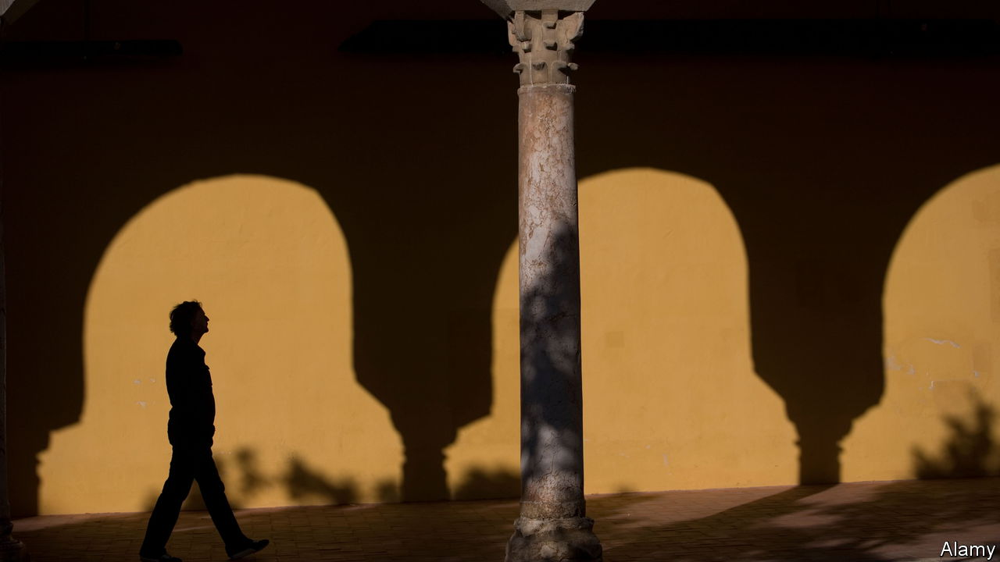

###### Contemplative spy fiction

# In Javier Marías’s final novel, an agent confronts his conscience 

##### The hero of “Tomás Nevinson” is plucked from retirement for a tough final mission 

 

> May 25th 2023 

By Javier Marías. Translated by Margaret Jull Costa. 

When Javier Marías died last September at the age of 70, he left a richly beguiling,  and, above all, original body of work. Whether exploring academic life, marriage or the murky world of , the Spanish author’s novels, written over five decades, blend intellectual inquiry with playful and artful high jinks.

Marías’s final book revisits characters and themes from his penultimate one,  (published in 2017). He saw “Tomás Nevinson” as a “companion piece” to its predecessor—but it is a better novel. The eponymous hero comes fully alive as he navigates shadowy machinations and ethical quandaries.

Tomás Nevinson’s days in the British Secret Service are over. Back in his home town of Madrid, the half-English, half-Spanish former spy is trying to rebuild his family life after years of “enforced exile”. But when his old handler and manipulator, Bertram Tupra, tracks him down and tempts him with one last assignment, Tomás is roused from retirement, reactivated and once again obliged to “dovetail lies and false identities”.

His mission requires him to go undercover in north-west Spain and find out which of three women is a terrorist with , a Basque separatist group, who is now lying low after taking part in bombings in Barcelona and Zaragoza. Posing as a teacher of English, Tomás embarks on a charm offensive, befriending the women—a fellow schoolteacher, a restaurant owner and a trapped wife—and forging more intimate relations with one of them. He watches their movements and reactions, all the while looking for clues that might betray a hidden identity and a role in past crimes.

But then Tupra, impatient for results, changes the rules. If Tomás cannot unmask and dispatch the terrorist, then all three women will have to die. Can he find the culprit in time—and will he have the unscrupulous courage to carry out his “blood mission”?

Those who prefer their espionage thrillers lean and taut may be put off by this hulking tome. But like the stories in Marías’s bravura trilogy, , “Tomás Nevinson” is a different kind of spy novel. It unfolds in meandering yet mesmerising sentences. Some describe scenes, others contribute to free-flowing monologues or digressive meditations. The author’s other trademark tropes, from literary allusions to historical references and philosophical debates, all feature.

Occasionally the narrative is weighed down by ponderous musings on topics such as hatred, justice and killing for the greater good. But it is never long before readers are again enthralled by Marías’s high-stakes plot, his protagonist’s tangled web of deceit and the sharp scrutiny of guilt, doubt, betrayal and memory. Now seamlessly translated by Margaret Jull Costa, this final work is a stimulating drama by a master of his craft. ■


