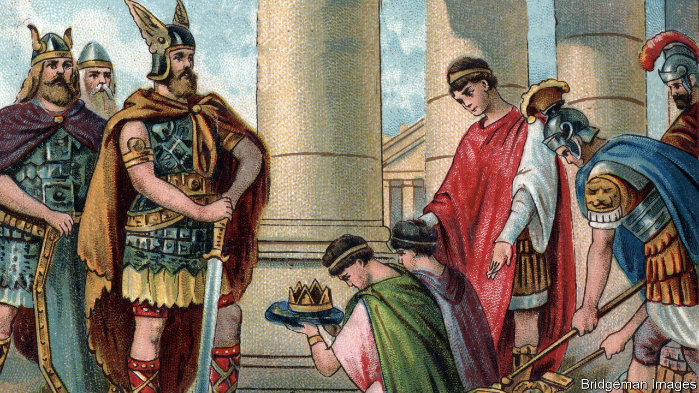

###### Great-power decline

# Rome fell. Will the modern-day West follow suit? 

##### “Why Empires Fall” makes a diverting historical comparison, if not a wholly convincing one 

 

> May 25th 2023 

. By John Rapley and Peter Heather. 

DECLINISM is in fashion again. As relations between America and China worsen, studying the ends of earlier ages of hegemony becomes more popular. Books predicting the unstoppable rise of autocratic strongmen and the death of democracy proliferate. There is much talk of the ”: the inevitability of a clash between a rising power and an established one, as Athens challenged Sparta in the fifth century bc. 

This provocative short book adapts this approach with a novel twist. It draws a comparison between the West in 1999, the zenith of its confidence, and Rome exactly 1,600 years earlier, in 399—just decades before the empire’s collapse.

The most interesting part of the story . John Rapley, a political economist, and Peter Heather, a historian, dissent from the analysis familiar since Edward Gibbon of an empire in gradual decline almost from its inception under Augustus. Rome, they argue, was as strong as ever at the turn of the fifth century ad. An admittedly extensive and sometimes rickety empire was held together mainly by co-opting talented outsiders, devolving extensive power to strong commanders and doing deals with potential enemies. Yet within a decade Rome had pulled its legions out of Britain (the authors dub this withdrawal the first ). Less than a century later, the last western emperor, Romulus Augustulus, was gone. 

What went wrong? The book dwells on foreign forces that became ever harder to resist. At the empire’s weakening periphery, local bigwigs began throwing in their lot with , Ostrogoths, Visigoths, Huns, Vandals and the rest. The sister of one emperor even married a Visigoth leader (apparently voluntarily) and produced a son with serious imperial claims. As Gibbon laboured to explain 250 years ago, the eastern empire based in Constantinople continued for almost another millennium. But it, too, was weakening and steadily losing territory, initially through costly wars against Persia and later with the rise of Islam and the .

Over the centuries western Europe recovered, first under Charlemagne and later even more spectacularly when it spread its power (and its own empires) across most of the known world. The question the authors pose is whether, despite its apparent dominance as recently as the turn of the 21st century, the West is now inexorably heading in the same direction as Rome in the fifth. They point to such issues as rising debt burdens, costly welfare states, depressed productivity growth, demographic decline and mass immigration. They see big challenges to the West from the growth of Asia, particularly China and India, and also from anti-Western powers such as Russia and the rise of Africa.

Yet the analogy with Rome’s decline and fall is ultimately unconvincing. The rest of the world is certainly catching up with the West, both economically and demographically. China’s economy may soon be bigger than America’s. Europe accounted for a quarter of the global population in 1914, but has less than a tenth today. Immigration, especially from Africa and Latin America, is politically testing. Populism is on the march. 

All the same, on a global scale it is hard to envisage a serious military rival to the clout of the United States and its European allies. Russia is revanchist , but it is also in long-term decline. China is brittle and its growth is slowing sharply. India is politically rancorous. The West’s grip on the best technology and research is firm. And though Europe’s economic prospects may be cloudy, American productivity leaves most competitors in the dust. 

Declinists like to cite George Bernard Shaw, whose dictum on the transience of great powers jokily invoked an English village: “Rome fell. Babylon fell. Hindhead’s turn will come.” It is tempting to think that way. But for now, at least, it is not obvious when, if ever, the West will follow suit. ■


