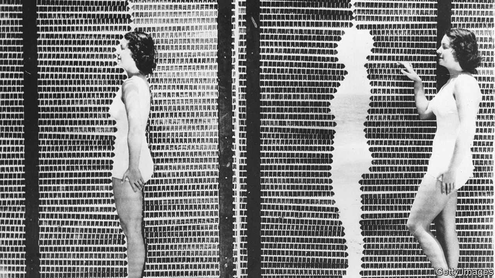

###### Social psychology

# “The Perfection Trap” decries what it calls a “hidden epidemic” 

##### Thomas Curran finds some unusual culprits for the scourge of perfectionism 

 

> May 25th 2023 

By Thomas Curran.

In Nathaniel Hawthorne’s short story “The Birth-Mark”, a chemist called Aylmer marries a young woman, Georgiana, whose sole imperfection is a red blemish on her left cheek. He considers it a “fatal flaw”; she pleads with him to use his skills to remove it. Stumbling on his journal, however, Georgiana is astonished to find it is a catalogue of scientific mishaps. Might his loathing of her birthmark stem from his professional disappointment? At length Aylmer concocts a potion that has the desired effect—and promptly kills her.

Hawthorne’s 180-year-old tale illustrates the . It is Thomas Curran’s starting-point for a study of what he calls a “hidden epidemic”. He thinks the obsessive pursuit of ever higher standards, rather than propelling achievement, is mainly a scourge. A social psychologist at the London School of Economics, he describes himself as “a recovering perfectionist”. Drawing on both academic research and his own experiences of “deficit thinking”, he makes a vigorous case, albeit one occasionally marked by cliché (he sees his younger self as a “chin-stroking, cardigan-wearing intellectual”).

Mr Curran distinguishes between three sorts of perfectionism. The first, which looks inward, is the relentless self-scolding of the  or punctilious student. A second version, directed towards others, is commonly found in bosses who have unrealistic expectations of their staff and decry their supposed failings (he cites as an example). The third and most troublesome kind is the form imputed to society: “an all-encompassing belief that everybody, at all times, expects us to be perfect”. Its victims tend to feel lonely; often they harm themselves and harbour thoughts of suicide. 

Having noted the ways in which this pathology inflames vulnerabilities and erodes resilience, Mr Curran suggests some causes. These include a lack of job security, neurotic supervision by helicopter parents and the gaudy blandishments of advertising, which fuel consumption and anxiety. “The very fabric of this economy”, he claims, “is woven from our discontent.” Inevitably he blames social media, which inundate users with images of finely sculpted bodies, flawless outfits, ambrosial holidays and exquisite weddings. 

A less familiar culprit is Don Hamachek, an American psychologist, who in the 1970s coined the term “normal perfectionism”, thereby legitimising morbid self-criticism, says Mr Curran. He even reproaches Barack Obama for enjoining young people to learn from their mistakes. Instead, he says, failures should be “allowed to simply wash through us as a joyous reminder of what it means to be a fallible human”.

The author’s greatest odium, though, is directed at meritocracy. In this he draws on the thinking of Michael Sandel, a philosopher at Harvard. Especially in  (published in 2020), Professor Sandel has argued that using education as a giant sorting machine creates a toxic obsession with credentials, dividing society into winners and losers and depleting the common good. Like other critics of meritocracy, Mr Curran has a point—until you consider the alternatives.

Daily life, in his view, now resembles an endless tribunal. Young people suffer most from the constant scrutiny of scores and rankings. Decrying a fixation on economic growth, he applauds countries, such as Bhutan and New Zealand, where decision-makers take account of citizens’ happiness. Mr Curran’s preferred fix is a universal basic income, which he says would “extinguish the fire of perfectionism”.

Whatever its economic merits, his argument errs in treating perfectionism as a purely cultural phenomenon. Might it not also be a disposition embedded in the psyche? Tellingly, his guidance—“Keep going. Do not yield”; “Keep practising that acceptance of fortune and fate”—is couched in the language of the perfectionist’s round-the-clock report card. ■


